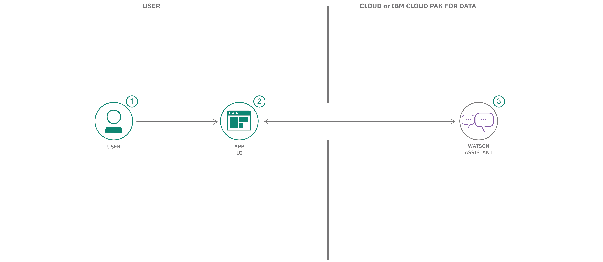

# ピザ注文用チャットボットの対話を組み立てる

### Watson Assistant スロット、Node.js、IBM Container Service を利用して、複雑な対話の作成を簡易化する

English version: https://developer.ibm.com/patterns/./assemble-a-pizza-ordering-chatbot-dialog
  ソースコード: https://github.com/IBM/watson-conversation-slots-intro/

###### 最新の英語版コンテンツは上記URLを参照してください。
last_updated: 2019-08-19

 
## 概要

Watson Assistant を利用した経験があるとしたらわかると思いますが、ユーザーからの入力データが必要になると、そのプロセスは非常に厄介なものになりがちです。フィールドを追加するたびに、ノードが必要になり、そのノードとは別のノード上で必要なロジックを検証しなければなりません。エラーの処理、ヘルプの追加、省略可能なフィールド、そしてその他のロジックには、さらにノードが必要になります。ユーザー・プロファイルやデータ・フォームを作成するだけでも、最終的には大規模なグラフと大々的なアプリケーション・ロジックになってしまいます。スロットという Watson Assistant の新機能を使用すると、この骨の折れる作業をたった 1 つのノードに集約することができます。このコード・パターンでは、単一の入力ノードを使用して、オンライン・ピザ注文用チャットボットを作成する方法を説明します。このコードの実装を完了することで身に付けた知識があれば、独自の Watson Assistant スロットを作成することができます。現在このコード・パターンには、IBM Cloud Kubernetes Service を使用するための手順も追加されています！

## 説明

このコード・パターンでは、Node.js と Watson Assistant を利用して単純なチャットボットを作成します。基本的なチャットボットに最小限必要な要素を提供する、たった 1 つのシン・アプリケーション層に、Watson Assistant のスロットという新機能を使用してすべてのロジックを Watson Assistant に詰め込みます。このチャットボットはピザの注文を受け付けて、必要なさまざまな情報のスロットを埋めていきます。ユーザー・プロファイルやその他のオンライン・フォームにも、これと同様の手法を適用できます。

このコード・パターンをひととおり完了すると、以下のスキルを身に付けることができます。

* Node.js と Watson Assistant を利用して単純なチャットボットを作成する
* Watson Assistant スロットを使用して、必要なデータを入力する
* スロットのハンドラーを使用して、スロットに当てはまらない会話のフローを処理する

このコード・パターンでは、アプリケーションをデプロイする方法として、IBM Cloud 上の Cloud Foundry を使用するか、IBM Cloud 上の IBM Container Service を使用するかも選べるようになっています。

## フロー

1. ユーザーがクラウド・べースの Node.js アプリケーションに対話を送信します。
1. アプリケーションが Watson Assistant と対話して、スロットを埋めていきます。
1. Watson Assistant からの返答がアプリケーションを介してユーザーに返されます。

## 手順

Find the detailed steps for this pattern in the [README](https://github.com/IBM/watson-conversation-slots-intro/blob/master/README.md). Those steps will show you how to:

1. Clone the repo.
1. Create IBM Cloud services.
1. Get IBM Cloud credentials and add to the .env file.
1. Configure Watson Assistant.
1. Run the application.
