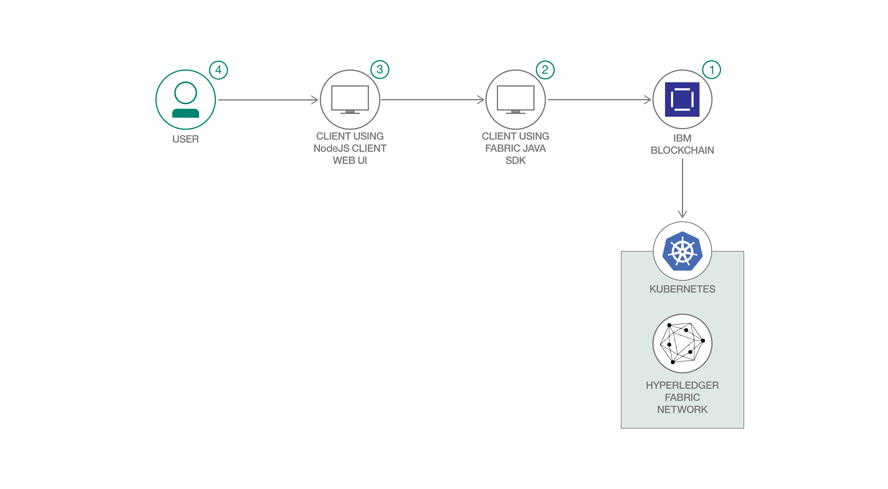

# ブロックチェーン対応クラウドファンディングをサポートするネットワークを構築する

### Hyperledger Fabric を使用してクラウドファンディング用のコラボレーション・プラットフォームを構築する

English version: https://developer.ibm.com/patterns/./blockchain-enabled-crowdfunding
  ソースコード: https://github.com/IBM/blockchain-enabled-crowdfunding

###### 最新の英語版コンテンツは上記URLを参照してください。
last_updated: 2019-09-09

 ## 概要

この開発者コード・パターンでは、Hyperledger Fabric を使用してブロックチェーン対応のクラウドファンディングをサポートするネットワークを構築する例を説明します。クラウドファンディングは支援者たちから多額の資金を集めるのに最も手っ取り早い方法の 1 つですが、クラウドファンディングのイベントには不正が行われる可能性がかなりあります。そこで、ブロックチェーンを利用して、参加者たちの間で信頼と透明性を確保できるようにします。

## 説明

クラウドファンディングは、プロジェクトやベンチャーの資金を提供することを目的に、通常はインターネットを介して大勢の人々から少額のお金を集めてまとまった金額にするという、多額の寄付金を集めるのに最も手っ取り早い方法の 1 つです。クラウドファンディングにはさまざまなタイプがありますが (寄付、見返り、借り、出資などのタイプ)、すべてのタイプのクラウドファンディングが政府機関 (英国の金融行動監督機構など) によって管理されているわけではありません。

クラウドファンディングには多くの利点がありますが、それと同時に、かなりの不正のリスクが伴うだけでなく、損金、投資のロックイン、収入不足、情報不足といった数々の潜在的リスクも伴います。主にクラウドファンディングには透明性と信頼が欠けていることから、人々は不正な支援要請に騙されてお金をとられるのではないかと不安を感じるものです。クラウドファンディングに関連するトランザクションの数と金額を考えると、クラウドファンディングについて報告された不正の数はかなり少ないとは言え、クラウドファンディング・プラットフォームの数が増えるにつれて、プラットフォームのオペレーター自身が不正に関わったり不正を可能にしたりするリスクも大きくなっていきます。

このコード・パターンでは、ブロックチェーン対応のクラウドファンディングをサポートするプラットフォームを構築するために、Hyperledger Fabric ネットワークを使用する方法を説明します。このネットワークでは要件とその現在の状況を全体的に把握できるため、効率性の向上というニーズに対処できます。また、必要な金額に対してお金を集めすぎたり、集めたお金が少なすぎたりするといった問題も軽減できます。このため、このプラットフォームによって信頼、説明責任、運用の透明性を確保することができます。

## フロー

このコード・パターンの手順では、以下の方法を説明します。

1. IBM Blockchain Platform on IBM Cloud を利用してブロックチェーン・ネットワークをセットアップします。
1. Hyperledger Fabric Java&trade; SDK を使用してクライアント・アプリケーションをデプロイします。このアプリケーションは中間層として機能し、REST API を公開します。
1. Node.js を使用して作成された Web UI アプリをデプロイします。
1. ユーザーが以下のタスクを行うために Web インターフェースを操作すると、Web インターフェースが中間層を介して内部でブロックチェーン・ネットワークとやりとりします。

## 手順

ブロックチェーン対応のクラウドファンディングに取り組む準備はできましたか？詳しい手順については、[README](https://github.com/IBM/blockchain-enabled-crowdfunding/blob/master/README.md) を参照してください。
