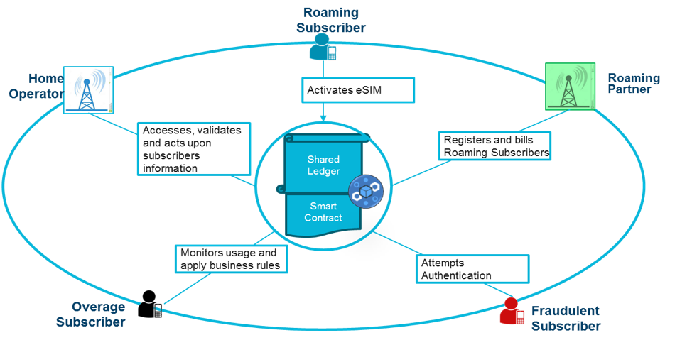
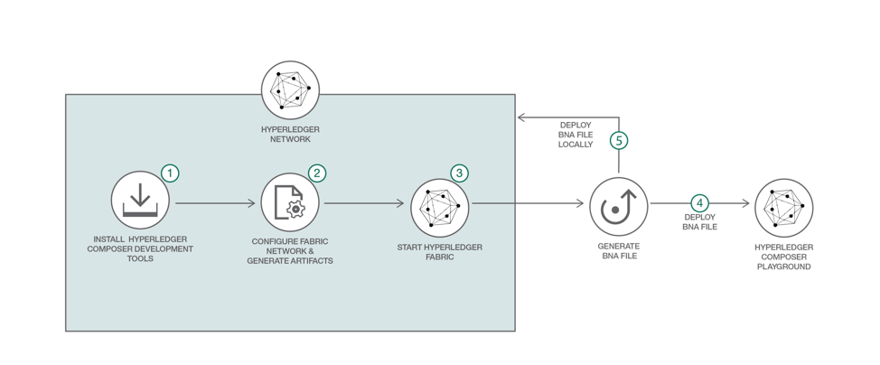

# テレコムのローミング、不正、使用量制限超過をブロックチェーンで管理する

### 通信サービス・プロバイダーがブロックチェーンを使用してバリュー・チェーンを強化する方法

English version: https://developer.ibm.com/patterns/./blockchain-for-telecom-roaming-fraud-and-overage-management
  ソースコード: https://github.com/IBM/Blockchain_for_TelcoRoaming

###### 最新の英語版コンテンツは上記URLを参照してください。
last_updated: 2018-09-18

 
_**Note:** This code pattern is currently being updated to focus on IBM Blockchain Platform V2.0._

## 概要

通信サービス・プロバイダー (CSP) で、ローミング CSP ネットワーク上で加入者関連の問題が発生することはよくあります。けれども、CSP が常にネットワーク上での加入者のアクティビティーを十分に把握しているとは限りません。ローミングを利用する顧客についての決算調整には時間がかかり、ローミングに伴う費用をサード・パーティー情報センターの仲介によって調整する必要があります。また、ほとんどの CSP は常に不正の検出と防止という問題を抱えていて、年間 380 億米ドルもの費用がこの問題への対処に使われているほどです。ホーム CSP ネットワークには、不正をもくろむ加入者がアクセスしてローミング加入者の ID を複製する可能性が伴います。こうした一連の CSP を単一の Hyperledger ブロックチェーン・ネットワークに参加させて情報を直接交換できるようにするのが、ブロックチェーンです。ブロックチェーン・ネットワークでのトランザクションは不変であり、スマート・コントラクトのルールに従ったコンセンサス・モデルに基づいてトランザクションが実行されます。この仕組みにより、CSP は加入者のアクティビティーをより明確に把握できるようになり、決済調整にかかる時間が短縮され、不正なトランザクションが削減されます。

このパターンで取り上げるブロックチェーン Hyperledger Composer プロジェクトで、Hyperledger Fabric を作成し、スマート・コントラクトによってホーム・オペレーターとしての CSP とローミング・パートナーとしての CSP の間のトランザクションを制御して、ネットワーク上のモバイル・ユーザーのアクティビティーをトラッキングする方法を説明します。

## 説明

このソリューションでは、次の 4 つの使用ケースを取り上げます。

* **ID 管理** - 加入者がローミング・パートナーのネットワークにアクセスすると、ローミング・パートナーは、このビジターがホーム・オペレーターの加入者であることを判別します。この判別処理は、ブロックチェーン・ネットワーク上での加入者情報交換トランザクションによって行われます。ホーム・オペレーターの加入者であることが判別されると、スマート・コントラクトに基づいてビジターの認証が行われ、その結果、ビジターが登録されます。
* **課金** - ローミング加入者がローミング・ネットワーク上で音声通話を開始します。このトランザクションが、ブロックチェーン・ネットワーク上で記録されます。通話が終了すると、その通話時間がブロックチェーン・トランザクション内で記録されます。スマート・コントラクトのルールに基づき、通話時間に応じた料金が設定されます。すると即時にコンセンサス・モデルと共有レジャー・テクノロジーに基づいて、ホーム・オペレーターからリモートのパートナーへの支払いが記録されます。この仕組みにより、情報センターが関与する必要はなくなります。したがって、関係者間の紛争回避に役立ちます。
* **不正** - 既存の登録電話番号と重複する移動局国際加入者電話番号を使用して、モバイル・ユーザーが接続を試行します。こうした不正なユーザーについては、加入者の認証フェーズで簡単に識別して不正のフラグを立てることができます。ホーム・オペレーターは、ブロックチェーンの共有レジャーを介して自らすぐにローミング・トランザクションにアクセスし、加入者のアクティビティーを確認できるため、ローミング・ネットワーク内でのローミング加入者のアクティビティーをより明確に把握できるようになります。
* **使用量制限超過** - 通話量の制限に達しようとしているローミング加入者が、ローミング・ネットワーク上で音声通話を開始します。ブロックチェーン・ネットワーク上では、ホーム・オペレーターとローミング・オペレーターの両方が加入者の使用状況情報をより明確に把握できるだけでなく、スマート・コントラクトのルールによって使用量超過の通知を自動的に加入者に送信できます。

顧客にとっては、次のビジネス価値があります。

* ホーム・オペレーターとローミング・パートナー間のコントラクトが自動的にトリガーされ、コントラクトを自動的に適用できます。
* ほぼ瞬時に課金を確定できるため、情報センターなどのサード・パーティーによる処理に費用をかける必要がなくなります。
* オペレーター間のトランザクションがリポジトリーに保管されて、紛争を解決する際にトランザクションを検証できます。
* CSP 間での効率的な ID 管理により、不正なローミングや加入を軽減できます。
* 関係者間でのデータおよび通話の使用量制限超過アラートをリアルタイムで加入者に送信できるため、顧客満足度が向上する結果となります。

以下の図は、このソリューションを背後で支えるエコシステムを説明しています。

ビジネス・ネットワーク定義は、モデル (.cto)、トランザクション関数 (.js)、アクセス制御リスト (.acl) のファイルを 1 つにパッケージ化したチェーンコード・アーカイブ・ファイル (.bna) からなります。ビジネス・ネットワーク定義は、Hyperledger 開発ツールに含まれる Hyperledger Composer Playground を使用して開発、テストしてから、そのチェーンコード・アーカイブ・ファイルを Hyperledger Fabric ネットワークにインポートしてデプロイできます。その後、Hyperledger Composer REST サーバーをデプロイして、ブロックチェーン・ネットワークとやり取りするために使用する REST API を生成し、トランザクションを呼び出してクエリーします。

## フロー

以下のフローで、このソリューションのブロックチェーン・コンポーネントを作成する際に従う手順を説明します。独立した UI と追加のバックエンド・コンポーネントが必要になりますが、この 2 つについてはフローで明かにしていないことに注意してください。

1. Hyperledger Composer 開発ツールをインストールします。
1. Hyperledger Fabric ネットワークを構成して起動します。
1. .bna ファイルを生成します。
1. Hyperledger Composer Playground を使用して .bna をデプロイします。
1. 別の方法: ローカルで稼働する Hyperledger Composer 上に .bna をデプロイします。

## 手順

このコード・パターンに取り組む準備はできましたか？アプリケーションを起動して使用する方法について詳しくは、[README](https://github.com/IBM/Blockchain_for_TelcoRoaming/blob/master/README.md) を参照してください。
