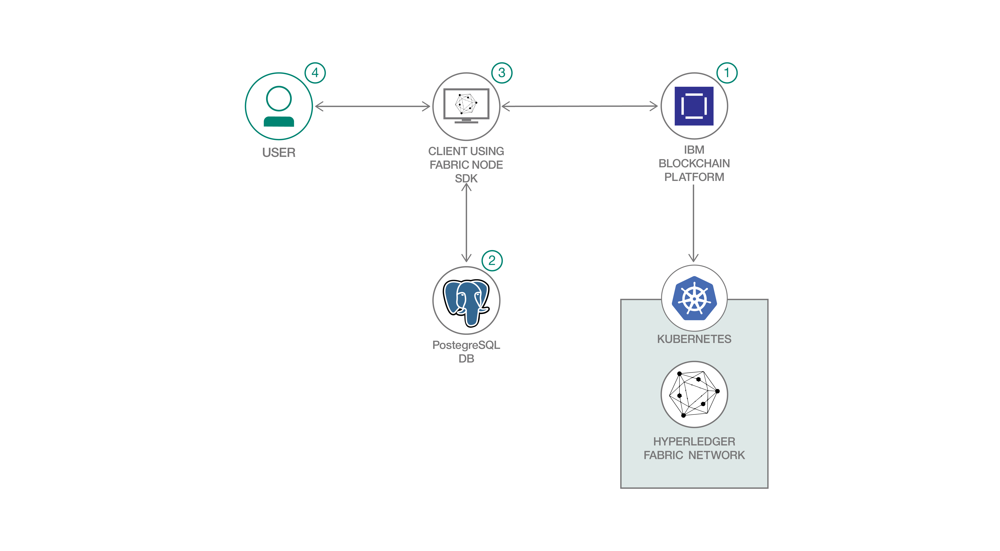

# Fabric Node SDK を使用して、PostgreSQL データベースを Hyperledger Fabric ウォレットとして活用する

### Kubernetes を使用してコンテナー化された PostgreSQL データベースをセットアップし、そのデータベースを Hyperledger Fabric ウォレットとして構成する

English version: https://developer.ibm.com/patterns/blockchain-postgres-fabric-certificate-wallet
  ソースコード: https://github.com/IBM/fabric-postgres-wallet

###### 最新の英語版コンテンツは上記URLを参照してください。
last_updated: 2019-09-17

 ## 概要

Hyperledger Fabric は適切なエンロールメント証明書を使用しながらブロックチェーン・ネットワークとやりとりします。Hyperledger Fabric SDK for Node.js には、Hyperledger Fabric ブロックチェーンとやりとりするための API だけでなく、Fabric 証明書を保管するためのデフォルトのファイル・システム・ウォレットも用意されています。このファイル・システム・ウォレットは、ユーザー証明書をフォルダー内に格納するという手法をとっていますが、この手法では必要なセキュリティーも柔軟性も確保できません、さらに、スケーラビリティーにも影響します。そこで、このコード・パターンを詳しく調べて、PostgreSQL データベースを Fabric ウォレットとして使用する方法を把握してください。

## 説明

Hyperledger Fabric は、Hyperledger に含まれるブロックチェーン・プロジェクトの 1 つであり、プライベートなパーミッション型ブロックチェーンです。Hyperledger Fabric 上では、デジタル署名によってセキュリティーが適用されます。Hyperledger Fabric に送信するすべてのリクエストには、適切なエンロールメント証明書を持つユーザーによる署名が必要です。ユーザーがエンロールされると、以降に使用できるようにそのエンロールメント証明書が Node.js によってウォレット内に保存されます。ウォレットにはユーザー ID 一式が格納され、ユーザーが実行するアプリケーションがチャネルに接続するときは、ウォレットからいずれかのユーザー ID が選択されます。

ウォレットのタイプには、ファイル・システム、インメモリー、ハードウェア・セキュリティー・モジュール、CouchDB の 4 つがあります。Hyperledger Fabric SDK for Node.js に用意されている Fabric 証明書保管用のデフォルトのウォレットは、ファイル・システム・タイプのものです。このウォレットでは、ユーザーの証明書がフォルダー内に保管されます。Hyperledger Fabric SDK では、デフォルトのファイル・システムではなく、CouchDB 内にウォレットを構成するための手段も用意されています。

一方、ユーザーが CouchDB ではなく PostgreSQL データベースを使用したい場合はどうなるでしょうか？Hyperledger Fabric SDK for Node.js にはエンロールメント証明書を直接 PostgreSQL に保管するための手段はありませんが、PostgreSQL データベースは SQL と NoSQL の両方のデータ・ストレージに対応し、コミュニティーによる強力な後ろ盾もあるため、ウォレットとして使用するには理想的です。そこで、このコード・パターンでは、PostgreSQL データベースを Hyperledger Fabric SDK for Node.js 内のウォレットとして使用する方法を説明します。ここでは IBM Blockchain Platform を使用して、Hyperledger Fabric ブロックチェーン・ネットワークをセットアップし、IBM Cloud サービスとして構成された PostgreSQL、または Kubernetes を使用してコンテナー化した PostgreSQL をセットアップします。

## フロー

1. IBM Blockchain Platform を利用して Hyperledger Fabric ネットワークをセットアップします。
1. Kubernetes を使用してコンテナー化された PostgreSQL データベースを構成し、デプロイします。
1. Hyperledger Fabric SDK for Node.js を使用してクライアント・アプリケーションをデプロイします。このアプリケーションで、ユーザーはブロックチェーン・ネットワークと通信できます。
1. ブロックチェーン・ネットワークと通信するには、ユーザーがネットワークに登録してエンロールする必要があります。エンロールするとエンロールメント証明書が生成されて、PostgreSQL データベース内に保管されます。以降のネットワークとの通信には、これらの証明書が使用されます。

## 手順

このコード・パターンに取り組む準備はできましたか？詳しい手順については、[README](https://github.com/IBM/fabric-postgres-wallet/blob/master/README.md) を参照してください。
