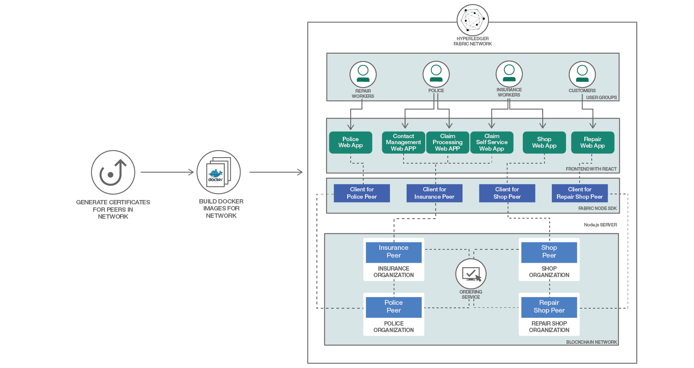

# ブロックチェーン対応の保険アプリを構築する

### Hyperledger Fabric を使用して、Web ベースのブロックチェーン対応の保険アプリケーションを構築する

English version: https://developer.ibm.com/patterns/./build-a-blockchain-insurance-app
  ソースコード: https://github.com/IBM/build-blockchain-insurance-app

###### 最新の英語版コンテンツは上記URLを参照してください。
last_updated: 2017-12-11

 
## 概要

ブロックチェーンはその分散型レジャー、スマート・コントラクト、否認防止機能によって、金融機関による取引の方法を革命的に変化させていますが、保険業界もその例外ではありません。今回紹介するコード・パターンでは、保険の販売と請求の両方を容易にする、Hyperledger Fabric を使用した Web ベースのブロックチェーン対応アプリをどのようにして実装するのかを説明します。

## 説明

**Updated to support Hyperledger Fabric V1.1**

私たちの多くが体験しているように、車の接触事故を起こすと、保険会社、警察、そして相手の運転手との対応にどれだけの時間と労力を費やすことになるのかとひどく不安になります。比較的円滑に事が運んだとしても、スケジュールにかなりの支障をきたすことに変わりはありません。

けれども開発者として事態を逆転させて、保険業界に抜本的な改革をもたらし、自分自身の体験だけでなく、同じような不都合や遅れ、また管理上のフラストレーションに対処する世界中の数えきれない人々の苦労を軽減できるとしたらどうでしょう？そのチャンスは、ブロックチェーンにあります。

保険業界にとって、ブロックチェーンは非常に大きなチャンスを与えてくれるテクノロジーです。ブロックチェーンによって、データの交換方法、請求の処理方法、不正の防止方法に関する状況を革新するチャンスがもたらされます。ブロックチェーンは、技術系企業の開発者、規制機関、保険会社を引きあわせて、新しい保険管理資産を創り出すことを可能にするのです。

### 自然な組み合わせ

共有インフラストラクチャーとして機能する、ブロックチェーンの分散型レジャー、スマート・コントラクト、否認防止機能を使用すれば、保険関連のあらゆる類の処理の形を変えることができます。現在、保険金請求処理の多くは手作業で行われているため、エラーが発生しやすく、かなりの処理時間を要することもあります。複数の基幹システム内で同じデータの異なるバージョンが存在することが原因で、追加のコストや長時間にわたる争議が発生することも珍しくありません。

ブロックチェーンを使用して、保険加入者、給付資格、請求データに関する情報を共有すれば、手作業によるプロセスが自動化されます。スマート・コントラクトには、ブロックチェーン・ネットワークへの参加者の登録および検証ルールが計算によってエンコードされます。データを共有し、このようなスマート・コントラクトで計算することで、ダウンストリームの争議は減少します。また、保険給付の検証は複数のデータ・ソースに基づいて行われ、しかもこれらのデータ・ソースにはすべてのサービス・プロバイダーが簡単にアクセスすることができます。

要するに、ブロックチェーン・テクノロジーは、保険業界が業務の効率化、トランザクションの処理コストの低減、カスタマー・エクスペリエンスの向上、データ品質の改善、関係者間の信頼強化を実現するチャンスを提供しています。

このコード・パターンをひと通り完了することで、機能的なブロックチェーン対応の保険アプリを構築する方法を把握できます。ここで構築するアプリでは、4 種類の参加者 (ピア) を扱います。

* 保険会社
* 警察
* 修理工場
* 小売店

「保険会社」ピアは、製品 (この例では、自動車) に対する保険を提供し、保険金の請求を処理する会社です。「警察」ピアは、事故や盗難の申し立てを検証します。「修理工場」ピアは、製品の修理を行います。「小売店」ピアは、消費者に製品を販売します。

### 仕組み

このアプリの実際の仕組みはどのようになっているのでしょうか？一例として、スポーツ・ファンの Susie が新しい自転車を購入することにしました。自転車店を訪れた彼女は、ロード・レーサーの掘り出し物を見つけます。購入プロセスの一環として勧められた保険契約に対し、彼女は保険を掛けておくことは重要であると同意し、保険の契約をします。その際、自分の個人データを提供し、契約の発効日と終了日を指定します。この契約が処理されると、チェーンコードに組み込まれた式によって、日割計算保険料が計算されます。すべての書類が揃うと、Susie にはアプリの資格情報が提供されます。保険金の請求をする場合、彼女は随時、この資格情報を使用してアプリにログインできます。ここまで終わった時点で、ブロックチェーンにこのトランザクションを保守するためのブロックが書き込まれます。

保険契約を結んでから 10 日後、Susie が自転車でバークレー・ヒルズを訪れた際に、自転車が盗まれてしまいました。警察に盗難届けを出した後、Susie はアプリ上でセルフサービス・タブを開いてログインし、盗難について保険会社に報告して保険金請求を申し立てます。彼女がこの申し立てを送信すると、それは別のトランザクションとしてブロックに書き込まれます。申し立てはまず、警察によって処理されます。自転車が盗難に遭ったことを、警察が確認または否定するためです。この例では、警察は盗難を確認し、この申し立てに参照番号を割り当てます。すると、別のブロックが請求に書き込まれます (これと同じように、Susie が自転車に損傷を与えることになった事故に対する保険金請求を申し立てた場合は、警察ではなく、修理工場が申し立てを処理することになります)。保険会社はブロックチェーン上でアクティブなすべての保険金請求申し立てをモニタリングします。警察が確認結果を送信すると、保険会社はその確認を受けて、保険金請求に対して還付金を送信します。前のトランザクションの場合と同じく、還付結果がブロックチェーンに書き込まれます。Susie は保険会社から保険金が支払われたことを確認して、ひと安心しました。けれども自転車を取り戻せたとしたら、彼女はもっと幸せだったことでしょう。

保険会社には、特定の契約を有効または無効にする選択肢があることに注意してください。これは、顧客が結んだ契約を無効にするという意味ではなく、特定のタイプの保険については新しい契約を許可しないというだけです。さらに、保険会社は、異なる契約条件または異なる価格構成を設定した新しい契約テンプレートを作成することもできます。

この Web ベースのアプリケーションは Node.js と Reacts で作成されていて、アプリケーションのチェーンコード (つまり、スマート・コントラクト) は Go 言語で作成されています。

次に自動車 (またはサイクリング) 関連のちょっとした不幸に見舞われたとしても、その事故に伴う混乱について思い悩まないでください。このコード・パターンに従ってブロックチェーンのスキルを磨けば、業界全体を抜本的に改革できるようになります。

## フロー

1. ピアの証明書を生成します。
1. ネットワークの Docker イメージをビルドします。
1. 保険ネットワークを起動します。
 
## 手順

To put this code pattern to use, see the complete details for running and using this application in the [README](https://github.com/IBM/build-blockchain-insurance-app?cm_sp=Developer-_-build-a-blockchain-insurance-app-_-Get-the-Code).
