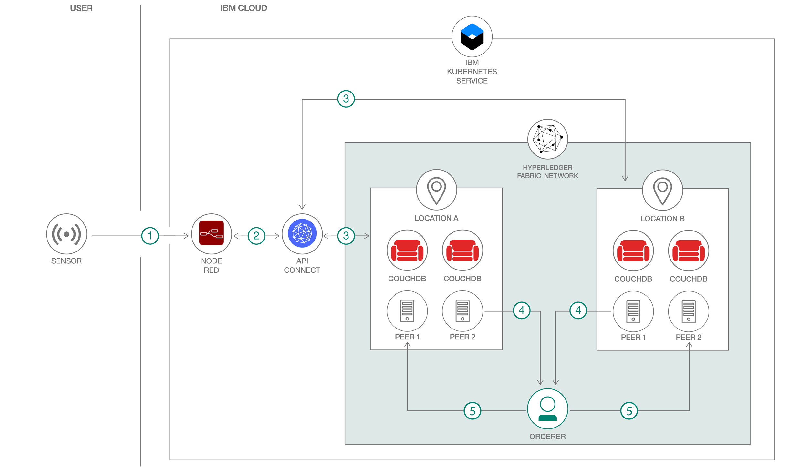

# IoT の信頼を確立するためのブロックチェーン・ネットワークを構築する

### Hyperledger Fabric と Node-RED を使用して、IoT データのセキュリティーを確保するブロックチェーン・ネットワークを作成する

English version: https://developer.ibm.com/patterns/./build-a-blockchain-network-for-trusted-iot
  ソースコード: https://github.com/IBM/Hyperledger-Fabric-for-Trusted-IoT

###### 最新の英語版コンテンツは上記URLを参照してください。
last_updated: 2019-08-01

 ## 概要

ブロックチェーンは、トランザクション・プロセスの重要性が高い業界に、トランザクションの信頼性と透明性をもたらす新しいテクノロジーです。デジタル・トランスフォーメーション・ビジネスにおいては、インターネットに接続された世界中の数え切れないほどの物理デバイスがデータを収集して共有するモノのインターネット (IoT) も盛んに使用されているテクノロジーとなっています。この開発者コード・パターンでは、オープンソースのブロックチェーン・フレームワークである Hyperledger Fabric、Watson&trade; IoT Platform、そして Node-RED を利用して、分散型ネットワーク上のデータの集合を操作して不変な状態にする方法を説明します。

## 説明

このコード・パターンを開発する際に設定した目標は、ブロックチェーンと IoT を結合した概念検証を設計することでした。ここで紹介するソリューションは、完全な機能を備えたアプリケーションを開発するためのものではなく、理解のしやすさと学習に役立つことを重視して作成されています。このソリューションで学んだ知識を基に、新しい組織を分散型ネットワークに追加して、ロジックに応じた新しいスマート・コントラクトを開発することで、新しいビジネス・モデルに合わせてコード・パターンを拡張および更新できます。このコード・パターンでは、IoT センサー・データ (温度など) を保管する Hyperledger Fabric ネットワークと、センサー・データの履歴を確認できる UI を作成します。

このコード・パターンを完了すると、以下の方法がわかるようになります。

* Hyperledger Fabric ネットワークをセットアップする
* Hyperledger Fabric SDK を使用して、ネットワークとやり取りするための API を設計する
* センサーからデータを収集して、Node-RED を使用したダッシュボード上に表示する

## フロー

1. Node-RED に組み込まれた Watson IoT Platform 入力ノードが、デバイスから送信されたイベント (このパターンの例では温度) を受信します。
1. レジャーを呼び出してクエリー (データの書き込みと読み取り) を実行するために、Node-RED 内のノードが HTTP リクエストを送信し、そのリクエストに対するレスポンスを API に返します。
1. Hyperledger Fabric Client SDK for Node.js をベースに定義された API が、Hyperledger Fabric ネットワーク内のチェーンコードとやりとりして、レジャーを更新または読み取ります。
1. エンドーサー・ピアが、リクエストに応じてチェーンコード内に定義された関数を実行し、その結果を順序付けサービスに送信します。
1. 順序付けサービスがブロックを作成してアンカー・ピアに送信します。アンカー・ピアはそのブロックをエンドーサー・ピアにブロードキャストします。

## 手順

このコード・パターンに取り組む準備はできましたか？詳しい手順については、[README](https://github.com/IBM/Hyperledger-Fabric-for-Trusted-IoT/blob/master/README.md) を参照してください。手順の概要は以下のとおりです。

* インストールの前提条件を確認してリポジトリーのクローンを作成します。
* IBM Cloud Kubernetes クラスターを作成して、作成したクラスターにアクセスします。
* Hyperledger Fabric をデプロイします。
* Hyperledger Fabric SDK for Node.js をデプロイします。
* Node-RED をデプロイします。
