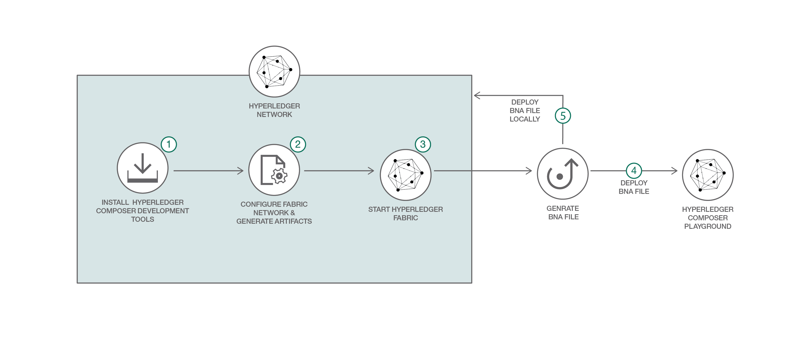

# ブロックチェーン・ネットワークを構築する

### Hyperledger Composer を使用して、初めてのブロックチェーン・ネットワークを作成する

English version: https://developer.ibm.com/patterns/./build-a-blockchain-network
  ソースコード: https://github.com/IBM/Create-BlockchainNetwork-IBPV20

###### 最新の英語版コンテンツは上記URLを参照してください。
last_updated: 2018-05-28

 
## 概要

ブロックチェーンはセキュアな分散型の開かれたテクノロジーとして、プロセスのコストを下げて迅速化するとともに、トランザクション・アプリケーションにおいて新しいレベルの信頼を築いています。この開発者向けコード・パターンでは、Hyperledger Composer を使用してブロックチェーン・ネットワークを構築する方法を説明し、皆さんがブロックチェーンの開発を開始できるよう手引きします。

## 説明

**Hyperledger Fabric V1.1 および Hyperledger Composer V0.19 に対応するために更新されました。**

現在、ブロックチェーンがビジネス取引のやり方を変えつつあります。このセキュアな分散型の開かれたテクノロジーは、コストを下げ、プロセスを迅速化するとともに、セキュアな取引において新しいレベルの信頼を築いています。

ブロックチェーンのように重要なテクノロジーが新たに登場する中で主導権を握れるのは、そのテクノロジーを理解して実装できる開発者です。けれどもそれには、まず学ばなければなりません。    

「hello world」ブロックチェーン・パターン・シリーズの第 1 回となるこの開発者向けパターンで、Hyperledger Composer を使用してブロックチェーン・ネットワークを構築する方法を学んでください。このパターンでは、まず、モデルを定義するためのビジネス・ネットワーク・アーカイブ (BNA) を作成し、そこに、例えば参加者、取引可能な資産、許容されるトランザクションを定義します。次に、ネットワークを Hyperledger Fabric 上にデプロイします。Hyperledger Fabric は、Linux&reg; Foundation によってホストされているブロックチェーン・ネットワークの実装です。今回は、Hyperledger Fabric をローカルで実行します。

この一連の手順に従うと、Hyperledger Composer がいかに有用なツールであるかがわかるはずです。Hyperledger Composer を使用すれば、現在のビジネス・ネットワークを、既存の資産とそれらの資産に関連する取引を含め、迅速にモデル化することができます。ビジネス・ネットワーク・モデルの一部として、今回は資産とやり取りできるトランザクションを定義します。ビジネス・ネットワークには、そのネットワークとやり取りする参加者も含まれます。参加者のそれぞれには、複数のビジネス・ネットワークにおいて一意の ID を関連付けることができます。

このコード・パターン・シリーズは、ブロックチェーンの潮流に乗って、あらゆる企業で必要とするようになるスキルを身に着けるチャンスとなります。今回のコード・パターンを完了したら、以降のブロックチェーン・パターンに引き続き取り組んで、開発者としてかけがえのない存在になってください。

## フロー

1. Hyperledger Composer 開発ツールをインストールします。
2. Hyperledger Fabric を起動します。
3. ビジネス・ネットワーク・アーカイブを生成します。
4. Composer Playground を使用してビジネス・ネットワーク・アーカイブをデプロイします。
5. (別の方法) ビジネス・ネットワーク・アーカイブを、ローカルで稼働中の Hyperledger Composer 上にデプロイします。

## 手順

Find the detailed steps for this pattern in the [README](https://github.com/IBM/BlockchainNetwork-CompositeJourney/blob/master/README.md). Those steps will show you how to:

1. Install Hyperledger Composer Development Tools.
1. Start Hyperledger Fabric.
1. Generate the Business Network Archive (BNA).
1. Deploy the Business Network Archive using Composer Playground.
1. Deploy the Business Network Archive on Hyperledger Composer running locally.
