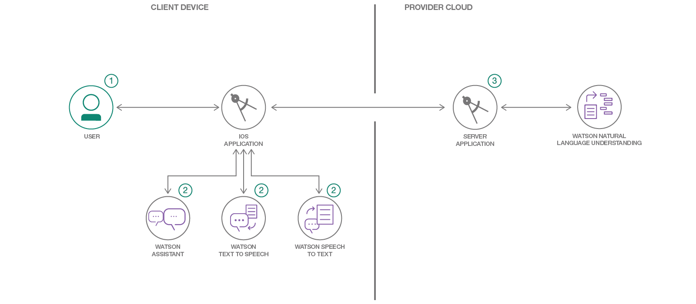

# Swift を使用してコグニティブ・レコメンデーション・アプリを構築する

### おすすめ、予約、イベント計画に対応する Swift ベースのモバイル・チャットボットを作成する

English version: https://developer.ibm.com/patterns/build-a-cognitive-recommendation-app-with-swift
  ソースコード: https://github.com/IBM/CognitiveConcierge

###### 最新の英語版コンテンツは上記URLを参照してください。
last_updated: 2017-08-02

 
## 概要

消費者におすすめを提示できるチャットボットの需要が高まっています。特に需要が高いのは、モバイル・プラットフォーム用に設計されたものです。このコード・パターンでは、近くのおすすめレストランを提示する Cognitive Concierge というモバイル・アプリを構築するにはどのようにするのかを紹介します。このアプリに変更を加えて、他のおすすめの提示、予約、イベント計画、ツール化を実現することもできます。アプリを構築するために使用するのは、Swift、Watson サービス、Kitura です。

## 説明

旅行の楽しみの 1 つは、その街の地元の人しか知らないような、おいしい食事を提供してくれる最高のレストランを発見することです。そのようなレストランを見つけるために、時間をかけて事前の調査をしたり、タクシーの運転手が案内してくれたレストランをいちかばちかで試したりすることもできますが、それよりも、集合知の力を利用する有効な方法があります。

コグニティブ・モバイル・アプリケーションによるデジタル・エクスペリエンスを提供する開発者の数は増え続けています。コグニティブ・モバイル・アプリケーションというこのテクノロジー分野は、モバイル、そしてクライド上で提供されるコグニティブ・サービスの統合によって支えられ、電光石火の速さで進化しています。これらのアプリでは、個人に合わせてパーソナライズされた洞察とおすすめ情報をすぐに手に入れることができます。

私たちは、入力する選択基準に応じて最適な場所を見つけるための手段として、便利さ、速さ、柔軟さを兼ね備えたアプリを構築しようと考えました。また、このモデルをレストランだけでなく、ホテルを見つけたり、都市を案内したりするなど、他のあらゆる実用的な目的に応じて適応できるものにしたいとも考えました。

その結果完成したのが、Cognitive Concierge というサンプル・アプリケーションです。このアプリケーションは Swift で作成されたエンドツーエンドのアプリケーションで、フロントエンドには iOS、バックエンドには Kitura Web フレームワークを使用しています。Cognitive Concierge は、さまざまな Watson サービスを Swift クライアントおよびサーバー・サイドのアプリに統合することによって、アプリケーションにインテリジェンスを追加して利用する実例となっています。Assistant、Text to Speech、Speech to Text、Natural Language Understanding などの Watson サービスにアクセスするには、Watson Developer Cloud の iOS SDK を利用できます。

このコード・パターンでは、あらゆる種類のおすすめを提示するために変更を加えることのできる、実用的な音声制御式アプリを構築する方法を紹介します。皆さんが開発スキルを磨いて、Swift 言語を理解できるようお手伝いするとともに、あらゆるサービスを実用目的で利用する方法を説明します。

## フロー

1. サーバー・アプリケーションを IBM Cloud にデプロイします。
2. ユーザーが Watson サービスを介して iOS アプリケーションを操作します。
3. ユーザーが何らかのアクションを行うと、iOS アプリケーションがサーバー・アプリケーション API を呼び出します。この API は、Watson Natural Language Understanding サービスと Google Places API を利用して、ユーザーにおすすめを提示します。

## 手順

1. Deploy the server application.
2. Update the Watson Assistant Service on IBM Cloud.
3. Run the IOS application.
