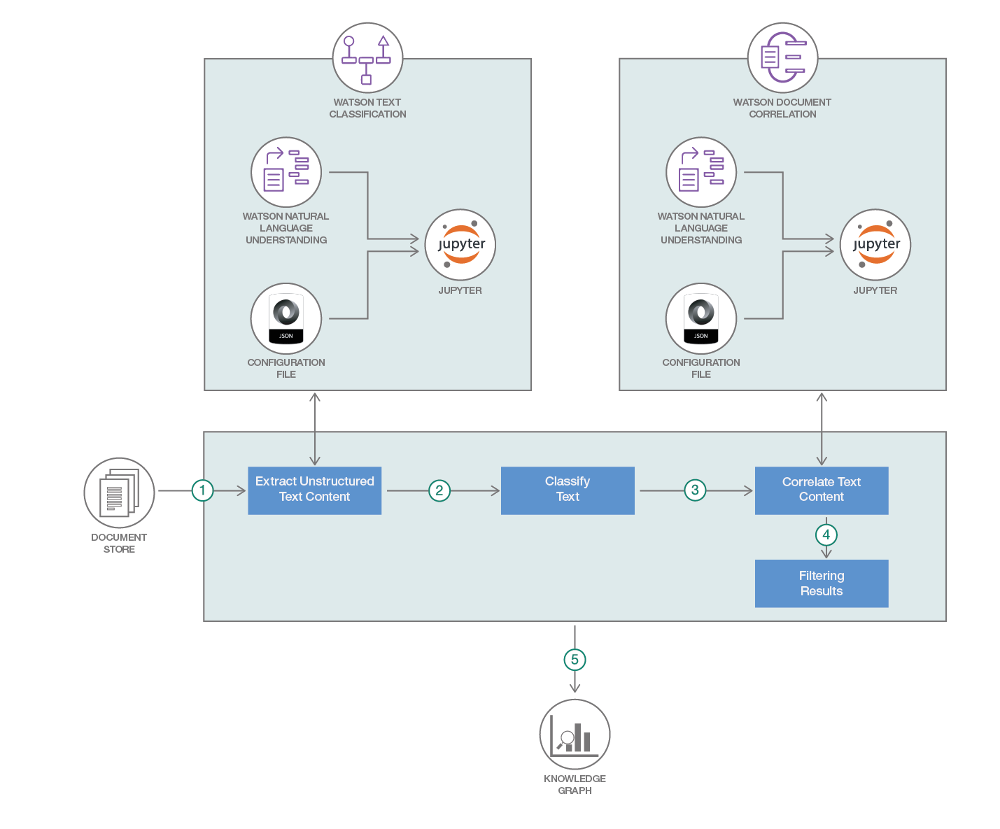

# ドキュメントを基にナレッジ・グラフを作成する

### IBM Cloud、Watson サービス、Watson Studio、そしてオープンソース・テクノロジーを利用して、各種のビジネス領域で生成された非構造化テキスト・コンテンツから洞察を引き出す

English version: https://developer.ibm.com/patterns/./build-a-domain-specific-knowledge-graph-from-given-set-of-documents
  ソースコード: https://github.com/IBM/build-knowledge-base-with-domain-specific-documents/

###### 最新の英語版コンテンツは上記URLを参照してください。
last_updated: 2018-09-14

 
_**Note: This pattern is part of a composite pattern.** These are code patterns that can be stand-alone applications or might be a continuation of another code pattern. This composite pattern consists of:_

* [Watson のテキスト分類を拡張する](https://github.com/IBM/japan-technology/blob/main/Code-Patterns/extend-watson-text-classification/)
* [さまざまなソースからのドキュメントを互いに関連付ける](https://github.com/IBM/japan-technology/blob/main/Code-Patterns/watson-document-correlation/)
* ドキュメントを基にナレッジ・グラフを作成する (このパターン)
* [ナレッジ・ベースでドキュメントをクエリーする](https://github.com/IBM/japan-technology/blob/main/Code-Patterns/algorithm-that-gives-you-answer-to-any-particular-question-based-on-mining-documents/)

## 概要

ビジネスの領域を問わず、Microsoft Word ドキュメントは一般的に使用されています。Word ドキュメントには、未加工のテキスト、表、画像などの形式で情報が含まれています。そしてこれらの Word ドキュメントのすべてに、それぞれのビジネスに重要なファクトが含まれています。このコード・パターンで対処するのは、領域固有の Word ドキュメントに含まれているテキストや表から知識を引き出すという課題です。この課題に対処して引き出した知識を基に、ナレッジ・グラフを作成し、知識のクエリーを可能にします。これにより、トレーニングとルール・ベースの手法のそれぞれからもたらされる長所を生かして、ドキュメントから知識を引き出せるようになります。

## 説明

最近の業界において最大の課題の 1 つとなっているのは、人間がドキュメントを読んでその内容と意図を理解するのと同じように、機械にドキュメント内のデータを理解させるにはどのようにすればよいかという課題です。機械がドキュメント内のデータを理解できるようにするには、最初のステップとして、非構造化形式の情報 (自由形式のテキストと表内のテキスト) を半構造化形式に変換してから、さらに処理する必要があります。ここで大きな役割を果たすのが、ドキュメント内の非構造化形式のデータに形状と構造を与えるグラフです。このコード・パターンでは、ビジネス領域に固有の Word ドキュメントに含まれているテキストや表から知識を引き出すという問題を取り上げます。この問題に対処してドキュメントから引き出した知識を基に、領域固有のナレッジ・グラフを作成し、知識のクエリーを可能にします。このコード・パターンに従って作成したグラフで分析を行えば、分析結果のデータを処理して、さらに有効な洞察を引き出せるようになります。

このコード・パターンでは、IBM Cloud、IBM Watson サービス、Mammoth という Python パッケージ、Python NLTK、そして IBM Watson Studio を利用して、未加工のテキストや表内に情報を含むドキュメントから洞察を引き出す方法を説明します。

このコード・パターンに従うことで、次の成果を得ることができます。

* 自由形式のテキストと併せて .docx ファイル内の表を処理するスキル
* 主題専門家または領域専門家によって定義されたルールから得た結果に、Watson NLU によるリアルタイムの分析結果を結合するための戦略

## フロー

1. カスタム Python コードを使用して、分析して相互に関連付ける必要がある複数の .docx ファイルから非構造化テキスト・データを抽出します。
1. コード・パターン「[Watson のテキスト分類を拡張する](https://github.com/IBM/watson-document-classifier)」に従って、NLU を使用してテキストを分類し、分類したテキストにタグを付けます。
1. コード・パターン「[さまざまなソースからのドキュメントを互いに関連付ける](https://github.com/IBM/watson-document-co-relation)」に従って、テキストを相互に関連付けます。
1. カスタム Python コードを使用して、結果をフィルタリングします。
1. ナレッジ・グラフを作成します。

## 手順

このパターンの詳細な手順については、[README](https://github.com/IBM/build-knowledge-base-with-domain-specific-documents/blob/master/README.md) を参照してください。手順の概要は以下のとおりです。

1. IBM Cloud サービス・インスタンスを作成します。
1. Jupyter Notebook を IBM Watson Studio 内で実行します。
1. 結果を分析します。
