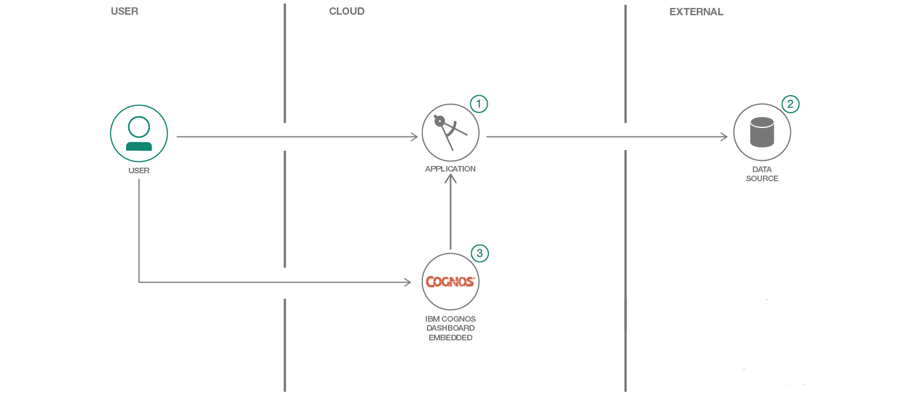

# 動的ダッシュボード・アプリケーションを構築する

### AngularJS と Node.js のデモ・アプリを通して Cognos Dashboard Embedded サービスを理解する

English version: https://developer.ibm.com/patterns/./build-a-dynamic-dashboard-application
  ソースコード: https://github.com/IBM/cognos-dashboard-demo

###### 最新の英語版コンテンツは上記URLを参照してください。
last_updated: 2018-05-28

 
## 概要

膨大な量のデータの意味を理解して効率的に使用するには、視覚化が役立ちます。視覚化プラットフォームは、データを小さいグループに分割してダッシュボード上に表示します。このように表示されたデータは理解しやすく、視覚的にも興味深いものになります。開発者がこうした視覚化を利用すれば、データ分析によって得た結果を理解しやすいアプリケーションを構築できます。アプリケーションに視覚化機能と分析機能を追加する手段としては、この Angular 5 と Node.js のデモ・アプリでデモンストレーションする、IBM Cognos Dashboard Embedded という IBM Cloud のサービスを利用できます。

## 説明

最近作成されているアプリケーションは事実上すべて、膨大な量のデータに依存しています。開発者は、こうした大量のデータを利用して、特定の分野におけるユーザーの洞察をさらに深める方法さえわかれば、これを実現できます。データの力を利用してユーザーに最大限の価値をもたらすためには、アプリケーション開発者がアナリティクスと視覚化を使用してロー・データを強化できるようでなければなりません。

そこで、このコード・パターンでは、IBM Cognos Dashboard Embedded の力をデモンストレーションする Angular 5 と Node.js のデモ・アプリの実行方法を説明します。IBM Cognos Dashboard Embedded は、アプリケーションに視覚化とアナリティクスを追加する手段として利用できる IBM Cloud サービスです。

IBM Cognos Dashboard Embedded では、データをユーザーに表示する方法について、開発者がさまざまなレベルの粒度で選択できるようになっています。あらかじめ用意されている既定のダッシュボードを使用して、ユーザーがガイドに従って分析を調査できるようにすることも、ユーザーが独自の洞察を見つけられるような自由な形の分析調査環境を提供することも、あるいはその中間のほぼあらゆる方法をとることができます。IBM Cognos Dashboard Embedded は IBM Cloud サービスとして提供されているため、堅牢で強力な視覚化機能とアナリティクス機能を迅速にアプリケーションに統合できます。

このデモ・アプリは、IBM Cognos Dashboard Embedded サービスの機能をデモンストレーションし、API の使用方法を説明するためのものです。このコード・パターンをひと通り完了すると、以下の方法がわかるようになります。

* Cloud Foundry アプリをデプロイする
* IBM Cognos Dashboard Embedded セッションを初期化して構成する

## フロー

1. ユーザーがアプリケーションを作成します。
2. アプリケーションがデータ・ソースに接続されます。
3. ユーザーが Cognos Dashboard Embedded サービスを構成して、このサービスがデータ・ソースを読み取り、DDE をアプリケーションに統合するようにします。

## 手順

以下に、デモ・アプリをデプロイする手順を要約します。デモ・アプリを構成して実行するための完全な手順については、プロジェクトの [README](https://github.com/IBM/cognos-dashboard-demo/blob/master/README.md) ファイルを参照してください。

1. [IBM Cloud](https://cloud.ibm.com/?cm_sp=ibmdev-_-developer-patterns-_-cloudreg) 内で Node.js Cloud Foundry アプリケーションを新規に作成します。
1. manifest.yml と、環境および構成の値を更新します。
1. npm run build または npm run build-prod を使用してローカルでアプリケーションをビルドします。
1. カレント・ディレクトリーを app フォルダーに変更します。
1. コマンド bx api [US South](https://api.ng.bluemix.net) を実行して API エンドポイントを設定します。
1. コマンド bx login を実行してログインします。
1. プロンプトに従って、IBM Cloud 資格情報を入力し、アカウントを選択し、Cloud Foundry のターゲット組織/スペースを指定します。
1. コマンド bx cf push を実行してアプリケーションをプッシュします。

