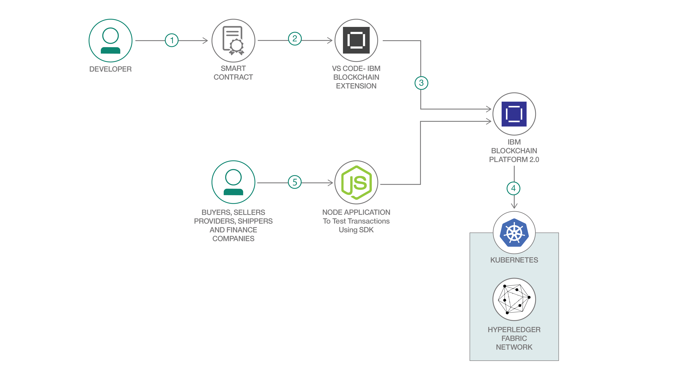

# ブロックチェーン・ベースの国際金融向けアプリケーションを作成する

### IBM Blockchain Platform と IBM Kubernetes Service を利用して国際金融向け Node.js アプリを作成する

English version: https://developer.ibm.com/patterns/./build-a-global-finance-application-on-blockchain
  ソースコード: https://github.com/IBM/Global-Finance-on-Blockchain

###### 最新の英語版コンテンツは上記URLを参照してください。
last_updated: 2019-07-31

 
## 概要

ブロックチェーンというセキュアな分散型のオープン・テクノロジーを利用すれば、コスト削減、プロセスの高速化、そしてトランザクション・アプリケーションの信頼性の確立に役立ちます。買い手、売り手、プロバイダー、運送会社、金融会社などのさまざまな参加者の間で商品購入のトランザクションが行われる国際金融の使用ケースにおいては、信頼と紛争解決が大きな懸念事項になります。この開発者コード・パターンでは、こうした参加者間のアクションを追跡するアプリケーションを作成し、業種を問わずに適用できる紛争解決方法を説明します。このコード・パターンで取り上げる使用ケースには、Node.js スマート・コントラクトと Node.js Web アプリケーションを使用します。

## 説明

国際金融の使用ケースには、買い手、売り手、プロバイダー、運送会社、金融会社などのさまざまな参加者が関わってきます。これらの参加者は、次のアクションを行います。

* **買い手**: 商品を注文します。
* **売り手**: 注文された商品についてプロバイダーに問い合わせます。
* **プロバイダー**: 注文された商品を提供します。
* **運送会社**: 注文された商品を配送します。
* **金融会社**: 売り手への決済処理を行います。

参加者の数と、実行されるさまざまなタイプのトランザクションを踏まえると、この使用ケースは、ブロックチェーンが提供するスマート・コントラクトと分散型レジャーによる紛争解決を説明するのに理想的です。このような使用ケースに採用される従来の手法とは対照的に、ブロックチェーンを使用すると、紛争解決の時間を短縮化することもできます。

このコード・パターンで説明する手順では、まず、国際金融向けスマート・コントラクトを IBM Blockchain Platform 上のネットワークにデプロイします。次に、Node.js アプリケーションを使用してネットワークをテストします。この Node.js アプリケーションは、ネットワーク上のさまざまな参加者に応じた個別のビューを作成して、国際金融での使用ケースを明らかにします。

このコード・パターンを完了すると、以下の方法がわかるようになります。

* IBM Blockchain Platform VS Code 拡張機能を使用して、ブロックチェーン・スマート・コントラクトをパッケージ化する
* IBM Blockchain Platform 上に Hyperledger Fabric ネットワークをセットアップする
* IBM Blockchain Platform を使用してスマート・コントラクト・パッケージをインストールし、インスタンス化する
* ブロックチェーン・ネットワークをテストするために、Node.js アプリケーションで Hyperledger Fabric SDK を使用してデプロイ済みネットワークとやりとりし、トランザクションを実行する

## フロー

1. ブロックチェーン・オペレーターが GitHub リポジトリーのクローンを作成して、Global Finance on Blockchain スマート・コントラクトを入手します。
1. ブロックチェーン・オペレーターが IBM Blockchain Platform VS Code 拡張機能を使用して、スマート・コントラクトをパッケージ化します。
1. ブロックチェーン・オペレーターが IBM Blockchain Platform サービスをセットアップして起動します。
1. IBM Blockchain Platform を使用して IBM Kubernetes Service 上に Hyperledger Fabric ネットワークを作成し、そのネットワーク上に Global Finance on Blockchain スマート・コントラクトをインストールしてインスタンス化できるようにします。
1. ユーザー (買い手、売り手、プロバイダー、運送会社、金融会社) の間では Node.js アプリケーションを使用してやりとりが行われます。Node.js アプリケーションは Fabric SDK を使用して、IBM Blockchain Platform 上にデプロイされたネットワークとやりとりし、トランザクションを実行します。

## 手順

このコード・パターンに取り組む準備はできましたか？詳しい手順については、[README](https://github.com/IBM/Global-Finance-on-Blockchain/blob/master/README.md) を参照してください。手順の概要は以下のとおりです。

1. リポジトリーのクローンを作成します。
1. スマート・コントラクトをパッケージ化します。
1. IBM Cloud サービス・インスタンスを作成します。
1. ネットワークを構築します。
1. 国際金融向けスマート・コントラクトをネットワーク上にデプロイします。
1. アプリケーションをネットワークに接続します。
1. アプリケーションを実行します。
