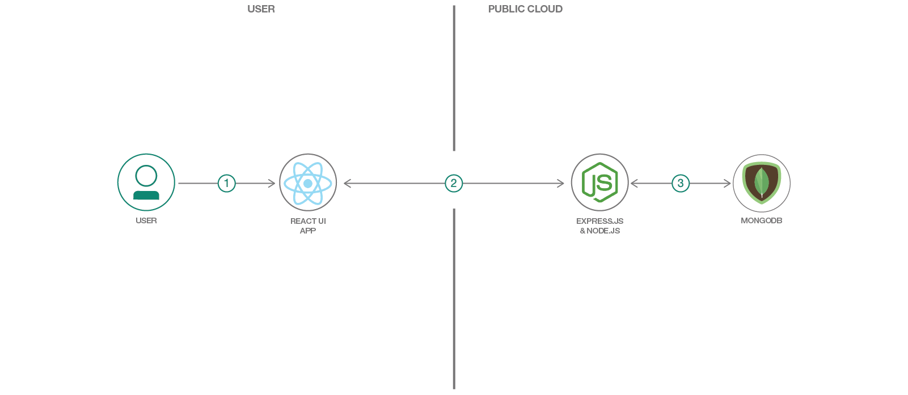

# MERN Web アプリを構築する

### IBM Cloud を使用して MERN (Mongo、Express、React、Node) Web アプリケーションを生成、構築、デプロイする

English version: https://developer.ibm.com/patterns/./build-a-mern-web-app
  ソースコード: https://github.com/IBM/mern-app

###### 最新の英語版コンテンツは上記URLを参照してください。
last_updated: 2018-11-08

 ## 概要

このコード・パターンでは、MERN (Mongo、Express、React、Node) Web アプリを IBM Cloud にデプロイします。スターター・キットを使用すれば、ものの数分でアプリをデプロイできます。あるいは、チュートリアルに従って数ステップでデプロイすることもできます。デプロイした MERN アプリは、数回クリックするだけで Kubernetes 上または Cloud Foundry 上 (どちらを選ぶかは、お任せします！) で実行中の状態になります。

## 説明

MERN スタックとそのバリアント (MEAN および MEVN) が Web 開発に与えた大きな影響として、クライアント・サイドとサーバー・サイドの両方で言語を統一できるようになったこと、どこででも JSON を使用できるようになったこと、オープンソースの NoSQL データベースを利用できるようになったことなど、多数のメリットが挙げられます。現在の Web 開発者にとって、MEAN/MERN スタックは不可欠のものとなっています。

このコード・パターンでは、アプリを数分で IBM Cloud にデプロイすることを最終目標に、MERN スタックを使用して事前構成された Web アプリを作成する方法を説明します。IBM Cloud Developer Tools CLI を使用すると構成ステップが減ります。したがって、このアプリケーションはローカルで実行することもできます。

このコード・パターンを完了すると、以下の方法がわかるようになります。

* MongoDB、Express.js、React、Node.js を使用するアプリケーションを構築する
* App Metrics を使用してモニタリングと分散トレースを行うアプリケーションを作成する
* IBM Cloud Developer Tools CLI を使用してアプリケーションをデプロイするか、Kubernetes または Cloud Foundry を使用してネイティブにデプロイする

## フロー

1. ユーザーがブラウザーで React Web アプリを表示します。
1. React フロントエンドと Express バックエンドはどちらも Node.js で作成されています。この 2 つのコンポーネントが RESTful API を介して通信します。
1. バックエンドの Express アプリケーションは Mongo データベースを使用してデータを保管、取得します。
1. バックエンドの結果がフロントエンドに返されます。
1. フロントエンドの結果は、人間が読んで理解できる形式でユーザーに表示されます。

## 手順

このパターンに取り組む準備はできましたか？詳細な手順については、[README](https://github.com/IBM/mern-app/blob/master/README.md) を参照してください。
