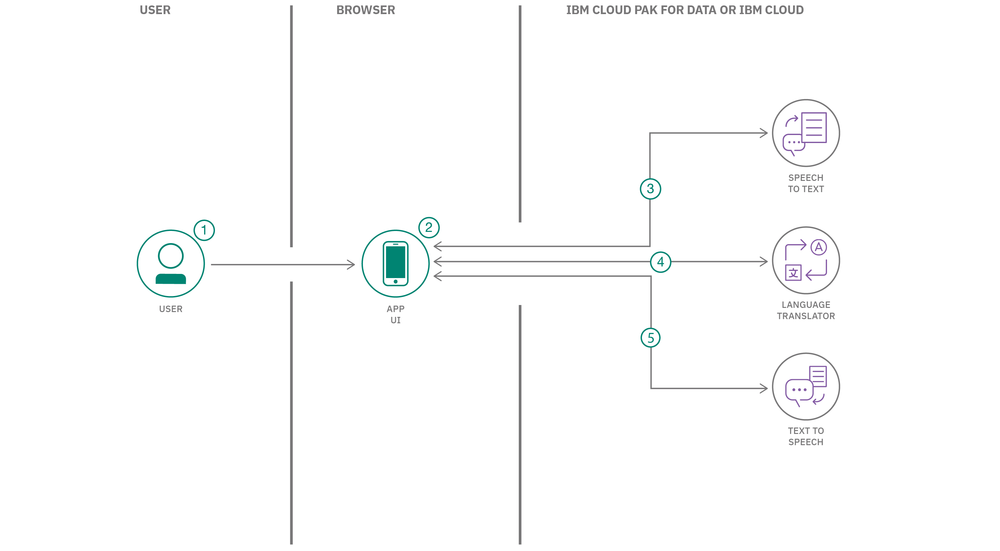

# 聴いて発話できるリアルタイムの翻訳アプリを作成する

### 音声認識、言語翻訳、音声合成を使用して、多言語トランスレーターとして利用できる Web アプリを作成する

English version: https://developer.ibm.com/patterns/build-a-real-time-translation-service-with-watson-api-kit
  ソースコード: https://github.com/ibm/watson-speech-translator

###### 最新の英語版コンテンツは上記URLを参照してください。
last_updated: 2020-02-08

 
_[2020 Call for Code Global Challenge](https://developer.ibm.com/jp/callforcode/) を構成するコンテンツであるこのコード・パターンは、[IBM Cloud](https://cloud.ibm.com/registration?cm_sp=ibmdev-_-developer-patterns-_-cloudreg) 上で実行することができます。_

## 概要

Node.js と React コンポーネントを使用して、パーソナル・トランスレーターとして使用できる Web アプリを作成します。このアプリではマイクで拾った音声をテキストに書き起こして翻訳し、合成してからヘッドフォンに送り出すために、IBM&reg; Watson&trade; Speech to Text、Watson Language Translator、Watson Text to Speech の各サービスを利用します。これらの Watson サービスは IBM Cloud 上で利用できる他、[IBM Cloud Pak for Data](https://www.ibm.com/jp-ja/products/cloud-pak-for-data) 上に用意されている [Watson API Kit](https://www.ibm.com/jp-ja/watson/products-services) にも含まれています。このコード・パターンでは、IBM Cloud 上で Watson サービスを実行する場合と、Watson API Kit に含まれている Watson サービスを実行する場合の手順を両方とも説明しています。

## 説明

React コンポーネントと Node.js サーバーで構成された、この言語翻訳 Web アプリは、音声入力をキャプチャーして Watson Speech to Text サービスにストリーミングします。入力された音声から書き起こされたテキストは、Watson Language Translator サービスに送信されて、ユーザーが選択した言語に翻訳されます。書き起こされたテキストと翻訳されたテキストは両方ともリアルタイムでアプリに表示されます。翻訳されて完成したフレームのそれぞれは Watson Text to Speech サービスに送信されて、ユーザーが選択したロケール固有の音声で発話されます。

リアルタイムのテキスト書き起こし/翻訳と「完成したフレーズ」の読み上げを理解するのに最も効果的な方法は、実際に試してみることです。テキストは単語やフレーズが終わるときに更新され、コンテキストに沿った把握が向上することがわかるはずです。音声のバックトラッキングや重複を回避するために、完成したフレーズだけが読み上げられます。通常、読み上げられるのは、小休止で区切られた短いセンテンスまたは発話です。

ライブで体験するのに最適な方法として、ヘッドフォンを装着して、マイクで拾った音声を翻訳したバージョンを聴いてください。あるいは、最初は翻訳せずにトグル・ボタンを使って録音、テキスト書き起こしを行うこともできます。準備ができたら、言語と音声を選択し、翻訳 (および音声) を有効にします。

このコード・パターンを完了すると、以下の方法がわかるようになります。

* WebSocket を使用して音声を Watson Speech to Text サービスにストリーミングする
* REST API を使用して Watson Language Translator サービスを利用する
* REST API を使用して、Watson Speech to Text サービスから音声を取得し再生する
* Watson Speech to Text、Watson Language Translator、および Watson Text to Speech サービスを Web アプリに統合する
* React コンポーネントと Node.js サーバーを使用する

## フロー

1. ユーザーがマイクのボタンを押して、入力音声をキャプチャーします。
1. WebSocket を使用して音声が Speech to Text サービスにストリーミングされます。
1. Speech to Text サービスによって書き起こされたテキストが表示され、更新されます。
1. 書き起こされたテキストが Language Translator に送信され、翻訳されたテキストが表示、更新されます。
1. 完成したフレーズが Text to Speech に送信され、生成された音声が自動的に再生されます。

## 手順

このパターンの詳細な手順については、[README](https://github.com/IBM/watson-speech-translator/blob/master/README.md) ファイルを参照してください。手順の概要は以下のとおりです。

1. Watson サービスをプロビジョニングします。
1. サーバーをデプロイします。
1. Web アプリを使用します。
