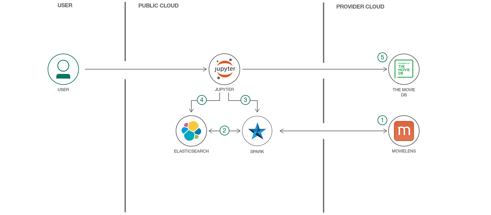

# Apache Spark と Elasticsearch を使用してレコメンダーを作成する

### Apache Spark と Elasticsearch によるレコメンデーション・モデルのトレーニングおよび運用方法をデモンストレーションする Jupyter Notebook を実地検証する

English version: https://developer.ibm.com/patterns/./build-a-recommender-with-apache-spark-and-elasticsearch
  ソースコード: https://github.com/IBM/elasticsearch-spark-recommender

###### 最新の英語版コンテンツは上記URLを参照してください。
last_updated: 2019-03-28

 
## 概要

レコメンデーション・エンジンは、機械学習を適用する価値が最もあり、最もよく知られていて最も広まっている使用ケースの 1 つです。レコメンデーション・モデルのトレーニングの基礎について説明するリソースは多数ありますが、これらのモデルを実際にデプロイして大規模なレコメンダー・システムを作成する方法について説明しているリソースは、比較的数が限られています。

## 説明

この開発者向けパターンでは、Apache Spark と Elasticsearch を使用して、レコメンダー・システムを構成する主要な要素について説明します。Jupyter Notebook を使用した実演により、Spark を使用して Elasticsearch 内に保管されている評価データを基に協調フィルタリング・レコメンデーション・モデルをトレーニングし、トレーニング後のモデル因子を Elasticsearch に保管し、Elasticsearch でそのモデルを使用してリアルタイムのレコメンデーションを提供する方法を説明します。

このパターンをひととおり完了すると、以下の方法がわかるようになります。

* Elasticsearch Spark コネクターを使用して、ユーザー・イベント・データを Elasticsearch に取り込み、インデックスを付ける
* イベント・データを Spark DataFrames にロードし、Spark の機械学習ライブラリー (MLlib) を使用して協調フィルタリング・レコメンデーション・モデルをトレーニングする
* トレーニング後のモデルを Elasticsearch にエクスポートする
* カスタム Elasticsearch プラグインを使用して、パーソナライズされたユーザーおよび同様のアイテムのレコメンデーションを算出し、これらのレコメンデーションを検索およびコンテンツ・フィルタリングに結合する

## フロー

1. 映画に関するデータ・セットを Spark にロードします。
1. Spark DataFrame のデータ処理を使用して、データ・セットをクリーンアップしてから Elasticsearch にロードします。
1. Spark MLlib を使用して、協調フィルタリング・レコメンデーション・モデルをトレーニングします。
1. トレーニング後のモデルを Elasticsearch に保存します。
1. Elasticsearch のクエリーとカスタム・ベクター・スコアリング・プラグインを使用して、いくつかのサンプル・レコメンデーションを生成します。Movie Database API を使用して、おすすめの映画のポスター画像を表示します。
