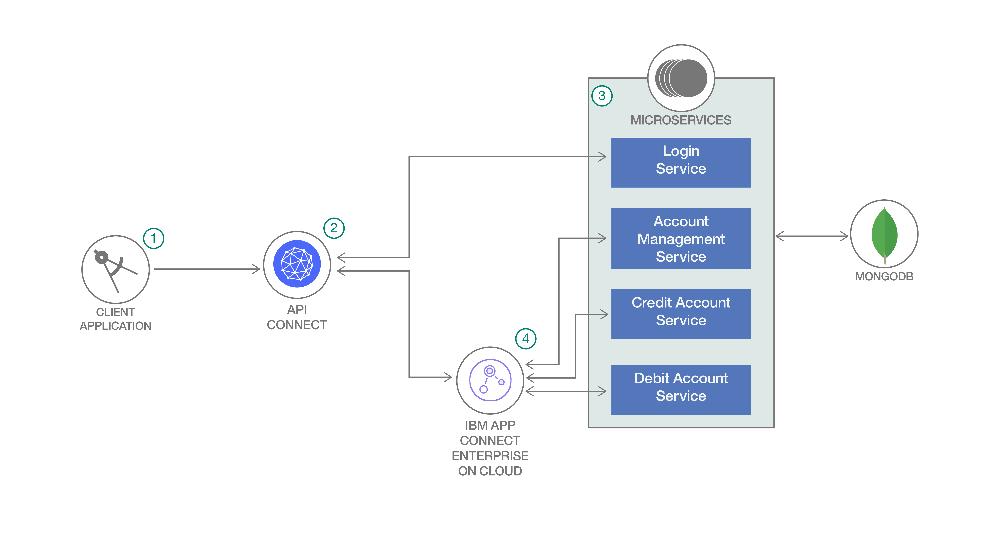

# セキュアなマイクロサービス・ベースのバンキング・アプリケーションを構築する

### OAuth 機能としての API Connect、App Connect の API オーケストレーション、Node.js を利用してバンキング・アプリケーションを開発する

English version: https://developer.ibm.com/patterns/build-a-secure-microservices-based-application-with-transactional-flows
  ソースコード: https://github.com/IBM/microservices-using-apiconnect-and-appconnect

###### 最新の英語版コンテンツは上記URLを参照してください。
last_updated: 2020-08-25

 
## 概要

このコード・パターンでは、個人の銀行取引を使用ケースのシナリオとして、マイクロサービスのセキュリティーとオーケストレーションについて説明します。

## 説明

マイクロサービス・ベースのソリューションに共通の要件は、ワークフローのセキュリティーとオーケストレーションです。IBM API Connect を利用してマイクロサービスに対する OAuth ベースの認証および許可に対処し、IBM App Connect を利用して (コードを一切使わずに) API をアプリケーションにシームレスに統合することで、ユーザーが資金を移動するために使用できる、セキュアなマイクロサービス・ベースの個人向けバンキング・アプリケーションを構築することができます。

このコード・パターンに従うことで、以下の方法を理解できます。

* API Connect 内で OAuth を使用して認証と許可を行う
* App Connect を利用して API をオーケストレーションする
* Node.js マイクロサービスをビルドして [IBM Cloud Kubernetes Service](https://www.ibm.com/jp-ja/cloud/container-service) 上にデプロイする
* Node-RED を使用してクライアント・アプリケーションを開発する

## フロー

1. ユーザーがクライアント・アプリケーションにログインします。
1. ログイン・リクエストが API Connect に送信されます。
1. API Connect が Login API (IBM Kubernetes Service 上にデプロイされて MongoDB とやり取りするマイクロサービス) を使用して認証を行ってから、アクセスを許可するための OAuth トークンを生成します。
1. ユーザーが OAuth トークンを使用して資金移動トランザクションを呼び出します。トランザクション・リクエストが App Connect に送信されます。App Connect は内部で `Account Management` API、`Credit Account` API、`Debit Account` API (いずれも IBM Kubernetes Service 上にデプロイされて MongoDB とやり取りするマイクロサービス) を使用してリクエストに対処します。

## 手順

このコード・パターンに取り組む準備はできましたか？このアプリケーションを起動して使用する方法について詳しくは、[README](https://github.com/IBM/microservices-using-apiconnect-and-appconnect/blob/master/README.md) を参照してください。
