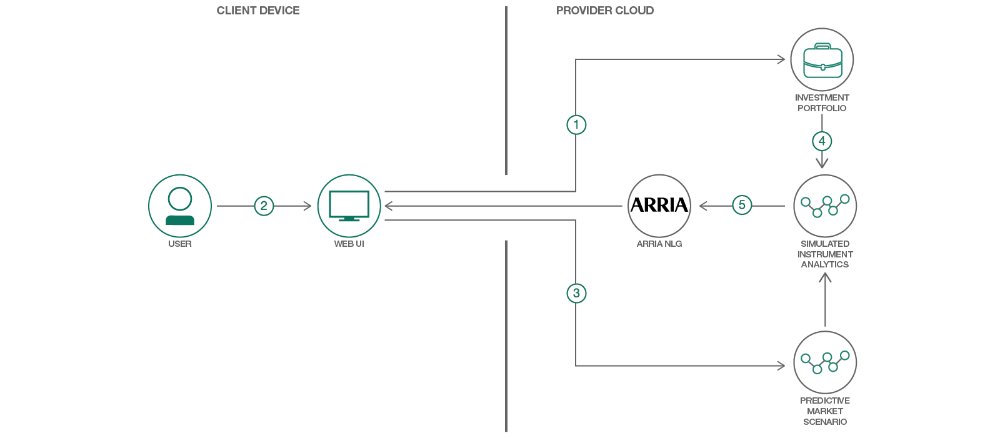

# 自然言語生成を使用した金融ストレス・テスト・アプリを構築する

### さまざまなクラウド・サービスと Arria NLG を利用して、投資ポートフォリオのストレス・テスト・アプリを作成する

English version: https://developer.ibm.com/patterns/build-a-stress-test-app-for-financial-portfolios

ソースコード: https://github.com/IBM/predictive-market-using-arria

###### 最新の英語版コンテンツは上記URLを参照してください。
last_updated: 2018-02-14

 ## 概要

最近の不安定な経済情勢のなか、投資家は投資ポートフォリオ上のさまざまな市況の影響を今まで以上に深く理解する必要に迫られています。そこで、このコード・パターンでは投資ポートフォリオのストレス・テスト・アプリを作成する方法を紹介します。このアプリには、付加価値として自然言語生成 (NLG) を統合し、詳細でわかりやすく作成されたポートフォリオ分析結果を生成できるようにします。

## 説明

金融市場は絶えず変化しています。投資ポートフォリオを所有している誰もが知っているように、市場の動きを観察していても、その変化が投資ポートフォリオにどのような影響を与えるかがわからなければ、非常にストレスが溜まります。

開発者にとって、多岐にわたる状況下でポートフォリオのパフォーマンスがどのように変わってくる可能性があるかについて、洞察を引き出し、正確に予測するのは大きな課題です。さらに、ファイナンシャル・アドバイザーはもとより、一般の人々でも簡単に理解できる結果を提示する必要もあります。複雑なアプリケーションを作成しても、そのアプリケーションによって生成されるデータやレポートを解釈することが、情報を必要とする人々にとって困難であっては意味がありません。

このコード・パターンでは、さまざまなサービスを組み合わせて利用することで、ストレス・テストを計算する方法を説明します。具体的には、Investment Portfolio サービス内に維持された投資データ・セットに、Predictive Market Scenario サービスと Simulated Instrument Analytics サービスを適用します。さらに Arria NLG サービスを利用して、テキスト形式のレポートという形で分析結果の解説文を生成します。

Investment Portfolio サービスは、適格投資、ベンチマーク、ユーザー・ポートフォリオといった、ポートフォリオおよび有価証券情報を管理、保管するサービスです。Predictive Market Scenarios サービスは、別の潜在的市場状況を表すシナリオを生成します。生成されたシナリオは、Simulated Instrument Analytics サービスを利用して Investment Portfolio サービス内の資産に適用することができます。

このパターンで生成する結果には、市場リスク要因 (金利、株価指数、外国為替相場など) の間で観測された相関関係と共分散、ユーザー定義のマーケット・ショックを基に予測された潜在的変動、投資ポートフォリオに含まれる資産ごとの損得が含まれます。このようなストレス・テストによる結果を解釈したり、解析して意味を理解したりするのは簡単なことではありません。そこで、自然言語生成も実装します。複雑なデータを悪戦苦闘して調べるのではなく、結果を Arria NLG サービスに渡し、人間が読んで理解できる結果の解説文を生成するという仕組みです。

このパターンでは、高度な分析に、革新的な新しい NLG テクノロジーを統合する Web アプリを構築するために必要な手順を段階的に追っていきます。手順ではまず、単純化したユーザー・インターフェースを作成して、ユーザーが観測したいタイプのストレスに関する情報を収集する方法を説明します。次に、チャートとグラフで表した結果と併せて表示する解説文を生成します。金融関係の開発環境で必要とされる、革新的かつ実用的なスキルを身に付けることを目指す開発者にとって、このパターンは出発点となります。

## フロー

1. アプリケーションを実行する前に、ユーザーが Investment Portfolio サービスにポートフォリオ固有の情報をシードします。
2. ユーザーが Web インターフェースにポートフォリオの内容、リスク要因、ショックの規模などの情報を入力します。
3. IBM Cloud Predictive Market Scenario サービスが、リスク要因とショックの規模の入力からシナリオを生成します。
4. IBM Cloud Simulated Instrument Analytics サービスが前のステップで生成されたシナリオを使用して、ポートフォリオに含まれる持ち株ごとにストレス値を計算します。
5. 結果が Arria NLG サービスに渡されて解説文が生成され、その解説文が数値の結果と併せてユーザーに返されます。

## 手順

このパターンの詳細な技術的手順については、GitHub リポジトリーの [README](https://github.com/IBM/predictive-market-using-arria/blob/master/README.md) を参照してください。手順の概要は以下のとおりです。

1. Arria サービスを作成します。
2. 一連の IBM Cloud サービス:を作成します。
3. リポジトリーを複製します。
4. .env ファイルを構成します。
5. 投資ポートフォリオをロードします。
6. アプリケーションを実行します。
7. アプリケーションを IBM Cloud にデプロイします。

