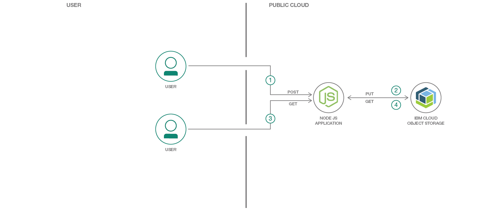

# クラウド内で画像ギャラリー・アプリを作成する

### クラウド上のオブジェクト・ストレージとやり取りする単純な Web アプリケーションのサンプル・コード

English version: https://developer.ibm.com/patterns/build-a-web-gallery-app-in-the-cloud
ソースコード: https://github.com/IBM/cos-web-gallery

###### 最新の英語版コンテンツは上記URLを参照してください。
last_updated: 2018-09-26

 
## 概要

クラウド内の Object Storage の使用方法を明らかにするには、このコード・パターンを使用して単純な Web ギャラリー・アプリケーションを作成してください。クラウド上に作成したアプリケーションにすべての写真を移せば、ハード・ドライブ上のストレージ容量を解放できます。

## 説明

Cloud Object Storage 内の Web Gallery は、IBM Cloud 上で稼働する単純な Node.js アプリです。このアプリでは Express フレームワークを使用して、Cloud Object からデータをプルし、単純な Web フォームで Cloud Object にデータをプッシュできる基本的な 2 層の Web アプリを作成しています。このリンク先の「[Tutorial: Image Gallery](https://cloud.ibm.com/docs/services/cloud-object-storage/tutorials/web-application.html)」を参照してください。

サーバー・サイドのアプリの中核となっているのは、Node.js IBM Cloud Object Storage SDK パッケージです。このパッケージで、Cloud Object Storage に対する認証と接続に対応します。また、Express でルーティングを処理することによって、コントローラーでビジネス・ロジックを処理できるようにします。アップロード・フォームによって画像が Express ルートにアップロードされると、IBM Cloud Object Storage SDK の multer および multer-s3 関数が呼び出され、指定された Cloud Object Storage バケットに画像がアップロードされます。画像ギャラリーのビューに対するリクエストにより、Cloud Object Storage SDK の関数が呼び出され、バケット内の各画像の URL が取得されます。この URL データがレスポンス内で返されて、ビューのレンダリング時に EJS ビュー・テンプレートにマージされます。

このコード・パターンを完了すると、以下の方法がわかるようになります。

* Node.js アプリをデプロイする (必要に応じて、Cloud Foundry を使用できます)
* Cloud Object Storage のサービス・インスタンスをプロビジョニングする
* Node.js IBM Cloud Object Storage SDK を使用して Cloud Object Storage とやり取りする

## フロー

1. 画像ギャラリー・アプリのユーザーが、画像アップロード・フォームを使用してアップロードするイメージを選択し、*「Upload (アップロード)」*をクリックします。
2. フォームがアプリに対して POST リクエストを実行します。すると、アプリが S3 SDK を使用して IBM Cloud Object Storage サーバーに対する PUT リクエストを生成します。
3. 画像ギャラリー・アプリのユーザーが「Gallery (ギャラリー)」タブをクリックすると、アプリに対してギャラリー・ビューの GET リクエストが実行されます。
4. アプリが S3 SDK を使用して GET リクエストを実行し、IBM Cloud Object Storage バケット内に保管されている画像の画像 URL を取得します。画像 URL がレスポンス内で渡されて、ビュー・テンプレートにマージされます。このテンプレートがレンダリングされて、ユーザーに画像が表示されます。

## 手順

このコード・パターンに関する詳細な手順は、GitHub リポジトリー内にある [README.md](https://github.com/IBM/cos-web-gallery/blob/master/README.md) ファイルに記載されています。手順の概要は以下のとおりです。

1. アプリを IBM Cloud にデプロイします。
2. アプリをローカルで実行できるよう準備するために、まずリポジトリーを複製します。
3. IBM Cloud Object Storage を構成します。
4. アプリケーションを実行します。
