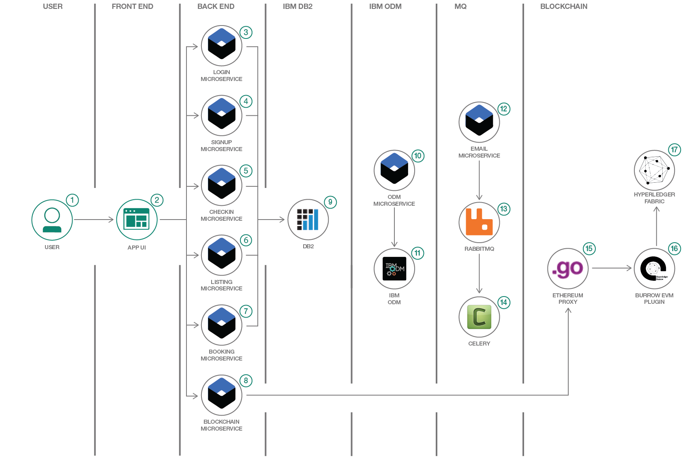

# プライベート・クラウド上にフライト予約プラットフォームを構築する

### Node.js をベースに、マイクロサービス・アーキテクチャーを使用したサンプル・フライト予約アプリケーションを作成し、作成したアプリケーションを IBM Cloud Private 上にデプロイする

English version: https://developer.ibm.com/patterns/build-an-airline-booking-platform-on-a-private-cloud

ソースコード: https://github.com/IBM/icp-airways

###### 最新の英語版コンテンツは上記URLを参照してください。
last_updated: 2018-08-14

 
## 概要

最近は開発者たちの耳に、クラウド・ネイティブのアプリケーションに関するさまざまな情報が入ってきます。こうしたクラウド・ネイティブの世界で評判も需要も高くなってきているテクノロジーとしては、Kubernetes と Docker が挙げられます。完全にフルスタックのマイクロサービス・アプリケーションを必要としていて、ブロックチェーンの実装によってクラウド・ネイティブのアプリを構築したいとしたら、このコード・パターンが絶好の出発点となります。このコード・パターンでは、Hyperledger Fabric 上で Ethereum スマート・コントラクトを使用して、許可制ブロックチェーンを簡単に利用できるようにするための手順を案内します。また、極めてスケーラブルな Kubernetes ベースの最新のツールを紹介し、データ・ストレージとビジネス・ルールを統合する方法を説明します。

## 説明

このコード・パターンで紹介しているのは、プライベート・クラウド上で高可用性を備えたクラウド・ネイティブのアプリを構築する方法です。具体的には、Node.js と IBM DB2 をベースにアプリのバックエンドを作成します。ルール・ベースのビジネス意思決定は、IBM Operational Decision Manager を使用して設計します。フロントエンドは、Angular4 を使用して作成します。分散型の非同期タスク・キューは、RabbitMQ と Celery をベースに作成します。さらに Kubernetes によってコンテナー・オーケストレーションを管理します。そして最後に、Hyperledger Fabric、Hyperledger Burrow、Ethereum スマート・コントラクトをベースにブロックチェーンを作成します。

このコード・パターンでは、マイクロサービス・アーキテクチャーと IBM ミドルウェアをベースに、12 Factor App 手法として以下のテクノロジーを使用したクラウド・ネイティブのサンプル・アプリケーションを構築します。このサンプル・アプリケーションは、フライト予約プラットフォームです。

* Node.js (Typescript)
* IBM DB2
* IBM Operational Decision Manager (ODM)
* RabbitMQ
* Celery
* Angular
* Hyperledger Fabric
* Hyperledger Burrow
* Solidity
* Docker
* Kubernetes
* IBM Cloud Private

このコード・パターンを完了すると、以下の方法がわかるようになります。

* アプリケーションを個別のマイクロサービスに分割する
* マイクロサービス・ベースのアプリケーションを IBM Cloud Private 上にデプロイする
* Kubernetes 上で IBM ODM や IBM DB2 などのミドルウェアを使用する
* IBM ODM 用にビジネス・ルールと意思決定を設計する
* RabbitMQ と Celery を使用して分散型タスク・キューを作成する
* DB2 をバックエンドのデータ・ストレージとして使用する
* Hyperledger Burrow を使用して Ethereum スマート・コントラクトを Hyperledger Fabric 上にデプロイする
* IBM Cloud Private、Docker、Kubernetes を使用する

## フロー

1. ユーザーがサンプル・フライト予約アプリにアクセスします。
2. Angular4 を使用して作成されたユーザー・インターフェースでは、Restful エンドポイントを使用してバックエンドのマイクロサービスにアクセスするようになっています。
3. ユーザーがアプリケーションにログインするには、Login マイクロサービスを利用します。
4. ユーザーがフライト予約アプリケーションに登録するには、Signup マイクロサービスを利用します。
5. ユーザーが予約した特定のフライトにチェックインするには、Checkin マイクロサービスを利用します。
6. ユーザーが予約可能なフライトを一覧表示して閲覧するには、Listing マイクロサービスを利用します。
7. ユーザーが利用可能なフライトを予約するには、Booking マイクロサービスを利用します。
8. Blockchain マイクロサービスは、Ethereum プロキシーを介したブロックチェーンとの通信をサポートします。
9. ユーザーから入力されたデータと、マイクロサービスとのやり取りを示すデータは、SQL データベースである IBM DB2 内に保管されます。
10. ODM マイクロサービスは、IBM Operational Decision Manager (ODM) との通信をサポートします。
11. 高度なビジネス・ルール管理システムとしての IBM ODM を使用して、頻繁に行われる繰り返し可能なビジネス意思決定をキャプチャー、自動化、管理します。IBM ODM が日常的な業務にリアルタイムの意思決定機能を追加します。
12. Email マイクロサービスは RabbitMQ および Celery と通信して非同期キュー内の e-メールを送信します。
13. RabbitMQ はメッセージの送受信を仲介するメッセージング・ブローカーです。RabbitMQ はアプリケーションにとってはメッセージ送受信用の共通プラットフォームとなり、メッセージにとっては受信されるまで存続できる安全な場所となります。
14. Celery は、分散メッセージ送信手法をベースとする非同期タスク・キューまたはジョブ・キューです。
15. Ethereum プロキシーによって、Ethereum 仮想マシン (EVM) と通信します。
16. Hyperledger Burrow EVM チェーンコード・プラグインによって、Hyperledger Burrow を使用する Hyperledger Fabric に Ethereum 機能が追加されます。
17. Hyperledger Fabric は、モジュール式アーキテクチャーを使用してアプリケーションやソリューションを開発する基盤として意図されたブロックチェーン・フレームワーク実装です。The Linux Foundation によってホストされている Hyperledger プロジェクトのうちの 1 つとなっています。Hyperledger Fabric では、コンセンサスやメンバーシップ・サービスなどをプラグ・アンド・プレイ・コンポーネントとして使用できます。

## 手順

このコード・パターンに関する詳細な手順は、GitHub リポジトリー内にある [README.md](https://github.com/IBM/icp-airways/blob/master/README.md) ファイルに記載されています。手順の概要は以下のとおりです。

1. Docker (プライベート・レジストリー) を IBM Cloud Private に関連付けます。
2. すべての依存関係をインストールし、イメージを作成して IBM Cloud Private のプライベート・レジストリーにアップロードします。
3. kubesctl を IBM Cloud Private の Kubernetes に関連付けます。
4. IBM Cloud Private 内で永続ストレージを構成します。
6. IBM DB2 をデプロイしてデータベースを作成し、IBM DB2 を構成します。
7. RabbitMQ をデプロイします。
8. IBM Operational Decision Manager (ODM) をデプロイして構成し、ビジネス・ルールをロードします。
9. ブロックチェーンをデプロイします。
10. Ethereum プロキシーをデプロイします。
11. Kubernetes のシークレットを構成してデプロイします。
12. config-maps を構成してデプロイします。
13. すべてのサービスとデプロイメントを展開します。
