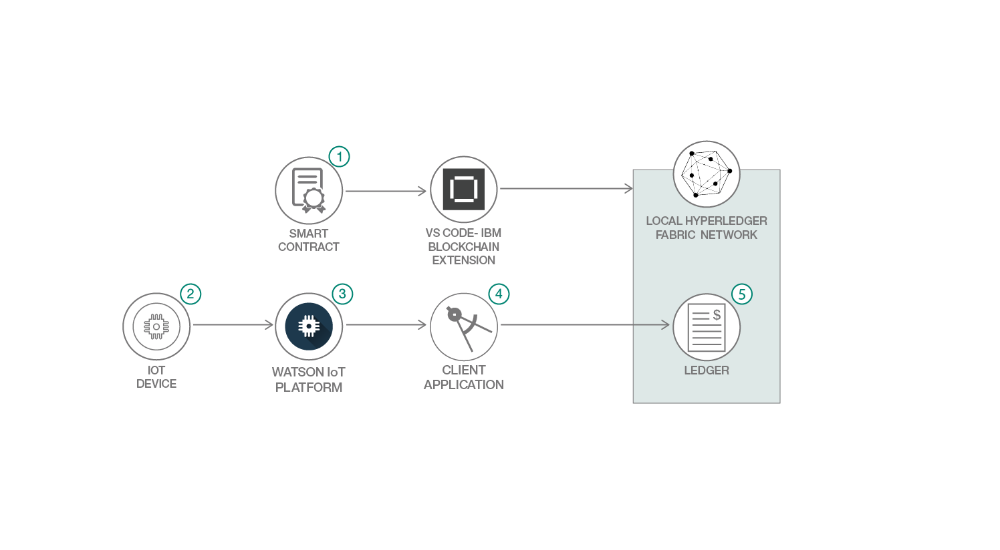

# ブロックチェーンと IoT を使用して、資産のライフサイクル管理とロケーション追跡に対応するアプリを構築する

### IBM Blockchain Platform の VS Code 拡張機能を使用してローカル Hyperledger Fabric ネットワークを作成する

English version: https://developer.ibm.com/patterns/build-an-asset-leasing-application-using-blockchain-and-iot
  
ソースコード: https://github.com/IBM/assetTracking

###### 最新の英語版コンテンツは上記URLを参照してください。
last_updated: 2019-05-20

 
## 概要

ブロックチェーンと IoT が組み合わさると、絶大な力を発揮します。この組み合わせにより、ビジネス・ネットワークのあらゆる関係者は資産がどのように移動したのかを正確に突き止めることができます。さらに、ブロックチェーンではすべてのデータが不変性を持つように記録されるため、関係者は情報が改ざんされていないと確信できます。このパターンでは、Node-RED を使用して作成された IoT デバイスをシミュレーションし、そのデバイスを使ってイベントをトリガーすることで、レジャー上に記録されている資産の現在の場所を更新します。

## 説明

このパターンでは、IBM Blockchain Platform の VS Code 拡張機能を使用してローカル Hyperledger Fabric ネットワークを作成する方法を説明します。この拡張機能を使用することで、簡単にスマート・コントラクトの開発を開始できます。

ここで作成するソリューションは、資産が作成された時点から削除される時点まで、そのライフサイクルを管理して記録するトラッキング・ソリューションです。また、資産リース契約の条項 (リース終了日、料金、保証金額など) を追跡する機能も作成し、リースの管理を可能にします。

IoT 統合には IBM Watson IoT Platform を利用して、移動される資産を各所でスキャンするデバイスを管理します。ここでは実際の物理デバイスを使用するのではなく、デバイスのように振る舞う Web アプリを作成します。そのアプリで資産のスキャンをトリガーし、ローカル Node.js アプリにイベントを通知することによって、`updateAssetLocation` トランザクションを呼び出します。

## フロー

1. IBM Blockchain Platform の VS Code 拡張機能を使用して、スマート・コントラクトをローカル Hyperledger Fabric ネットワークにデプロイします。
1. 資産がある場所から別の場所に移動されると、IoT デバイスが RFID またはバーコードによってその資産をスキャンします。このパターンでは、シミュレーションされたデバイスを使用します。
1. IoT デバイスがイベント通知を IBM Watson IoT Platform にプッシュします。すると、イベントを listen するすべてのアプリケーションに、IBM Watson IoT Platform から資産のスキャン・イベントが通知されます。
1. IBM Watson IoT Platform からのスキャン・イベントを listen するアプリケーションが、資産移譲トランザクションを呼び出します。
1. レジャー内に記録されている資産の場所が自動的に更新されます。

## 手順

このパターンの詳細な手順については、[README](https://github.com/IBM/assetTracking/blob/master/readme.md) ファイルを参照してください。
