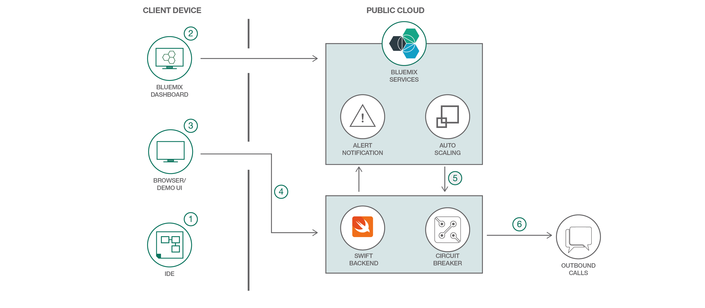

#  複数のサービスを利用するエンタープライズ Swift アプリを構築する

### 複数のサービスとライブラリーを利用するエンタープライズ Swift アプリケーションを構築してデプロイする

English version: https://developer.ibm.com/patterns/build-an-enterprise-swift-app-using-services
  
ソースコード: https://github.com/IBM/swift-enterprise-demo

###### 最新の英語版コンテンツは上記URLを参照してください。
last_updated:    2018-02-02

 ## 概要

Swift は、Apple のプラットフォームと Linux 向けの汎用プログラミング言語です。エンタープライズ Swift アプリケーションを IBM Cloud プラットフォームにデプロイする際に、アプリケーションでは複数のサービスとライブラリーを利用することができます。このコード・パターンでは、そのようなアプリケーションを構築する方法を紹介します。

## 説明

このコード・パターンでは、Swift アプリケーションを IBM Cloud プラットフォームにデプロイする際に、新しいエンタープライズ機能を実装する方法を説明します。これらの機能を実装するために利用するのは、Swift 言語対応の以下の IBM Cloud サービスとライブラリーです。

* Auto Scaling
* Alert Notification
* Circuit Breaker
* SwiftMetrics

アプリケーションをスケーリングする方法、重要なイベントが発生したときにアラートを受け取れるようにする方法、確実に失敗するアクションをアプリケーションが実行しないようにする方法を学んでください。このアプリケーションでは、メモリー使用量、HTTP 応答時間、および 1 秒あたりの HTTP リクエストの数を増減できるアクションをトリガーするための UI ウィジェットも提供します。

## フロー

1. アプリケーションを IBM Cloud にデプロイする前に、(任意の IDE を使用して) アプリケーション・コード内で Circuit Breaker ライブラリーの設定を構成します。
2. アプリケーションをデプロイした後、IBM Cloud 上でポリシーを作成して Auto-Scaling サービスと Alert Notification サービスをセットアップします。
3. このタスクを行うには、IBM Cloud ダッシュボードを使用します。デプロイ済みアプリケーションの操作は、ブラウザー内で行います。
4. 何らかのアクションを実行すると、UI によって Swift アプリケーションのバックエンド・コンポーネントが呼び出されます。
5. Auto-Scaling ポリシーの条件が満たされると、アプリケーションが IBM Cloud 内でスケーリングされます。アプリケーションの現在の状態に関するアラート通知が送信されると、Auto-Scaling ルールがトリガーされます。
6. エンドポイントに対するリクエストの失敗数に応じて、構成済みのエンドポイントに対し、Circuit Breaker ライブラリーがアクティブになります。

## 手順

Ready to put this code pattern to use? Complete details on how to get started running and using this application are in the [README](https://github.com/IBM/swift-enterprise-demo/blob/master/README.md).
