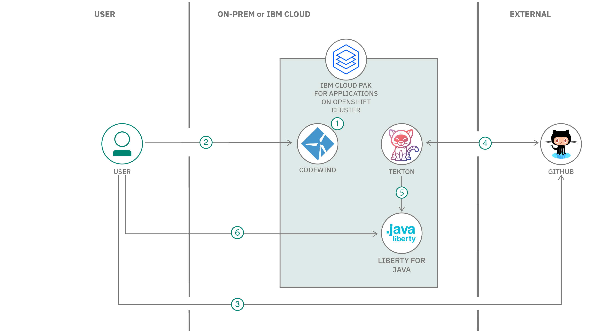

# IBM Cloud Pak for Applications を利用してクラウド・ネイティブの Java アプリケーションを構築してデプロイする

### Codewind を使用してクラウド・ネイティブの気象情報アプリケーションを Java で開発し、CI/CD Tekton パイプラインを使用してデプロイする

English version: https://developer.ibm.com/patterns/build-deploy-cloud-native-java-applications-using-ibm-cloud-pak-for-applications
  ソースコード: https://github.com/IBM/build-deploy-cloud-native-application-using-cp4a

###### 最新の英語版コンテンツは上記URLを参照してください。
# last_updated:

 
## 概要

IBM Cloud Pak for Applications を利用すれば、既存のアプリケーションをモダナイズしたり、短時間で価値をもたらすことのできる新しいクラウド・ネイティブのアプリケーションを開発したりできます。このコード・パターンでは、クラウド・ネイティブ・アプリケーションを開発し、CI/CD 機能を使用してそのアプリケーションを Red Hat OpenShift 上にデプロイする手順を通して、IBM Cloud Pak for Applications に備わっている Accelerators for Teams の機能を具体的に説明します。

## 説明

現在、多くの企業がさまざまなメリットを求めてクラウド・ネイティブ開発に移行しています。けれども、クラウド・ネイティブ開発のメリットを実現するためには、企業が克服しなければならない課題がいくつかあります。具体的には、エンタープライズ・ガバナンスを維持すること、そして新しいスキルを育成し、開発手法全体を変革するためにかかるコストです。

クラウド・ネイティブ・ソリューション向けの Accelerator for Teams は、クラウド・ネイティブ・アプリケーションの開発を迅速化するために設計されています。ビジネス問題を特定するところから本番環境対応のアプリケーションを開発するまでのプロセス全体に対応しています。また、一連のアプリケーション・スタック、統合された DevOps、さまざまな開発者向けツールによって、エンタープライズ・ガバナンスを維持できるようにしています。しかも、クラウド・ネイティブ・サービスをさらに短時間で提供できるよう、Accelerators for Teams はアプリケーションを Red Hat OpenShift クラスターにデプロイするために必要な開発プロジェクト、サービス、構成設定を自動的に生成します。開発チームに必要な作業は、ビジネス・ロジックをコーディングすることだけです。

開発者向け IDE では、Codewind を使用してアプリケーションを作成、ビルド、実行し、アプリケーションのプロファイルを作成できます。Tekton パイプラインでは、コードの開発中に発生するリポジトリー・イベントに反応して動作する、一貫性のある管理された CI/CD プロセスをアプリケーションに適用できます。

このコード・パターンで開発する、シンプルなインターフェースを備えたシンプルな Java アプリケーションは、場所の名前または緯度/経度を受け入れ、Open Weather API を使用して該当する場所の基本的な気象情報を表示します。

このコード・パターンを完了すると、以下の方法がわかるようになります。

* Eclipse 上の Codewind を使用してシンプルな Java アプリケーションを構築する
* IBM Cloud Pak for Automation の Tekton パイプラインを使用して、Java アプリケーションを OpenShift 上にデプロイする

## フロー

1. ユーザーが Codewind をインストールし、IBM によって管理される OpenShift クラスター上の IBM Cloud Pak for Applications が提供するスタック・ハブを追加します。
2. ユーザーが、プロジェクト・テンプレートを使用してアプリケーションを開発します。このテンプレートは、追加したスタック・ハブ内に用意されています。
3. ユーザーが開発したアプリケーション・コードを GitHub リポジトリーにプッシュします。
4. ユーザーが Tekton パイプラインを構成し、IBM Cloud Pak for Applications 上で GitHub Webhook を定義します。
5. GitHub リポジトリー内でコードの変更イベントが発生するたびに、Tekton パイプラインによってアプリケーションがビルドされ、OpenShift クラスターにデプロイされます。
6. ユーザーがデプロイ済みアプリケーションにアクセスします。

## 手順

このパターンの詳細な手順については、[readme](https://github.com/IBM/build-deploy-cloud-native-application-using-cp4a/blob/master/README.md) ファイルを参照してください。手順では、次のことを行う方法を説明します。

1. Codewind と Appsody をインストールします。
2. プロジェクト・テンプレートを Codewind に追加します。
3. Codewind 内でプロジェクトを作成します。
4. Open Weather API から API 鍵を取得します。
5. アプリケーションをローカルで実行します。
6. アプリケーションを IBM Cloud Pak for Applications にデプロイできるよう準備します。
7. アプリケーション・コードを GitHub リポジトリーにプッシュします。
8. GitHub に対して使用するトークンを作成します。
9. Tekton パイプラインを構成して実行します。
10. デプロイ済みアプリケーションにアクセスします。
