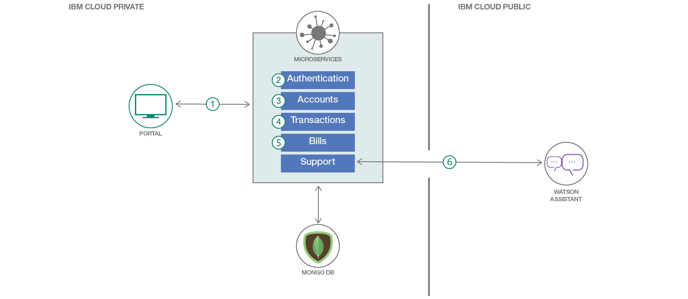

# マイクロサービス・ベースのデジタル・バンキング Web アプリケーションを作成する

### ユーザー・アカウント、トランザクション、送金、請求を管理できるデジタル・バンクを構築してデプロイする

English version: https://developer.ibm.com/patterns/build-digital-bank-microservices-kubernetes
  ソースコード: https://github.com/IBM/innovate-digital-bank

###### 最新の英語版コンテンツは上記URLを参照してください。
last_updated: 2018-10-19

 ## 概要

ソフトウェア開発手法のベスト・プラクティスとして、一連のマイクロサービスに分割できるクラウド・ネイティブのアプリの開発が称賛、推奨されていることから、クラウド・ネイティブのコンピューティングを可能にする Kubernetes のようなソフトウェア・スタックがかなりよく使われるようになっています。
けれども、いわゆるクラウド・ネイティブ・アプリのロジスティクスについて語ることよりも、実際に構築してみることのほうが遥かに面白味があります。そこで、このコード・パターンでは親近感のある使用ケースのシナリオとして、デジタル・バンクを取り上げます。ここで紹介するのは、[Monzo](https://monzo.com/) に着想を得た、「[Innovate](http://169.61.19.184:30200/)」という名前のデモ・バンクです。
*注: Innovate はデモ・サイトなので、PII は収集しません。*

## 説明

このコード・パターンの目的は、仮説に基づく、実際に使われるようなアプリケーションを一連のマイクロサービスに分割し、コアの機能を適切なマイクロサービスに委託して Web アプリのポータルをできる限り軽量に維持する方法を説明することです。
理想的には、このパターンは 12 Factor App に伴う特性のいくつかを表現し、マイクロサービスを適宜使用することの妥当性を説明するよう意図されています。このパターンに含まれるマイクロサービスはそれぞれ単独でデプロイすることや、独立してスケーリングすることができるようになっています。

このコード・パターンをひと通り完了すると、以下の方法がわかるようになります。

* アプリケーションを一連のマイクロサービスに分割する
* [IBM Cloud](https://cloud.ibm.com/?cm_sp=ibmdev-_-developer-patterns-_-cloudreg) 上で [Kubernetes クラスターを作成して管理](https://cloud.ibm.com/docs/containers/cs_tutorials.html?cm_sp=ibmdev-_-developer-patterns-_-cloudreg)する。
* IBM Cloud 上に Kubernetes クラスターをデプロイする
* [IBM Cloud Private](https://cloud.ibm.com/docs/containers/cs_hybrid.html#hybrid_iks_icp) にデプロイする

## フロー

1. ポータル: UI をロードして、ユーザー・セッションに対応します。その他すべてのマイクロサービスに、コアの機能を任せます。
1. 認証: ユーザー・プロファイルの作成と、ログインおよびログアウトを行います。
1. 口座: ユーザーの銀行口座の作成、管理、検索を行います。
1. 取引: ユーザーの銀行口座での取引、取引の検索を行います。
1. 請求書: 請求書の作成、支払、請求書の検索を行います。
1. サポート: [Watson Conversation](https://cloud.ibm.com/catalog/services/watson-assistant-formerly-conversation?cm_sp=ibmdev-_-developer-patterns-_-cloudreg) と通信してチャット機能をサポートします。

## 手順

このパターンに取り組む準備はできましたか？アプリケーションを起動して使用する方法について詳しくは、[README.md](https://github.com/IBM/innovate-digital-bank) ファイルを参照してください。
