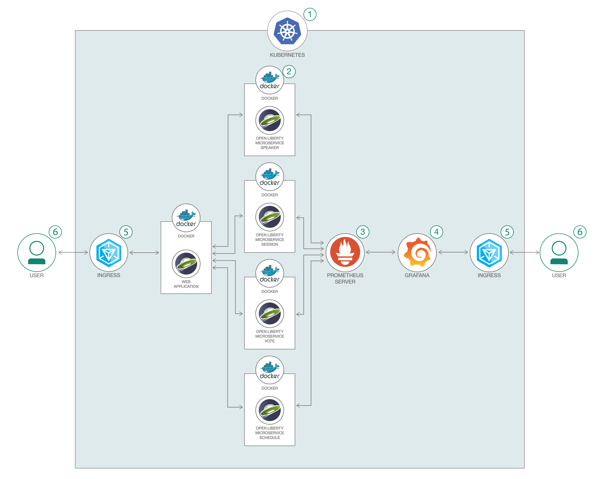

# 耐障害性を備えたマイクロサービスを作成する

### Eclipse MicroProfile を使用した Open Liberty アプリケーションを Kubernetes 上にデプロイする

English version: https://developer.ibm.com/patterns/build-fault-tolerant-microservices-with-java
  
ソースコード: https://github.com/IBM/java-microprofile-fault-monitoring

###### 最新の英語版コンテンツは上記URLを参照してください。
last_updated: 2019-06-27

 
## 概要

この開発者コード・パターンでは、Eclipse MicroProfile を使用した Open Liberty アプリケーションを Kubernetes 上にデプロイする方法を説明します。この例では Prometheus を使用してアプリケーションのメトリックを収集し、Grafana プラットフォームを使用してアナリティクスとモニタリングを行います。Open Liberty アプリケーションでは MicroProfile リリース 2.1 を使用し、このリリースのフィーチャーの 1 つである耐障害性にフォーカスします。

## 説明

障害が発生しないマイクロサービスというものはありません。そこで重要となるのは、レジリエンシーのあるマイクロサービスを作成することです。耐障害性を備えたマイクロサービスを作成するには、Eclipse MicroProfile Fault Tolerance 仕様が、シンプルで柔軟に構成可能なソリューションになります。この仕様では、以下の耐障害性ポリシーを使用できるようになっています。

* **Timeout**: タイムアウトの期間を定義します。
* **Retry**: 失敗した実行を再試行する基準を定義します。
* **Fallback**: 実行に失敗した場合の代替ソリューションを指定します。
* **Bulkhead**: 障害が発生した部分をシステムから切り分けて、システムの残りの部分が引き続き機能できるようにします。
* **CircuitBreaker**: システムが過負荷になって無期限待機の状態になることや、クライアントによってタイムアウトになることを防ぐ目的ですぐに失敗させるために、自動的に処理の実行を失敗させます。
* **Asynchronous**: 非同期処理を実行します。

設計の要点は、実行ロジックを実行から切り離すことです。こうすることで、耐障害性ポリシーを適用した実行を構成できます。

MicroProfile は、Enterprise Java をマイクロサービス・アーキテクチャーに合わせて最適化し、さまざまな MicroProfile ランタイムの間でアプリケーションを移植可能にする基本的なプラットフォーム定義です。MicroProfile リリース 1.2 以降、プラットフォームですぐに使用できるメトリック収集機能が備わっています。

このコード・パターンで使用する[サンプル・アプリケーション](https://github.com/IBM/sample.microservices.web-app) はコンファレンスを管理する Web アプリケーションであり、さまざまな個別のマイクロサービスをベースとしています。フロントエンドは Angular で作成されていて、バックエンドの複数のマイクロサービスは Java で作成されています。いずれも Kubernetes が管理する Docker コンテナー内に収容されて、Open Liberty ベースで稼働します。このコンファレンス管理アプリケーションは、MicroProfile プラットフォーム・チームが作成した[デモ・アプリケーション](https://github.com/eclipse/microprofile-conference)に基づいています。そのリポジトリーを[フォークしたサンプル・アプリケーション](https://github.com/IBM/sample.microservices.web-app)は、Open Liberty ならびに、Microprofile リリース 2.1 に含まれる Microprofile Metrics を使用するように変換されています。

## フロー

1. [IBM Cloud](https://cloud.ibm.com?cm_sp=ibmdev-_-developer-patterns-_-cloudreg) 内で Kubernetes サービスを作成します。
1. すべてのマイクロサービスを Kubernetes クラスター内にデプロイします。
1. Prometheus サーバーをサービスとして Kubernetes クラスター内にデプロイします。
1. Grafana をサービスとして Kubernetes クラスター内にデプロイします。
1. Ingress ゲートウェイを使用して、Kubernetes クラスター内の Web アプリケーションを公開します。
1. ユーザーがブラウザーを介して Web アプリケーションにアクセスします。

## 手順

このコード・パターンに取り組む準備はできましたか？詳しい手順については、[README](https://github.com/IBM/java-microprofile-fault-monitoring/blob/master/README.md) を参照してください。
