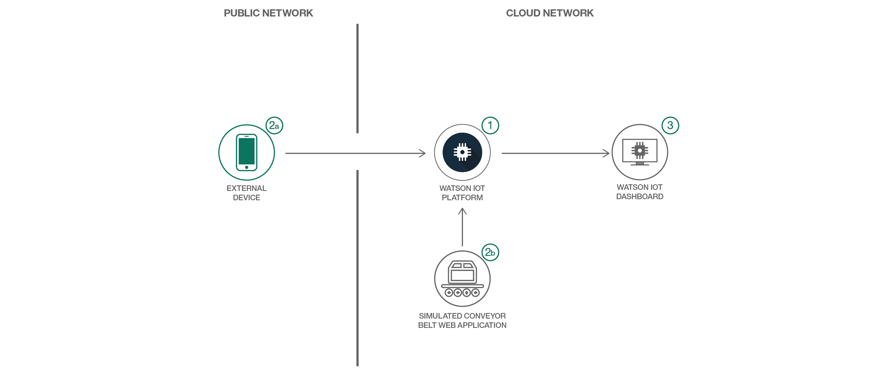

# IoT で駆動する独自のコンベヤー・ベルトを作成してモニターする

### モニタリング・データを IBM Cloud 上の Watson IoT Platform に送信するデバイスを搭載した基本的なコンベヤー・ベルトを作成する

English version: https://developer.ibm.com/patterns/build-monitor-iot-driven-conveyor-belt
  
ソースコード: https://github.com/IBM/guide-conveyor-simulator

###### 最新の英語版コンテンツは上記URLを参照してください。
last_updated: 2017-10-03

 
## 概要

IBM Cloud のサービスを利用して IoT デバイス搭載のコンベヤー・ベルトを作成した後は、Watson IoT™ Platform を利用してプロアクティブにコンベヤー・ベルトを保守してください。このアプリケーションはシミュレーションされたコンベヤー・ベルトを作成し、Watson IoT Platform を利用してシステム内の変化 (停止、起動、加速など) をモニターします。さらに、Watson IoT Platform ダッシュボードを使用して常時、システムを視覚的にモニターすることができます。

## 説明

Google の副社長兼チーフ・インターネット・エヴァンジェリストの Vinton G. Cerf 氏が着ていた T シャツに書かれていた「IP on everything （あらゆるモノに IP を）」といスローガンを覚えていますか？ 2017 年の今はまだ初期段階とは言え、あらゆるモノに IP を乗せるという構想は現実化の寸前になっていて、IP デバイスが急増しています。それはまた、映画「アイ・ロボット」が再現されることのないよう、プロアクティブにモノをモニターする必要が生じていることも意味します。IoT ネットワークをモニターしていれば、あなた、私、サービス・プロバイダーは何か問題が発生したら迅速に対応し、大惨事になる前にそれを食い止めることができます。

このコード・パターンでは、Watson IoT Platform に IoT デバイスを接続してデバイス・データをモニターし、必要に応じて対応するプロセス全体を説明します。このコード・パターンで取り上げるシナリオではシミュレーションされたコンベヤー・ベルトを使用しますが、どのデバイスを選んでもプロセスは同じです。

シミュレーションされたコンベヤー・ベルトの場合、接続されたコンベヤー・ベルトをセットアップし、それを使用して IoT データを Watson IoT Platform に送信します。コンベヤー・ベルトのセットアップについては、スキル・レベルに応じて、以下のパスのいずれか、または両方に従うことができます。

* パス A: プロセスを素早く開始できるよう、IBM Cloud 上にコンベヤー・ベルト・シミュレーター・アプリをインストールします。アプリはデバイスを Watson IoT Platform に自己登録して、整形式データをプラットフォームに自動的に送信します。
* パス B: 技術的に見て難易度の高いこのパスに従うには、追加のハードウェア、Python プログラミングのスキルが必要です。また、デバイスを手作業で Watson IoT Platform に登録する必要もあります。
 
## フロー

1. IBM Cloud Cloud Foundry CLI を使用して、Watson IoT Platform 組織を作成し、デプロイします。
1. サンプルのコンベヤー・ベルト・デバイスを作成してデプロイします。
1. Watson IoT Platform ダッシュボードを使用して、デバイス・データをモニターし、視覚化します。

## 手順

Find the detailed steps for this pattern in the [README](https://github.com/IBM/guide-conveyor-simulator/blob/master/README.md). The steps will show you how to:

1. Create and deploy a Watson IoT Platform organization by using Cloud Foundry CLI.
2. Build and deploy a sample conveyor belt device.
3. Connect the simulated conveyor belt device to Watson IoT Platform.
4. Monitor and visualize device data by using the Watson IoT Platform dashboards.
