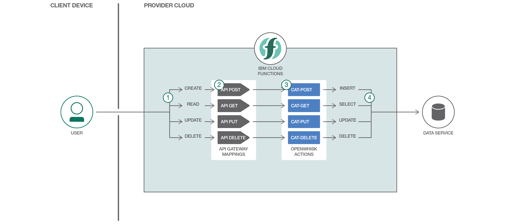

# サーバーレス API ハンドラーを作成する

### API 呼び出しに応答してオートスケーリングするアクションを作成する

English version: https://developer.ibm.com/patterns/./build-serverless-api-handlers
  ソースコード: https://github.com/IBM/ibm-cloud-functions-serverless-apis

###### 最新の英語版コンテンツは上記URLを参照してください。
last_updated: 2017-07-18

 
## 概要

Apache OpenWhisk を採用した IBM Cloud Functions のようなサーバーレス・プラットフォームは、需要に応じて自動的にスケールアップ、スケールダウンするランタイムを提供します。これにより、クラウド・リソースの全体的な消費量が減るだけでなく、リソースを無駄に使用することなく、リソースに費やしたコストに見合ったビジネス価値を得られるようになります。このコード・パターンでは、Cloud Functions を使用して、エンティティーの作成、読み取り、更新、削除を処理するビジネス・ロジック関数に HTTP REST API 呼び出しをマッピングする方法を説明します。リクエストのボリュームとの直接相関によって、各 API メソッド・ハンドラー・アクションがそれぞれ独立してスケーリングする (そして課金される) 仕組みを明かにします。

## 説明

このプロジェクトは、サーバーレスのイベント駆動型アーキテクチャーの仕組みを説明するものです。このアーテクチャーでは、HTTP REST API の呼び出しにより、需要に応じてコードが実行されます。API エンドポイントが呼び出されるまでは、レスポンスにリソースは消費されません。API エンドポイントが呼び出されると、現在の負荷とちょうど一致するようにリソースがプロビジョニングされます。

このプロジェクトでは、MySQL データベース内のデータの書き込み/読み取りを行う 4 つの (Apache OpenWhisk ベースの) IBM Cloud Functions を取り上げて、アクションとサポート・データ・サービスが連動して HTTP リクエストに応じてロジックを実行する仕組みを説明します。

最初の関数 (アクション) は、HTTP POST リクエストにマッピングされています。このアクションは、入力された猫の名前と色のパラメーターをデータベースに挿入します。2 番目のアクションは PUT リクエストにマッピングされていて、既存の猫の名前と色のフィールドを更新します。3 番目のアクションは GET リクエストにマッピングされていて、特定の猫のデータを返します。4 番目のアクションは、特定の猫のデータを削除します。

IBM Cloud 上の Node.js ランタイムには、[NPM モジュールの組み込みホワイトリスト](https://github.com/openwhisk/openwhisk/blob/master/docs/reference.md#javascript-runtime-environments")が用意されています。このデモでは高度な拡張性にも焦点を当て、MySQL クライアントなどの他の Node.js 依存関係をカスタム・アクションと一緒に ZIP ファイルにパッケージ化する方法を説明します。

## フロー

1. API クライアントが REST API に HTTP POST リクエストを送信します。
1. API ゲートウェイがリクエストを受け取り、それを OpenWhisk アクションに転送します。
1. OpenWhisk アクションがリクエスト本文のパラメーターを抽出し、NPM MySQL クライアントを使用して SQL INSERT を作成します。
1. 猫のデータがデータベースに保管されます。
1. GET、PUT、DELETE リクエストについてフローが繰り返されて、猫のデータの読み取り、更新、削除が行われます。

## 手順

Ready to put this code pattern to use? Complete details on how to get started running and using this application are in the [README](https://github.com/IBM/ibm-cloud-functions-serverless-apis/blob/master/README.md).
