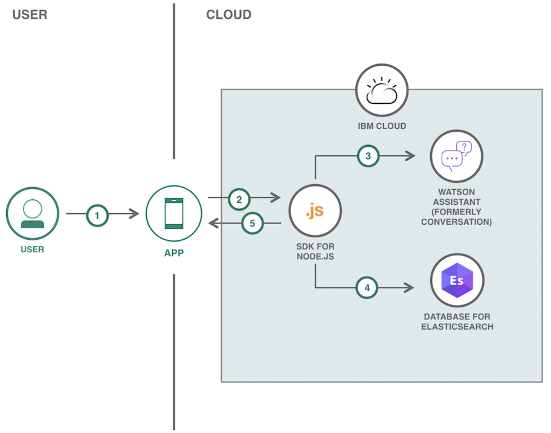
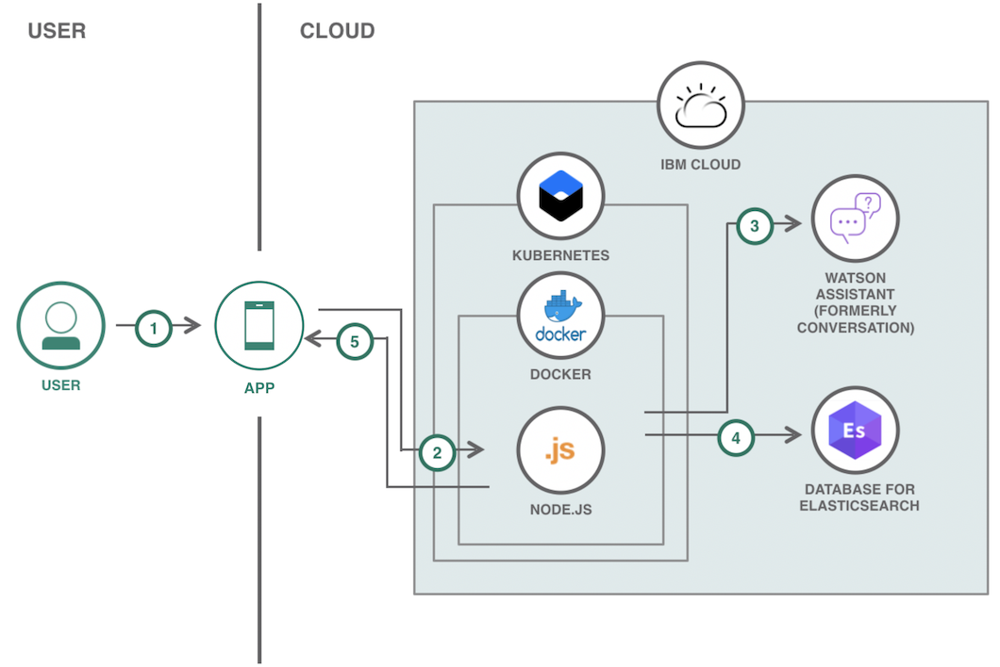

# モバイル・アプリ向けのチャットボットを作成する

### Watson Assistant と Elasticsearch を利用するチャットボットを作成する

English version: https://developer.ibm.com/patterns/building-a-chatbot-with-kubernetes-watson-assistant-and-elastic-search
  ソースコード: https://github.com/IBM/elasticsearch-chatbot

###### 最新の英語版コンテンツは上記URLを参照してください。
last_updated: 2019-07-22

 
## 概要

このコード・パターンでは、Watson Assistant と Elasticsearch を利用する Node.js チャットボット・アプリケーションを作成する方法を説明します。ユーザーがモバイル・アプリから操作できるこのチャットボット・アプリケーションは、Kubernetes 上でも Cloud Foundry 上でも実行できます。

## 説明

このコード・パターンがベースとしている、IBM Developer モバイル・アプリケーションで使用されているチャットボットは、モバイル・アプリ・ストアから入手できます。  

    

このコード・パターンに従って作成するチャットボットは、[TV Maze](https://www.tvmaze.com/api) からテレビ番組のデータを取得し、ユーザーにお勧めのテレビ番組を提示して番組情報を提供します。

このコード・パターンを完了すると、以下の方法がわかるようになります。

* ゼロからチャットボットを作成して完成させる
* Node.js アプリケーションを Kubernetes または Cloud Foundry にデプロイして実行する

## フロー

### Cloud Foundry にデプロイする場合のフロー

1. ユーザーがモバイル・アプリケーションの React UI を使用して質問をテキストで入力することによって、チャットボットと対話します。
1. React UI がユーザーのメッセージを Cloud Foundry 上の Node.js バックエンドに送信します。
1. Node.js バックエンドは受け取ったメッセージを Watson Assistant に送信し、Watson Assistant がユーザーのメッセージからそのインテントとエンティティーを判断します。
1. Node.js バックエンドが Watson Assistant によって判断されたインテントとエンティティーに基づいて、Elasticsearch データベースに対してクエリーを実行します。
1. クエリーに対する応答と結果が React UI に送信されます。

### Kubernetes にデプロイする場合のフロー

1. ユーザーがモバイル・アプリケーションの React UI を使用して質問をテキストで入力することによって、チャットボットと対話します。
1. React UI がユーザーのメッセージを Kubernetes 上の Node.js バックエンドに送信します。
1. Node.js バックエンドは受け取ったメッセージを Watson Assistant に送信し、Watson Assistant がユーザーのメッセージからそのインテントとエンティティーを判断します。
1. Node.js バックエンドが Watson Assistant によって判断されたインテントとエンティティーに基づいて、Elasticsearch データベースに対してクエリーを実行します。
1. クエリーに対する応答と結果が React UI に送信されます。

## 手順

このパターンの詳細な手順については、[readme ファイル](https://github.com/IBM/elasticsearch-chatbot/blob/master/README.md)を参照してください。
