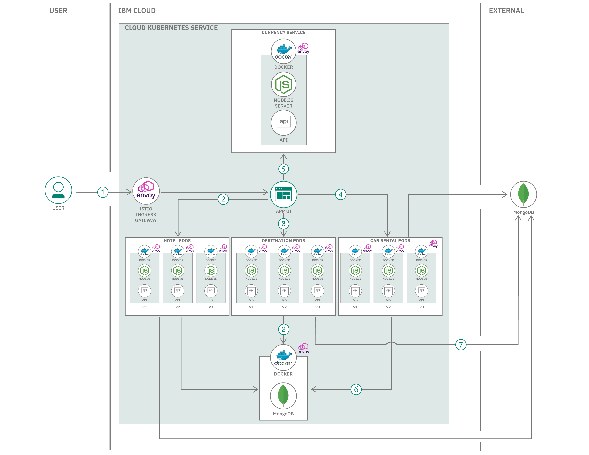

# Kubernetes 上にデプロイされたマイクロサービス・アプリケーション用の Istio 1.6 サービス・メッシュを作成する

### サンプルの旅行予約アプリケーションをコンテナー化して、コンテナー内に格納されたマイクロサービスを互いに接続して管理し、マイクロサービス間のやり取りをモニタリングするサービス・メッシュを作成する

English version: https://developer.ibm.com/patterns/building-istio-service-mesh-for-microservices-app-on-kubernetes
  ソースコード: https://github.com/IBM/bee-travels-istio

###### 最新の英語版コンテンツは上記URLを参照してください。
last_updated: 2020-09-29

 ## 概要

このコード・パターンでは、旅行予約用のマイクロサービス・アプリケーションを Kubernetes にデプロイし、Istio 1.6 を使用してサービス・メッシュを作成するプロセスに焦点を当てます。Kubernetes は、アプリケーションをコンテナー化するためのプラットフォームです。 Istio は、コンテナー内に格納されたマイクロサービスを互いに接続して管理し、マイクロサービス間のやり取りをモニタリングする手段になります。

## 説明

[Bee Travels](https://github.com/bee-travels) は、マイクロサービス・アーキテクチャーを説明するために設計された、概念上の旅行予約 Web アプリケーションです。アプリケーションを複数の独立した小さなマイクロサービスに分割すれば、個々のサービスを個別に開発、デプロイ、管理できます。このような分離によって、さまざまなメリットがもたらされます。例えば、ターゲットを絞ってスケーリングできること、障害分離を強化できること、カスタマイズ可能なテクノロジー・スタックを使用できることなどです。ただし、サービス・メッシュを使用しなければ、マイクロサービスを管理するのは難しい場合があります。

マイクロサービスを互いに接続して管理し、マイクロサービス間のやり取りをモニタリングする手段となるのが、[Istio](https://developer.ibm.com/jp/components/istio/) というオープンソースのサービス・メッシュ・プラットフォームです。ルールを構成した後はサービス・メッシュでトラフィックを管理できます。また、サービス・メッシュが収集するテレメトリーによって可観測性も確保できます。

このコード・パターンでは、Bee Travels アプリケーションを構成する次の 5 つのマイクロサービスに焦点を絞ります。

* UI
* 目的地
* ホテル
* レンタカー
* 為替

現在のところ、このアプリケーションには 3 つのバージョンがあります。バージョン 1 は目的地、ホテル、レンタカーのデータをローカルの JSON ファイル内に保管します。バージョン 2 はデータをクラスター内の MongoDB デプロイメントに保管します。バージョン 3 は [IBM Cloud Databases for MongoDB](https://cloud.ibm.com/catalog/services/databases-for-mongodb) サービスに接続します。このコード・パターンでは、トラフィックの宛先を変えて特定のバージョンのサービスにルーティングし、トレースと指標を観察してレイテンシーを分析します。

## フロー

1. ユーザーが Istio Ingress Gateway (Envoy プロキシーのインスタンス) を介してフロントエンドの UI サービスにアクセスします。

2-4. UI サービスが呼び出しをホテル、レンタカー、目的地の各サービスにルーティングします。Istio はルールに従ってトラフィックを調整し、Istio ルーティングの重みに応じて、バージョン 1、バージョン 2、またはバージョン 3 のサービスにトラフィックを転送します。バージョン 1 サービスに転送された場合、データはメモリー内に保管されます。

5. UI サービスが為替サービス (1 つのバージョンしかありません) を呼び出します。

6. 各サービスのバージョン 2 では、クラスター内の MongoDB インスタンスを使用します。

7. 各サービスのバージョン 3 では、IBM Cloud 上の MongoDB インスタンスを使用します。

# 手順

このパターンの詳細な手順については、[README ファイル](https://github.com/IBM/bee-travels-istio/blob/master/README.md)を参照してください。手順の概要は以下のとおりです。

1. 前提条件の IBM Cloud のセットアップを完了します。
1. リポジトリーのクローンを作成します。
1. アプリケーションを Kubernetes にデプロイします。
1. Istio サービス・メッシュを構成します。
