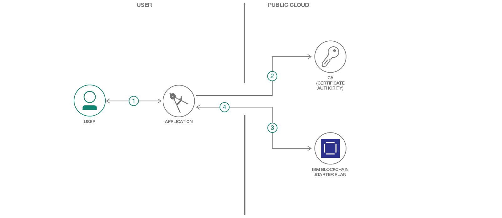

# 自動車オークション・ネットワーク: Hyperledger Fabric Node SDK と IBM Blockchain スターター・プランを使用したサンプル Hello World

### Hyperledger Fabric を使用してチェーンコードを呼び出すと同時に、スターター・プラン内に結果とデータを保管する

English version: https://developer.ibm.com/patterns/car-auction-network-hyperledger-fabric-node-sdk-starter-plan
  
ソースコード: https://github.com/IBM/car-auction-network-fabric-node-sdk

###### 最新の英語版コンテンツは上記URLを参照してください。
last_updated: 2018-10-19

 
## 概要

このコード・パターンでは、既存の Hyperledger Composer アプリケーションを見つけて、Hyperledger Fabric Node SDK と IBM Blockchain スターター・プランを使用するように、そのアプリケーションを変換します。[Composer アプリケーション](https://github.com/hyperledger/composer-sample-networks/tree/master/packages/carauction-network)のコードは、このリンク先のページから入手できます。このアプリは主に、オークションのメンバー、オークションにかけられる自動車、メンバーが応札できる自動車リストの 3 つで構成されています。Starter Plan という名前の IBM Blockchain クラウド・サービスを作成し、クラウド接続プロファイルに含まれる資格情報を使用して、Node アプリをスターター・プランの認証局 (CA) に関連付けます。CA から資格情報が提供された後は、トランザクション (チェーンコードの呼び出し) のそれぞれにユーザーの資格情報によって署名が付けられるため、ネットワーク上の他のピアはトランザクションを簡単に検証できます。

IBM Blockchain クラウド・サービスの内部では、チェーンコードをピアにインストールしてから、そのチェーンコードをインスタンス化します。これにより、オークションに 3 つのメンバー、1 つの自動車と、自動車の入札額を提示するための 1 つの自動車リストが取り込まれます。その後は、自動車をオークションに出して販売する必要があります。それには、チェーンコードを呼び出すことで簡単に対処できます。呼び出されたチェーンコードがエラーの有無をチェックし、確実に最高入札者が落札するようにするからです。自動車の販売後、レジャーが更新されて、自動車の新しい所有者が最高入札者であること、自動車の販売者が購入者から提示された最大の入札額を受け取ったことが反映されます。もちろん、これらのトランザクションのすべてはブロックとして IBM Blockchain クラウド・サービス内に保存されます。

## 説明

このコード・パターンでは、自動車オークション・ネットワークをシミュレートするブロックチェーン・ネットワークを作成します。

### 認証局の紹介

自動車オークション・ロジックに取り組む前の最初のステップは、IBM Blockchain スターター・プランに含まれる[認証局](https://hyperledger-fabric.readthedocs.io/en/release-1.2/identity/identity.html#certificate-authorities)にアプリケーションを登録することです。それには、IBM Blockchain スターター・プラン上で CA のエンドポイントをアプリケーションに割り当てて、アプリがネットワークと相互作用できるようにします。アプリにエンドポイントが割り当てられると、CA から証明書が渡されます。この証明書によってユーザーの信ぴょう性をネットワークに対して証明することで、ユーザーはネットワーク上でトランザクション (チェーンコードの呼び出し) を行えるようになります。

**注:** Hyperledger Fabric ネットワークに対する呼び出しには例外なく、秘密鍵と適切な署名付き X.509 証明書を使用して署名が付けられていなければなりません。そうでないと、検証に失敗します。ネットワーク内のアクター (ピア、発注者、クライアント・アプリ、管理者) のそれぞれには、X.509 証明書内にカプセル化されたデジタル ID が割り当てられます。管理者ユーザーと新規ユーザー (たとえば、`user1`) の両方に証明書が必要です。

### チェーンコードの紹介

キーと証明書を生成し終わったら、チェーンコードをピアにインストールする必要があります。チェーンコードをインストールした後、そのチェーンコードをインスタンス化すると、それによってチェーンコード・コンストラクターが呼び出され、レジャー上にブロックが作成されます。この動作は、[`chaincode/carauction.js`](https://github.com/IBM/car-auction-network-fabric-node-sdk/blob/master/chaincode/carauction.js#L50) ファイル内の `initLedger` 関数を参照して確認できます。チェーンコードのインスタンス化により、1 つの自動車、いくつかのメンバー、1 つの自動車リスト (メンバーが応札できる自動車のリスト) が作成されます。メンバーが自動車の入札額を提示すると、実際に内部でチェーンコードが呼び出されます。

**注:** チェーンコードを呼び出すということは、ブロックチェーン・ネットワーク上でトランザクションを行うということです。この点が極めて重要です。チェーンコードは、ネットワーク上でトランザクションを行うための手段となります。入札額を提示すると、チェーンコードは 2 つのタイプのエラーをチェックします。

1. 自動車の所有者が自分の自動車に入札している。
2. 入札者のアカウント内に、応札するのに十分な資金がない。

この両方のチェックに合格すると、提示された入札額がレジャーに記録されます。オークションが終了したら、[`chaincode/carauction.js`](https://github.com/IBM/car-auction-network-fabric-node-sdk/blob/master/chaincode/carauction.js#L273) ファイル内にある `closeBidding` トランザクションを呼び出します。これにより、最高入札者に自動車が落札され、資金が購入者から販売者に譲渡され、購入者が自動車の所有権を獲得します。

オークションが正常に機能したことを確認するには、最後にレジャーをクエリーして、自動車が正しい所有者の手に渡ったこと、販売者のアカウント内に正しい金額が入れられたことを確認します。

最後に、IBM Blockchain スターター・プラン上でピアのログをチェックしたり、ブロックの詳細を表示してトランザクションがどのように記録されているかをチェックしたりすることもできます。

このコード・パターンを完了すると、以下の方法がわかるようになります。

* IBM Blockchain スターター・プランを操作する
* Hyperledger Fabric Node SDK を使用してブロックチェーン・ネットワークを構築する
* IBM Blockchain スターター・:プランに接続されたアプリケーションのログを検査し、確認する

## フロー

1. ユーザーが IBM Blockchain スターター・プランの接続プロファイルをダウンロードし、Node アプリ内に CA の URL/シークレットを追加します。
1. ユーザーが管理者として登録し、他のユーザーを CA に登録します。
1. ユーザーがピアに carauction チェーンコードをインストールし、インスタンス化して呼び出します。
1. レジャーが更新され、ブロックが Starter Plan サービスに追加されて、レスポンスが Node アプリに送信されます。

## 手順

詳細な手順については、[README](https://github.com/IBM/car-auction-network-fabric-node-sdk/blob/master/README.md) を参照してください。手順の概要は以下のとおりです。

1. リポジトリーを複製します。
1. アプリを登録します。
1.  ユーザーを登録します。
1. チェーンコードを呼び出します。
1. アプリを実行します。
1. レジャーをクエリーします。
