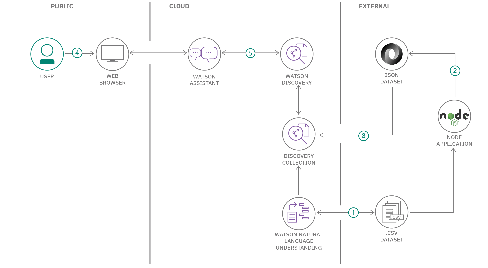

#    # IBM Watson Assistant を利用して独自のアシスタントを作成する

###  小学生と中学生から学習のリクエストを聞いて、該当する学習内容のリソースに学生をつなげる、Watson Assistant を活用したチャットボットを作成する

English version: https://developer.ibm.com/patterns/./chatbot-for-student-self-service-in-education
  ソースコード: https://github.com/IBM/Education-SelfService-AI-Chatbot

###### 最新の英語版コンテンツは上記URLを参照してください。
last_updated: 2020-05-26

 ## 概要

最近のさまざまな出来事によって生徒の学習への関り方が変わりつつある中、学習コンテンツを検索した生徒は、あまりにも多くの検索結果に圧倒されてしまうことがあります。ニーズに対応するわけではないものも含まれる圧倒的な数の検索結果の中から目的のコンテンツを探し出さなければなければならないとすると、生徒が学習意欲を失くしてしまうことも考えられます。生徒の時間は学習に費やされるべきであり、学習コンテンツの検索に費やされるべきではありません。そこで必要となるのが、生徒がセルフサービスで学習する方法です。このコード・パターンで説明する教育向けセルフサービス・チャットボット (Florence) は、生徒の学習に関するリクエストを受け付けて、学年レベルに適した学習課目に生徒を関連付けることによって迅速に応答します。

Florence を利用すれば、生徒はセルフサービスで学習コンテンツを見つけられるようになります。このセルフサービス・モデルは教育以外の業界にも適用できます。例えば、商品の検索と評価、行政サービス、公衆衛生情報の調査などでも、このモデルが役立ちます。セルフサービス・チャットボットを作成する際のコンセプトを広げて、セルフサービス・ユーザーになるよう、ユーザーを奨励してください。  

## 説明

多くの学校が閉鎖され、保護者と教師が慌てて学習の場を教室からオンラインに移す中、開発者が着目したのは、学習コンテンツを見つけられるよう、生徒をサポ―トしなければならないという点です。生徒が、信頼できる学習コンテンツにすばやくアクセスできるようにするために、Florence が作成されました。

Florence は、生徒からの学習コンテンツ・ソースのリクエストを受け付け、IBM&reg; Watson&trade; の人工知能 (AI) を利用して該当する学習リソースを配信するように設計されています。Florence を使用すれば、生徒は必要とする学年レベルや課目のリソースをリクエストし、レスポンスとして返されるダイレクト・リンクから学習コンテンツを選択することができます。

Florence ではこの仕組みを達成するために、Watson Assistant を利用しています。具体的には、Watson Assistant の AI テクノロジーを利用して、生徒が学習のレコメンデーションをリクエストする際に考えられる会話を模倣するダイアログ・フローを作成します。Watson Assistant チャットボットを作成するときは、インテント (生徒が尋ねる可能性のある質問) とエンティティー (インテントにコンテキストを与える用語) のリポジトリーとなる検索スキルを作成します。例えば、生徒が数学に関する質問をする場合は、質問の中で「式」という単語を使うことが考えられます。エンティティーには、Florence が式について学習できる数学のコードを識別したり、より正確な学習リソースで応答したりするのに役立つ同義語が関連付けられます。

Watson Discovery と Watson Natural Language Understanding (NLU) は、自然言語処理によって Florence がユーザーに返すレスポンスの精度を高めることから、この 2 つはアシスタント・プラットフォームに不可欠のサービスです。こうした自然言語による精度向上により、ユーザーにとって人間のように感じられるチャットボットになります。詳細については、このリンク先の[自然言語処理](https://developer.ibm.com/articles/introduction-to-watson-natural-language-processing/)に関するシリーズをご覧ください。

このコード・パターンを完了すると、以下の方法がわかるようになります。

* インテントとエンティティーを使用して Watson Assistant チャットボットを作成する
* IBM Cloud サービスの Trial Plus バージョンで利用可能な Watson Assistant の検索スキルを使用して、チャットボットに Watson Discovery を統合する
* 自然言語処理を使用してコンテンツと同義語の集合をキュレートし、より有効な集合にする
* Watson Discovery を利用して、チャットボットのレスポンスが正確になるよう、データをエンリッチする
* Watson Assistant チャットボットをデプロイし、このチャットボットを使用して学習コンテンツを検索するようにユーザーを招待する

## フロー

1. Python プログラムを実行して、Watson Natural Language Understanding によってデータセットを処理し、メタデータ (コースの名前と説明など) を抽出するとともに、CSV ファイルをエンリッチします。
1. Node プログラムを実行して CSV ファイルを JSON ファイルに変換します (Watson Discovery コレクションで使用するために必要な処理です)。
1. プログラムによって JSON ファイルを Watson Discovery コレクション内にアップロードします。
1. ユーザーが、Watson Assistant ダイアログ・スキルを使用したチャットボットと対話します。
1. 生徒がコースの情報について質問すると、Watson Assistant 検索スキルによって検索クエリーが Watson Discovery サービスに送信されます。Watson Discovery がクエリーによって取得したレスポンスをダイアログに返します。

## 手順

このパターンの詳細な手順については、[readme](https://github.com/IBM/Education-SelfService-AI-Chatbot/blob/master/README.md) ファイルを参照してください。手順の概要は以下のとおりです。

1. リポジトリーのクローンを作成します。
1. IBM Cloud でサービス・インスタンスを作成します。
1. Watson Natural Language Understanding サービス・インスタンスを構成します。
1. Watson Discovery サービス・インスタンスを構成します。
1. Watson Assistant サービス・インスタンスを構成してチャットボットをテストします。
