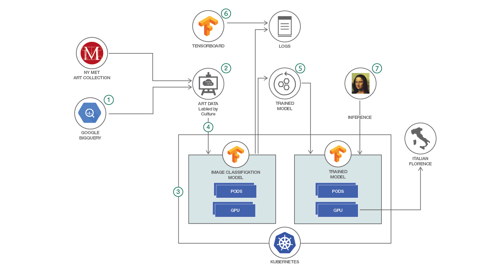

# TensorFlow を使用してアートを分類する

### メトロポリタン美術館のデータとラベルをプルして画像分類システムをトレーニングする

English version: https://developer.ibm.com/patterns/classify-art-using-tensorflow-model

ソースコード: https://github.com/IBM/tensorflow-kubernetes-art-classification

###### 最新の英語版コンテンツは上記URLを参照してください。
last_updated: 2017-10-06

 ## 概要

画像分類用の独自のデータ・セットを作成してモデルをトレーニングする方法を学んでください。この方法では、TensorFlow 内で有効にされた画像分類モデルを、Kubernetes クラスター上で実行します。デモ・コードは、メトリポリタン美術館の Web サイトと Google BigQuery からデータおよびラベルをプルするようになっています。モデルを実行するための Kubernetes クラスターは、IBM Cloud コンテナー・サービスが提供します。このデモ・コードに変更を加えれば、別の画像データ・セットを作成することも、Inception、VGG、ResNet、AlexNet、MobileNet などの一連の選択肢から別のパブリック・モデルを選んで使用することもできます。

## 説明

人間には視覚情報を処理する優れた能力があり、写真を一目見ただけで、それが何のシーンであるかを理解して適切に反応することができます。こうした能力をコンピューターが備えていれば、Facobook の友だちにタグ付けするといったアプリケーションから、肌の状態を撮影した写真からガンを認識するといったアプリケーションまで、さまざまな可能性が広がります。けれども、コンピューターによる画像認識は非常に難しいことであり、この分野は何年にもわたって活発に研究・開発が進められてきました。深層学習における最近の進歩は、画像の認識と分類に大幅な改善をもたらし、今では最先端のパフォーマンスを発揮する多数のニューラル・ネットワーク・モデルを利用できるようにまでなっています。アプリケーションで画像の特性を認識する必要がある場合、これらのモデルのいずれかを利用することで、このアプリケーション向けのニューラル・ネットワークをトレーニングおよびデプロイできます。

このプロセスを実際に行って説明するために、この IBM Code の開発者向けパターンでは、深層学習を使用して画像分類モデルをトレーニングします。具体的には、メトロポリタン美術館のアート・コレクションのデータと、Google BigQuery のメタデータを使用します。モデルとして使用するのは Inception です。このモデルを TensorFlow 内に実装して、Kubernetes クラスター上でトレーニングを実行します。トレーニングが完了したら、モデルを保存して、推測に使用するために後でロードします。このモデルを使用するには、入力として絵画の写真を指定します。すると、モデルによって推測された文化様式 (例えば、イタリア・フィレンツェ派) が返されます。返されるデータを調整するには、アート・コレクションを分類するための属性として別の属性 (作者、時代など) を選択します。あるいは、ラベルの作成方法を変えて、まったく別のデータ・ソースを選んで使用したり、分類のカテゴリーを変更したりすることもできます。さらに、VGG、ResNet、AlexNet、MobileNet などといった別のモデルを選択することも可能です。

トレーニングする画像の数、使用するクラスの数などは、使用できる計算リソースによって決定できます。ここでは、実際的なプロセス全体を説明するために、ある程度の時間内でトレーニングを完了できるよう、規模の小さい画像のセットと少数のクラスを使用します。大規模なデータ・セットを使用すると、トレーニングの所要時間が数日から数週間に及ぶ場合があります。

このコード・パターンをひととおり完了すると、以下の方法がわかるようになります。

* TensorFlow 内で、深層学習用のデータを収集して処理する
* Kubernetes クラスター上で実行するように TensorFlow を構成してデプロイする
* 高度な画像分類ニューラル・ネットワークをトレーニングする
* TensorBoard を使用してトレーニング・プロセスを視覚化し、理解する

## フロー

1. Google BigQuery データベース内でメトリポリタン美術館アート・コレクションに有効な属性を調べます。
1. 選択した属性を使用してラベル付けしたデータ・セットを作成します。
1. 利用可能な一連のパブリック・モデルから、画像分類に使用するモデルを選択して IBM Cloud にデプロイします。
1. Kubernetes 上でトレーニングを実行します。利用可能な場合は、GPU を使用します。
1. トレーニング済みモデルとログを保存します。
1. TensorBoard を使用してトレーニングを視覚化します。
1. トレーニング済みモデルを Kubernetes 内にロードし、モデルを使用して新しい絵画のカテゴリーを推測し、分類結果を確認します。

## 手順

Ready to put this code pattern to use? Complete details on how to get started running and using this application are in the [README](https://github.com/IBM/tensorflow-kubernetes-art-classification/blob/master/README.md).
