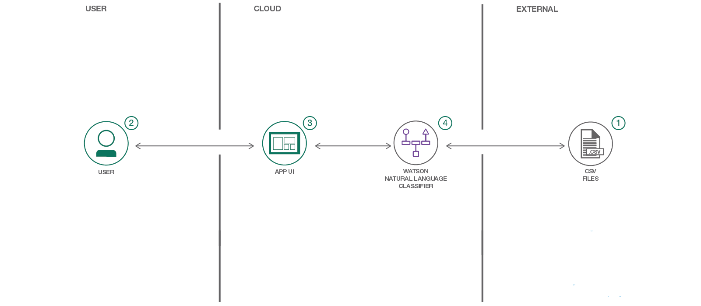

# Watson を利用して ICD-10 データを分類する

### Watson Natural Language Classifier を利用して医学的分類コードにタグを付ける

English version: https://developer.ibm.com/patterns/./classify-icd-10-data-with-watson
  ソースコード: https://github.com/IBM/nlc-icd10-classifier

###### 最新の英語版コンテンツは上記URLを参照してください。
last_updated: 2018-08-02

 
## 概要

今回紹介するアプリは、IBM の Watson&trade; Natural Language Classifier をデモするために作成したものです。このアプリは Watson Python SDK を使用して分類子の作成、分類子のリストアップ、入力テキストの分類を行います。また、無料で使用できる ICD-10 API も利用しています。この API では、ICD-10 コードを受け取って名前と説明を返します。

## 説明

**免責事項:** このアプリケーションはデモと説明のためだけに使用しているので、法規制関連のレビューは行われていません。医療アプリケーションとして使用されるよう意図されていないため、出力の正確さに関する表現はありません。これは、保証なしで提示するアプリケーションです。

ICD-10 は、「International Statistical Classification of Diseases and Related Health Problem (疾病及び関連保健問題の国際統計分類)」の第 10 版です。簡単に言うと、世界保健機構 (WHO) によって公表されている医学的分類のリストであり、疾病、徴候と症状、異常所見、病状、社会的状況、傷病の外因のコードが記載されています。病院や保険会社などは、Watson を利用して ICD-10 コードに適切なタグを付けることによって、時間と経費を節約できます。

今回紹介するアプリケーションは、IBM の Watson Natural Language Classifier をデモするために作成したものです。データ・セットとして、ICD-10 エントリーのサブセットが含まれる ICD-10-GT-AA.csv を使用します。このコード・パターンをひと通り完了すると、以下の方法がわかるようになります。

* Natural Language Classifier サービスのインスタンスを作成し、そのインスタンスを Python アプリケーション内で使用する
* CSV データを使用して Natural Language Classifier モデルをトレーニングする
* Flask を使用して Web アプリをデプロイし、モデルに対してクエリーを実行できるようにする
* トレーニング済みモデルを使用して、疾病や健康問題の分類結果を迅速に取得する

## フロー

1. モデルのトレーニングに使用する CSV ファイルを Natural Language Classifier サービスに送信します。
1. ユーザーが、ローカルまたはクラウド内で実行されているアプリの UI を操作します。
1. アプリケーションから Natural Language Classifier モデルに、分類対象のユーザー入力が送信されます。
1. 分類結果を含む情報が Web アプリに返されます。

## 手順

Find the detailed steps for this pattern in the [README](https://github.com/IBM/nlc-icd10-classifier/blob/master/README.md). Those steps will show you how to:

1. Clone the project.
1. Install the app's dependencies.
1. Copy the env.example file.
1. Update the .env file with your NLC credentials.
1. Run python welcome.py.
1. Access the running app in a browser.
