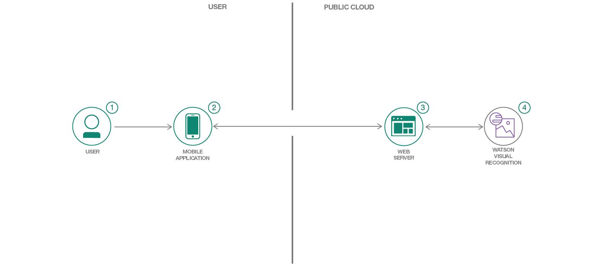

# 車両損傷の画像を分類する

### Apache Cordova、Node.js、Watson Visual Recognition を利用して、カスタム視覚認識分類子を作成する

English version: https://developer.ibm.com/patterns/classify-vehicle-damage-images
  ソースコード: https://github.com/IBM/watson-vehicle-damage-analyzer

###### 最新の英語版コンテンツは上記URLを参照してください。
last_updated: 2018-02-07

 
## 概要

IBM Watson&trade; Visual Recognition は、学習アルゴリズムを使用して画像を分析し、物体、場所などのコンテンツを認識するサービスです。このコード・パターンでは、保険業界での使用ケースとして、車両の損傷を分析するカスタム分類子を紹介します。このパターンで作成するモバイル・アプリケーションは、車両損傷の写真を撮って保険会社に送信し、問題 (タイヤのパンク、窓の損傷、車体のへこみなど) を特定して分類します。

## 説明

あらゆる類の組織で、画像分類の必要性が大きくなってきています。このことは、保険会社にしても例外ではありません。IBM Watson Visual Recognition サービスを利用すれば、画像分類に簡単に対応できます。

Visual Recognition サービスでは、サンプル画像をアップロードして、カスタム分類子を作成できるようになっています。このコード・パターンでは、興味深い使用ケースとして、保険会社が車両損傷を分析するためのカスタム分類子を必要としている場合を取り上げます。

ここでは、Apache Cordova, Node.js、および Watson Visual Recognition を利用してモバイル・アプリケーションを作成します。このモバイル・アプリケーションから送信する自動車やオートバイの事故やその他の車両問題の画像を、サーバー・アプリケーションで Watson Visual Recognition を利用して分析します。サーバー・アプリケーションでは画像を使用して、各種の問題区分 (破壊行為、フロントガラスの破損、自動車事故、タイヤのパンクなど) を特定できるように Watson Visual Recognition をトレーニングします。このパターンを利用して、さまざまな使用ケースに応じた独自のカスタム Watson Visual Recognition 分類子を作成することができます。

このコード・パターンをひと通り完了すると、以下の方法がわかるようになります。

* Watson Visual Recognition サービスを利用して画像を分類できる Node.js サーバーを作成する
* サーバーの起動時に、Watson Visual Recognition カスタム分類子を初期化する
* アプリケーション内に Watson Visual Recognition カスタム分類子を作成する
* Watson Visual Recognition を利用して分類する対象として写真をサーバーに送信できる Android モバイル・アプリケーションを作成する

## フロー

1. ユーザーがモバイル・アプリケーションで画像をキャプチャーします。
1. ユーザーがモバイル・アプリケーション上の写真を、クラウド内で稼働中のサーバー・アプリケーションに送信します。
1. サーバーが受信した画像を分析対象として Watson Visual Recognition サービスに送信します。
1. Watson Visual Recognition サービスが画像を分類し、その情報をサーバーに返します。

## 手順

このコード・パターンをデプロイする基本的な手順は、以下のとおりです。詳細については、[README.md](https://github.com/IBM/watson-vehicle-damage-analyzer/blob/master/README.md) ファイルを参照してください。

1. サーバー・アプリケーションを IBM Cloud またはローカルにデプロイします。
1. リポジトリーを複製します。
1. Watson Visual Recognition サービスを作成して名前を付けます。
1. .env ファイルに Visual Recoginition API キーを追加します。
1. 依存関係をインストールしてサーバーを実行します。
1. モバイル・アプリに合わせて構成値を更新します。
1. 依存関係をインストールしてモバイル・アプリケーションをビルドします。
1. ビルドされたモバイル・アプリケーションを Docker コンテナー内で実行します。
1. Android プラットフォームおよびプラグインを追加します。
1. Android デバイスをセットアップします。
1. モバイル・アプリケーションをビルドして実行します。
