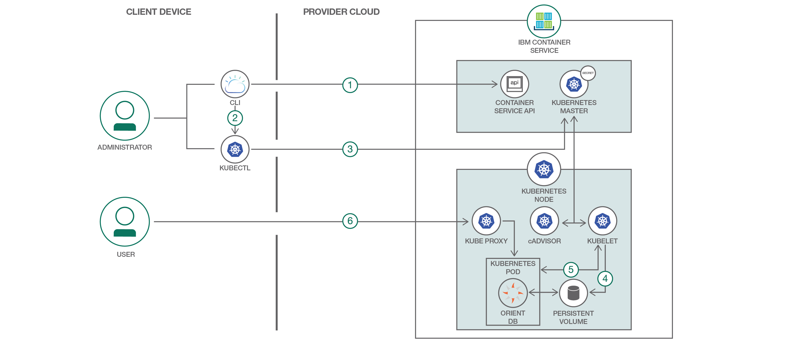

# Kubernetes を使用して、グラフ・データベースをクラウドでホストする

### Kubernetes を使用して、OrientDB をコンテナーとして迅速、簡単にデプロイする

English version: https://developer.ibm.com/patterns/./cloud-host-graph-database-using-kubernetes
  ソースコード: https://github.com/IBM/deploy-graph-db-container

###### 最新の英語版コンテンツは上記URLを参照してください。
last_updated: 2017-11-09

 ## 概要

OrientDB などのグラフ・データベースは、ノード、エッジ、プロパティーからなるグラフ構造内にデータを保管します。そしてこの意図的な複合階層構造によって、リレーショナル・データベースよりも遥かに効率的な方法で迅速、簡単にデータを取得できるようになっています。この開発者向けパターンでは、Kubernetes API を使用して、グラフ・データベースの OrientDB を IBM Cloud Container Service サービスに迅速にデプロイしてホストする方法を説明します。クラウドでホストされた OrientDB を利用すれば、開発チームとテスト・チームのコラボレーションが容易になります。

## 説明

[OrientDB](https://github.com/orientechnologies/orientdb) などの[グラフ・データベース](https://en.wikipedia.org/wiki/Graph_database)グラフ・データベースは、ノード、エッジ、プロパティーからなるグラフ構造内にデータを保管します。そしてこの意図的な複合階層構造によって、グラフ・データベースではリレーショナル・データベースよりも遥かに効率的な方法で迅速、簡単にデータを取得できるようになっています。グラフ・データベースからデータを取得するには、(RDBMS 用の SQL に相当する手段として) [Gremlin](http://tinkerpop.apache.org/gremlin.html) という標準化されたグラフ・トラバーサル言語を使用します。

OrientDB をチームで開発およびテスト目的で利用できるよう、このグラフ・データベースを簡単に [IBM Cloud Kubernetes Service](https://www.ibm.com/cloud/container-service) 上にデプロイする方法を説明します。

IBM Cloud Container Service では [Docker](https://docs.docker.com/get-started/) と [Kubernetes](https://kubernetes.io/docs/concepts/overview/what-is-kubernetes/) を結合した強力なツール一式を使用できるようになっていて、Docker でコンテナー化したアプリを、Kubernetes API を使用して個別のコンピューティング・ホストからなるクラスターに自動的にデプロイし、運用、スケーリング、モニタリングすることができます。

この開発者向けパターンでは、以下の方法について段階を追って説明します。

* OrientDB コンテナーを IBM Cloud Kubernetes にデプロイする
* 必要な OrientDB パスワードを Kubernetes シークレット内に保管する
* Kubernetes 永続ボリューム・クレームを利用して、OrientDB ボリューム用の永続ストレージを構成する
* 実行中のコンテナーにシェルを開く Kubernetes の機能を利用して、デプロイ済み OrientDB のコンソールならびに Gremlin コンソールを開く

## フロー

1. IBM Cloud の CLI にログインし、IBM Cloud Container Service プラグインを初期化します。
2. Kubernetes CLI にコンテキストを設定するために、IBM Cloud Kubernetes 構成ファイルをダウンロードして KUBECONFIG 環境変数を設定します。
3. 必要な OrientDB パスワードを Kubernetes シークレット内に保管します。
4. OrientDB ボリューム用の永続ストレージを構成します。
5. OrientDB コンテナーと NodePort サービスを Kubernetes クラスターにデプロイします。
6. ワーカー・ノードのパブリック IP アドレスと、OrientDB の HTTP ポートにマッピングされた NodePort を使用して、OrientDB ダッシュボードにアクセスします。

## 手順

Find the detailed steps for this pattern in the [README](https://github.com/IBM/deploy-graph-db-container).
