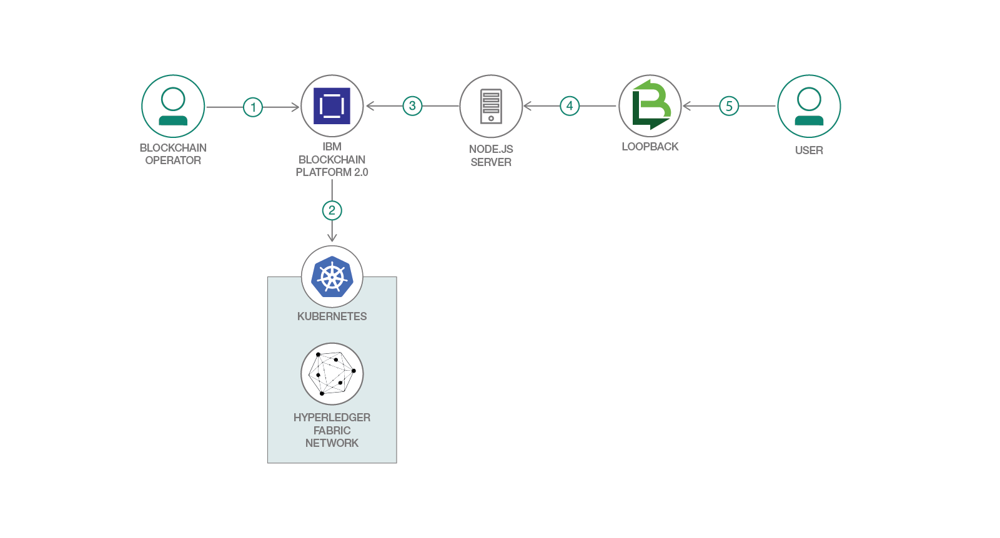

# 公正取引サプライチェーン・ネットワークを作成する

### Hyperledger Fabric と IBM Blockchain Platform を利用してコーヒー小売業者のサプライチェーンを効率化する

English version: https://developer.ibm.com/patterns/./coffee-supply-chain-network-hyperledger-fabric-blockchain-2
  ソースコード: https://github.com/IBM/blockchainbean2

###### 最新の英語版コンテンツは上記URLを参照してください。
last_updated: 2019-03-21

 
## 概要

山頂からキッチンのカウンターにコーヒーが届けられるまでには、長い道のりがあります。その道のりにおいて、説明責任と透明性が欠けている部分があると、配送が遅れる可能性や、不正を行う隙を作ってしまいます。そこで頼りになるのが、IBM Blockchain です。この開発者コード・パターンでは追跡することも監視することも可能なコーヒー取引を体験してもらうために、コーヒー小売業者のサプライチェーンの可視性と効率性を高めるブロックチェーン・アプリを作成します。農業経営者、焙煎業者、そして取引に関与するすべての関係者がより新鮮で、より公正に取引されたコーヒーを消費者に届ける上で、ブロックチェーンが役立つ仕組みを理解してください。

## 説明

このコード・パターンでは、IBM Blockchain Platform V2 Beta を利用してコーヒー小売業者のサプライチェーンの可視性と効率性を高めるブロックチェーン・アプリを作成する方法を説明します。サプライチェーンの参加者ごとに考えられるアクションを説明するために、いくつかのトランザクションを使用します。このサンプル・アプリケーションでは、すべてのトランザクションを IBM Blockchain Platform V2 Beta 上に記録し、コーヒーがオーガニックであり、公正に取引されたものであることを、コーヒー小売業者が消費者に保証できるようにします。このコード・パターンは、サプライチェーンに Hyperledger Fabric を統合するアプリケーションの作成方法を詳しく学ぶために利用できます。

このコード・パターンを完了すると、以下の方法がわかるようになります。

* (無料の) Kubernetes クラスターを作成して使用する
* Hyperledger Fabric を使用してブロックチェーンのバックエンドを構築する
* スマート・コントラクトとやり取りする Node.js アプリをクラウド内にデプロイする
* (無料の) IBM Blockchain Platform V2 Beta とやり取りする

## フロー

1. ブロックチェーン・オペレーターが IBM Blockchain Platform サービスをセットアップします。
1. IBM Blockchain Platform により、IBM Kubernetes Service 上に Hyperledger Fabric ネットワークが作成されます。このネットワークに、オペレーターがスマート・コントラクトをインストールしてインスタンス化します。
1. Node.js アプリケーション・サーバーが Fabric SDK を使用して IBM Blockchain Platform 上にデプロイされたネットワークとやり取りし、Web クライアント用の API を作成します。
1. Loopback 4 クライアントが Node.js API を使用してネットワークとやり取りします。
1. ユーザーが Loopback 4 Web インターフェースとやり取りして、ブロックチェーンのレジャーとその状態を更新、照会します。

## 手順

このパターンの詳細な手順については、[README ファイル](https://github.com/IBM/blockchainbean2/blob/master/README.md)を参照してください。次の手順に沿って、クラウド上にデプロイする方法を説明します。

1. リポジトリーを複製します。
2. 依存関係をインストールします。
3. コントラクトをパッケージ化します。
4. IBM Cloud サービスを作成します。
5. ネットワークを構築します。
6. ネットワーク上に Blockchainbean2 スマート・コントラクトをデプロイします。
7. アプリケーションをネットワークに接続します。
8. アプリケーションを実行します。
