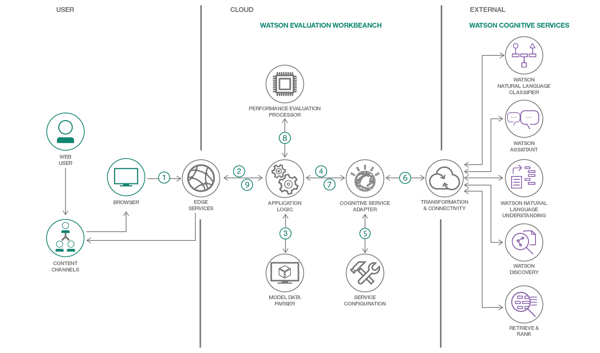

# 機械学習モデルのパフォーマンス評価

### Watson コグニティブ・サービスのさまざまなモデルを比較して、各種のパフォーマンス指標を入手する

English version: https://developer.ibm.com/patterns/cognitive-model-evaluation-workbench
  ソースコード: https://github.com/IBM/model-evaluation-workbench

###### 最新の英語版コンテンツは上記URLを参照してください。
last_updated: 2018-09-17

 
## 概要

特定のタスクに対処するために、数多くの機械学習モデルが作成されています。このコード・パターンでは、特定のデータ・セットに対してより効果的に機能するモデル、そして特定のニーズに最適なモデルを判断できるよう、Watson コグニティブ・サービスのさまざまなモデルを比較する方法を紹介します。このコード・パターンは、モデルを構成してデータを入力し、そのモデルを実行して、パフォーマンス評価の統計を作成するためのプラットフォームになります。

## 説明

Watson サービスのようなコグニティブ・サービスでは、多数の AI シナリオに対処しています。しかも機械学習の世界では、さまざまなタスクに対処するために、多種多様なモデルが作成されています。これだけ多くのモデルを利用できるようになっている中、どのモデルを使用すべきか、あるいはどのモデルがより効果的に機能するかを判断するにはどうすればよいでしょう？正しく言うと、特定のニーズに最適なモデルを判断するにはどうすればよいかという質問です。このコード・パターンでは、Watson コグニティブ・サービスのモデルのパフォーマンス評価と比較について詳しく説明します。このコード・パターンで紹介する Watson Model Evaluation Workbench は、コグニティブ・モデルを構成、実行、テストし、パフォーマンス評価指標を準備して、混同行列や ROC 曲線などのパフォーマンス統計を計算するためのプラットフォームになります。特定のデータ・セットに対するパフォーマンスは、それぞれのモデルによって異なります。このコード・パターンを利用して、ニーズに最適なモデルを判断してください。

## フロー

1. ユーザーがアプリケーションを起動します。
1. クラウドがリクエストの認証を行い、アプリケーションにリクエストをリダイレクトします。
1. モデルを評価するために入力されたデータを解析します。
1. アダプターを起動して、Natural Language Classifier や Natural Language Understanding などのコグニティブ・サービスを呼び出します。
1. コグニティブ・モデル・サービスの構成を解析します。
1. コグニティブ・サービスに接続します。
1. コグニティブ・サービスからレスポンスが返されます。
1. 期待される結果を実際の結果と比較して、パフォーマンスを評価します。
1. パフォーマンス結果がクライアント・デバイスに返されます。
1. UI 上にパフォーマンス分析が表示されます。

## 手順

このパターンの詳細な手順については、[README](https://github.com/IBM/model-evaluation-workbench/blob/master/README.md) を参照してください。手順の概要は以下のとおりです。

1. 前提条件を決定します。
1. コグニティブ・モデルを作成します。
1. アプリケーションを IBM Cloud にデプロイします。
1. アプリケーションをローカル・マシンにデプロイします。
1. アプリケーションを実行します。
1. 結果を分析します。
