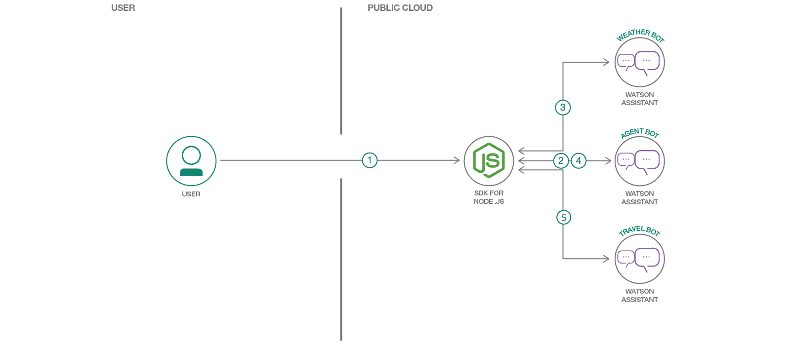

# エージェント・ボットを使用するドメイン固有のボットを作成する

### それぞれに異なるドメインに対応する複数のボットを作成し、それらのボットを 1 つのエージェント・ボットで調整する

English version: https://developer.ibm.com/patterns/./compose-bots-using-an-agent-bot
  ソースコード: https://github.com/IBM/watson-assistant-multi-bot-agent

###### 最新の英語版コンテンツは上記URLを参照してください。
last_updated: 2019-01-18

 
_このコード・パターンは [2020 Call for Code Global Challenge](https://developer.ibm.com/jp/callforcode/) の一部です。_

## 概要

ユーザーとボットとの会話には、複数のドメインが関与してくる場合があります。例えば、ある場所への旅行を計画する際に、その場所の気候を問い合わせて、車またはフライトを予約するとしたら、結局、天気ボットと旅行予約ボットの 2 つを切り替えて使用することになるでしょう。それよりも、1 つのインターフェース・ボットでさまざまなメッセージを該当するドメイン固有のボットにリダイレクトし、自動的に応答を取得したほうが便利だと思いませんか？この開発者コード・パターンでは、こうしたインターフェース・ボット手法の実装を紹介します。

## 説明

通常、チャットボットは特定のドメインに関する人間からの問い合わせに応じるように設計されます。例えば、天気ボットは次のようなメッセージを処理できます。

```
What is the weather forecast for today?
What will be the high temperature tomorrow?
Will it rain in the evening?
```

旅行予約ボットは次のような質問に対処できます。

```
Book a cab
Book a flight
What is the flight duration between Bengaluru and Mumbai?
```

ユーザーは質問する内容に応じて、該当するドメインのボットを使い分けなければなりません。ドメイン固有のボットが複数ある場合、それらのボットを使い分けるよう、ユーザーに期待するのは道理に合いません。

このような場合のソリューションとなるのは、エージェント・ボット (インターフェース・ボット) と、それとは別にそれぞれ特定のドメインに関する問い合わせを処理できる他のボットを用意することです。エージェント・ボットは、これらのドメイン固有のボットを把握しているだけでなく、それぞれのボットが処理できるドメインも把握しています。ユーザーがエージェント・ボットとの会話を開始すると、エージェント・ボットはユーザー・クエリーのインテントを理解し、そのクエリーを該当するドメイン固有のボットにリダイレクトします。ユーザーからのその後のリクエストも、そのドメインの固有のボットにリダイレクトします。ドメイン固有のボットとの会話が終了するか、ドメイン固有のボットがリクエストを処理できない場合は、制御がエージェント・ボットに戻されて、エージェント・ボットから該当するボットにメッセージがリダイレクトされます。

ユーザーにとってシームレスなエクスペリエンスを提供するこの手法は、顧客に金融サービスなどのさまざまなサービスを提供している組織、ツアー会社や旅行代理店、通信社に適用できます。

この手法には次のメリットがあります。

* ボットをプラグ＆プレイできる
* モジュール式手法であるためボットを容易に構成できる
* 2 つ以上のボットを作成して新しいサービスを開発できる
* 保守、変更、機能の追加/削除が簡単
* 問題のトラブルシューティングが簡単
* ユーザーに対してトランスペアレント

このコード・パターンでは Watson&trade; アシスタント・ボットを利用して複数のボットを作成するとともに、オーケストレーション層としての Node.js アプリケーションを作成します。

このコード・パターンをひと通り完了すると、以下の方法がわかるようになります。

* エージェント・ボットとするボットを構成する方法
* 制御をエージェント・ボットに返すようにドメイン固有のボットを構成する方法
* エージェント・ボットとドメイン固有のボットをつなげるオーケストレーション層を作成する方法

## フロー



1. ユーザーが Web アプリケーションにアクセスしてメッセージを入力します。オーケストレーション層としての Node.js アプリケーションがユーザーのメッセージをエージェント・ボットに送信します。
1. エージェント・ボットがメッセージのインテントを判断し、メッセージのリダイレクト先とすべきドメイン固有のボットの詳細を返して応答します。
1. Node.js アプリケーションは該当するドメイン固有のボット (この場合は天気ボット) にメッセージを送信します。ドメイン固有のボットから応答が返されます。ユーザーとドメイン固有のボットとの間で会話が続けられます。
1. ドメイン固有のボットとの会話が終わると、ユーザー・メッセージがエージェント・ボットに送信されてインテントが判断されます。
1. Node.js アプリケーションは該当するドメイン固有のボット (この場合は旅行予約ボット) にメッセージを送信します。ドメイン固有のボットから応答が返されます。ユーザーとドメイン固有のボットとの間で会話が続けられます。

## 手順

このパターンの詳細な手順については、[README](https://github.com/IBM/watson-assistant-multi-bot-agent/blob/master/README.md) を参照してください。手順の概要は以下のとおりです。

1. IBM Cloud 上で Watson Assistant サービス・インスタンスを作成します。
1. GitHub からコードをダウンロードします。
1. Git リポジトリーからダウンロードしたファイルをインポートしてボットを作成します。
1. アプリケーションを構成して IBM Cloud 上にデプロイします。
1. アプリケーションを実行します。
1. 必要に応じてボットを追加します。
