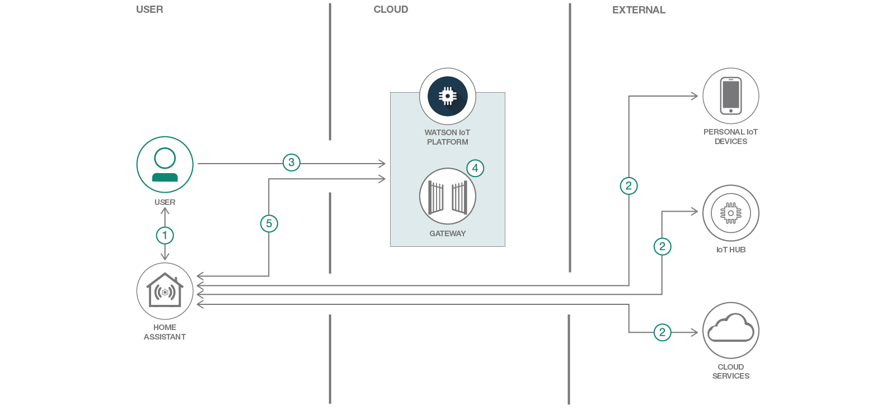

# 統合ホーム・オートメーション・システムを構築する

### Home Assistant オープンソース・プロジェクトと Watson IoT Platform を使用して、複数のデバイスを接続し、接続したデバイスからのデータを集約して分析する

English version: https://developer.ibm.com/patterns/connect-your-home-automation-system-to-watson-iot-platform
  ソースコード: 'https://github.com/IBM/home-assistant'

###### 最新の英語版コンテンツは上記URLを参照してください。
last_updated: '2018-09-25'

 
## 概要

真のスマート・ホームを作成するには、住居内のすべての接続されたデバイスとやり取りできる統合インターフェースが必要です。そのような統合インターフェースを Home Assistant オープンソース・プロジェクトと Watson IoT Platform を使用して作成する方法を学んでください。

## 説明

自宅内でさまざまな接続されたデバイスあるいはスマート・デバイスを使用することはよくあります。けれども、これらの各種デバイスが共通のプロトコルやインターフェースを共有しているとは限りません。そうなると、デバイス間のワークフローや自動化を構成するのが難しくなってきます。この状況は、デバイスを使用するためにそれぞれ異なるインターフェースを操作しなければならないことも意味します。

このような状況を救うのが、Home Assistant というオープンソースのホーム・オートメーション・プロジェクトです。Home Assistant は、自宅内の各種デバイスのすべてに対応する、特定のプラットフォームに依存しないハブになるよう意図されています。このプロジェクトが、すべてのデバイスを操作するための統合インターフェースと、すべてのデバイス間の自動化を構成するための共通メソッドを提供します。

Watson IoT Platform は、アプリケーションに IoT デバイスへの強力な手段とデータを提供し、アナリティクス・アプリケーション、視覚化ダッシュボード、モバイル IoT アプリを迅速に組み立てられるようサポートします。このコード・パターンでは、Home Assistant プロジェクトと Watson IoT Platform を連動させるプロセスについて説明します。Home Assistant を利用して共有インターフェースの背後で各種デバイスのすべてを接続し、Watson IoT Platform を使用してこれらのデバイスからのデータを集約し、集約されたデータに基づいてアナリティクスを実行できるようにします。

Home Assistant と Watson IoT Platform を接続するには、2 つの方法があります。

1. Home Assistant の組み込み MQTT サポートを利用して、デバイスの更新を Watson IoT Platform にパブリッシュする際のルールを作成する
2. デバイスの更新を Home Assistant から Watson IoT Platform にシームレスにパブリッシュするカスタム・モジュールを作成する

このコード・パターンを完了すると、以下の方法がわかるようになります。

* Home Assistant をセットアップして実行する
* Watson IoT Platform のインスタンスを作成する
* デバイスを Watson IoT Platform に追加する
* Home Assistant から Watson IoT Platform にデバイス・メトリックを報告させる

## フロー

1. Home Assistant の Web インターフェースまたはモバイル・インターフェースをインストールし、そのインターフェースを使用して Home Assistant を構成します。
1. IoT デバイス、IoT ハブ、クラウド・サービスを Home Assistant に接続します。
1. Watson IoT Platform をセットアップします。
1. Watson IoT Platform の内部ゲートウェイ・デバイスを作成して、Home Assistant が Watson IoT Platform と通信できるようにします。
1. Home Assistant を Watson IoT Platform に接続します。

## 手順

このコード・パターンに取り組む準備はできましたか？アプリケーションを起動して使用する方法について詳しくは、[README](https://github.com/IBM/home-assistant/blob/master/README.md) ファイルを参照してください。
