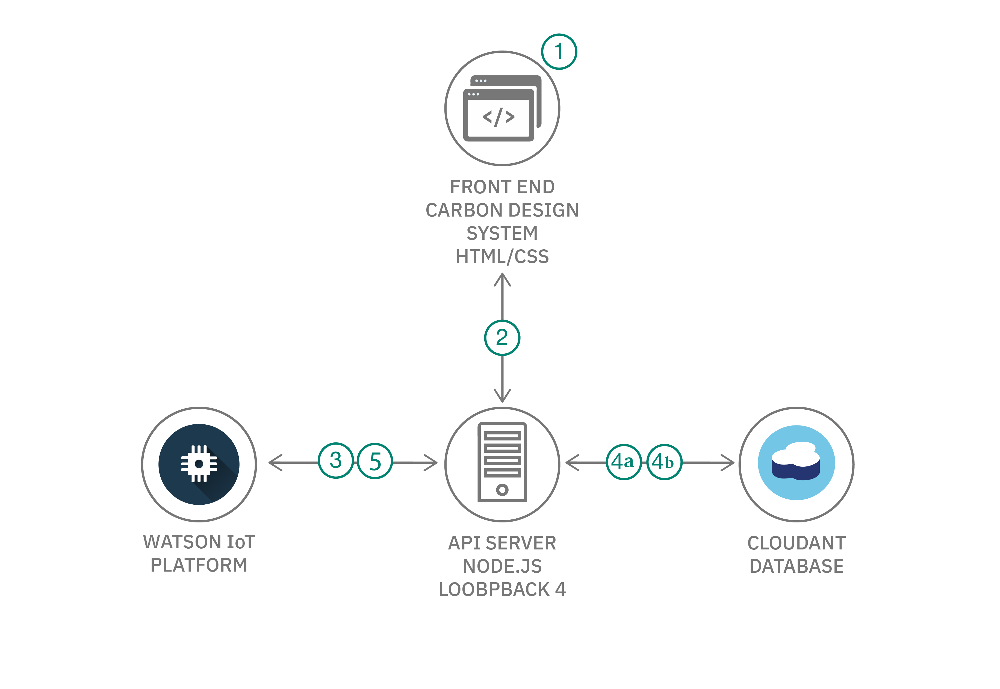

# IoT デバイスのデータをキャッシュに保存して迅速に Carbon ベースのフロントエンドを作成する

### Loopback.io と IBM Cloudant を利用して、Watson IoT Platform からの IoT デバイス・データをキャッシュに保存する API キャッシング Node.js サーバーを作成する

English version: https://developer.ibm.com/patterns/connecting-carbon-ui-to-api-caching-server
  
ソースコード: https://github.com/IBM/API-caching-server-for-Carbon-UI

###### 最新の英語版コンテンツは上記URLを参照してください。
last_updated: 2019-11-25

 
## 概要

このコード・パターンの対象は、IoT デバイス・データをリアルタイムで表示する俊敏で効率的なフロントエンドを作成しようと目指している開発者です。その目的を果たせるよう、このコード・パターンでは IBM Carbon Design System を使用して API キャッシング・サーバーを作成します。IBM Cloudant データベースを接続した Loopback.io を使用する API キャッシング Node.js サーバーを作成する方法を学んでください。

## 説明

この開発者コード・パターンでは、Carbon Design System フロントエンドと外部 API との間を仲介できる、俊敏で効率的なインターフェースの確立に役立つ API キャッシング・サーバーを紹介します。アプリケーション・フロントエンドと外部 API を仲介するこの Node.js サーバーは Loopback を使用して構成されており、アプリケーション・フロントエンドは Loopback と通信します。Loopback は IBM Cloudant&reg; データベースとやり取りして、そこに格納されている、アプリケーションがその UI コンポーネントをロードするために必要な外部 API の情報を取得するという仕組みです。

このコード・パターンを完了すると、以下の方法がわかるようになります。

* Node.js と Loopback.io バックエンド・サーバーを作成する
* Loopback.io を使用して API を作成する
* IBM Cloudant をセットアップして Loopback.io とインターフェースを取る
* IBM Cloudant をローカルで実行する

## フロー

1.  ユーザーが、Carbon Design System を使用して作成されたフロントエンドを介し、API サーバーに対して認証を行います。
2.  フロントエンドが REST API に対し、視覚化するデータをリクエストします。.
3.  API サーバーが外部 API に対し、その API 用に保管されている資格情報を使用してリクエストを送信します。
4.  (4a) 成功のレスポンスが返された場合、API サーバーは新しいデータを受信し、それをキャッシュに保存してからフロントエンドに送信します。
(4b) 失敗のレスポンスが返された場合、API サーバーは以前にキャッシュに保存した API 情報を取得し、そのAPI 情報をフロントエンドに返します。
5.  特定の間隔で、API サーバーは一連の API に関して保存しているデータを更新します。

## 手順

このパターンに取り組む準備はできましたか？このコード・パターンの詳細な手順については、GitHub リポジトリー内にある [README](https://github.com/IBM/API-caching-server-for-Carbon-UI/blob/master/README.md) を参照してください。
