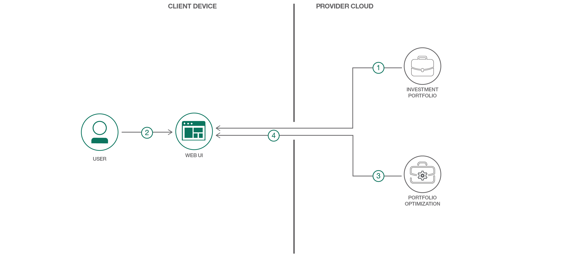

# 社会的責任投資ポートフォリオを作成する

### Portfolio Optimization サービスと、Investment Portfolio サービスからのデータを利用して、投資ポートフォリオを作成してリバランスを行う

English version: https://developer.ibm.com/patterns/construct-a-socially-responsible-investment-portfolio
  
ソースコード: https://github.com/IBM/Portfolio-Optimize

###### 最新の英語版コンテンツは上記URLを参照してください。
last_updated:    2017-10-26

 ## 概要

個人やアドバイザー向けの単純化したインターフェースを使用して、金融アナリストのスキルに相当する機能を使用した正しいやり方で、ポートフォリオを作成してください。この方法は、社会的責任投資などといった個人に固有の制約や好みをポートフォリオに盛り込むという、金融業界で高まりつつある需要を、開発者としてうまく利用する方法になります。

## 説明

このコード・パターンでは、Portfolio Optimization サービスに対するリクエストを構成して、選択したベンチマークのリスクとリターンのプロパティーと一致するカスタム投資ポートフォリオを作成する方法を紹介します。

IBM Cloud Investment Portfolio サービスを利用すると、投資ポートフォリオおよび関連するホールディングス情報を、API 呼び出しによって保管、更新、クエリーすることができます。このサービスには、リバランス対象のクライアント・ポートフォリオ一式、突き合わせる対象のプロパティーを持つベンチマーク・ポートフォリオ一式、そして分析で使用する適格投資一式を保持できます。

IBM Cloud Portfolio Optimization サービスでは、線形最適化フレームワークを使用して、指定された一連の基準を最適に満たす資産の組み合わせを検出します。このフレームワークを使用してポートフォリオを作成し、絶対条件 (例えば、リスクを最小限にしてリターンを最大限にするなど) と相対条件 (例えば、別のプロファイルと対比した条件など) の両方を基準にリバランスを行います。

このコード・パターンでは、標準的な使用ケースで、トラッキング・エラーまたはポートフォリオと標準化されたポートフォリオ (ベンチマークと呼ばれます) との間の差異が最小限になるように投資ポートフォリオを作成する (またはリバランスを行う) 手順を追っていきます。そのなかで、「害を及ぼすとみなされる株式」に対する嫌悪感、社会的責任投資の重み付け、全般的な配分要件などといった制約の収集とペイロードの作成について説明します。

このコード・パターンには、私たちが設計したインターフェースも用意されています。このインターフェースは、必要な情報をユーザーから収集しやすいように単純化されていて、最適化された社会的責任投資一式にするために必要となる取引を表示します。

## フロー

1. ユーザーまたは会社が Investment Portfolio サービスを実行する前に、適格投資、ベンチマーク、ユーザー・ポートフォリオなどのシード情報をサービスに提供します。これらの情報が UI に選択肢として取り込まれます。
1. ユーザーが Web インターフェースにアクセスして、目標、要件、制約を入力します。
1. 送信されたクライアント設定に Investment Portfolio サービスからの情報が補足されて、最適化ツールのペイロードが作成されます。作成されたペイロードは、Portfolio Optimizer サービスに送信されます。
1. 最適化の結果がユーザー・インターフェースに返されて、その後のやり取りまたは分析で使用されます。

## 手順

Ready to put this code pattern to use? Complete details on how to get started running and using this application are in the [README](https://github.com/IBM/Portfolio-Optimize/blob/master/README.md).
