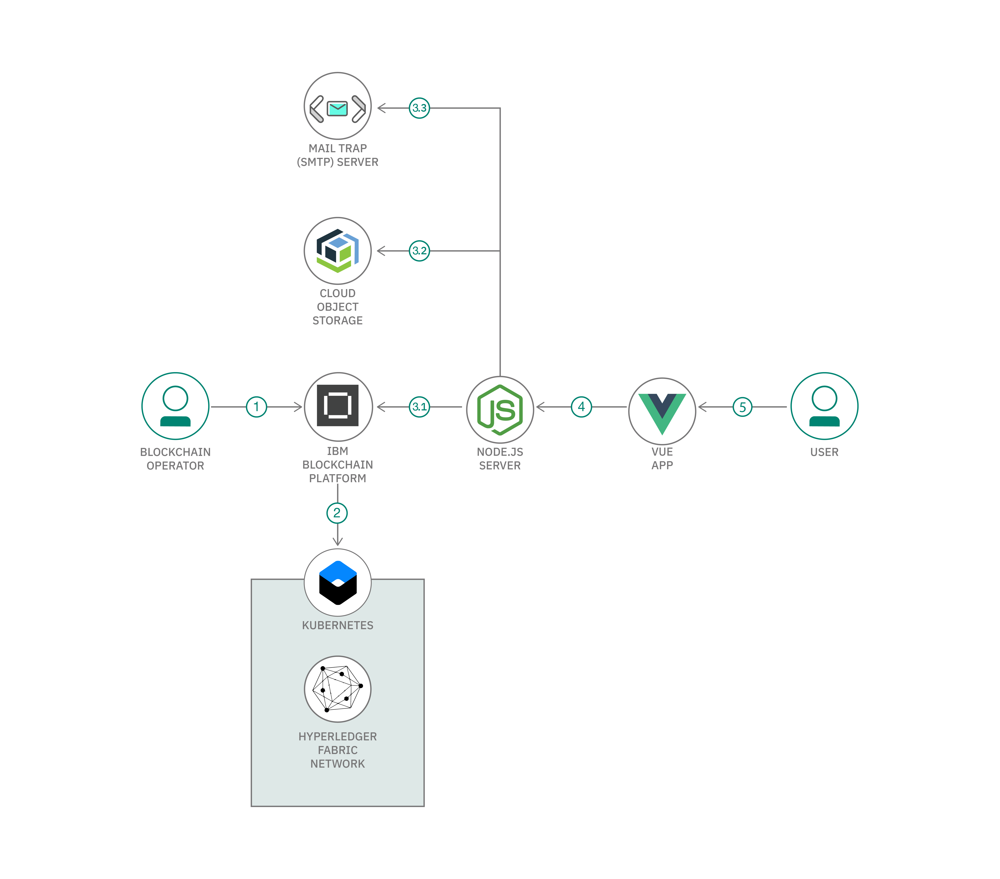

# ブロックチェーンを使用してデジタル資産管理アプリケーションを構築する

### システム内に維持されたデジタル資産に対してシステムの登録ユーザーが行うトランザクションを管理する

English version: https://developer.ibm.com/patterns/create-a-blockchain-to-control-and-manage-digital-assets
  ソースコード: https://github.com/bmos299/Blockchain-for-maintaining-Digital-Assets

###### 最新の英語版コンテンツは上記URLを参照してください。
last_updated: 2020-01-20

 ## 概要

デジタル資産管理システムは、デジタル資産に対する操作を、その資産に対して適切なアクセス権と権限を持っている個人 (または組織) しか行えないようにするためのものです。

この開発者コード・パターンでは、スマート・コントラクトを使用してデジタル資産管理アプリケーションをセットアップする方法を説明します。スマート・コントラクトによって、システム内に維持されたデジタル資産に対してシステムの登録ユーザーが行うトランザクションを管理します。

## 説明

各デジタル資産は、そのコンテンツ (画像、音楽ファイル、ドキュメント、または動画ファイル) とメタデータとして定義されます。メタデータは資産の名前、資産の所有者、資産の作成日の名前といった単純なものである場合も、動画から抽出した音声 (字幕) といった複雑なものである場合もあります。これらの資産を管理するための手段が、デジタル資産管理システムです。このシステムによって、許可されたユーザーだけが資産に対して変更を加えられるようにします。

デジタル資産管理システムがブロックチェーンに適した使用ケースである理由は、多数のユーザー (参加者) がいて、実行できるアクション (トランザクション) にもさまざまな種類があるためです。ブロックチェーンを使用すると、トランザクションの履歴をレジャー内に維持できるため、資産に対して行われたあらゆる変更の一連の記録も常に確保できます。

どのデジタル資産管理システムにも、任意の数のユーザーがいて、これらのユーザーは付与されている権限に応じて、システムの資産に対して各種のアクションを実行できます。こうしたアクションの例として、この開発者コード・パターンでは次のアクションを取り上げます。

* ユーザー登録とユーザー・ログイン
* システム内の既存のすべての資産を表示する
* 現在ログインしているユーザーが所有している資産を表示する
* 新しい資産をアップロードする
* 既存の資産を削除する
* 既存の資産の編集を提案する
* 現在ログインしているユーザーが所有している資産に提案された編集を表示する
* 現在ログインしているユーザーが所有している資産に提案された編集を承認または却下する
* 現在ログインしているユーザーが所有している資産を更新する権限を他のユーザーに許可する
* 現在ログインしているユーザーが所有している資産の所有者として別のユーザーを割り当てる
* 資産をダウンロードする

## フロー

1. ブロックチェーン・オペレーターが IBM Blockchain Platform サービスをセットアップします。
1. IBM Blockchain Platform サービスにより、IBM Kubernetes Service 上に Hyperledger Fabric ネットワークが作成されます。ブロックチェーン・オペレーターはこのネットワーク上にスマート・コントラクトをインストールしてインスタンス化します。
1. Node.js アプリケーション・サーバーが Fabric SDK を使用して、IBM Blockchain Platform 上にデプロイされたネットワーク、IBM Cloud Object Storage インスタンス、Mailtrap サーバー (疑似 SMTP テスト・サーバー) とやり取りし、Web クライアント用の API を作成します。
1. Vue.js クライアントが Node.js アプリケーション API を使用してネットワークとやり取りします。
1. ユーザーが Vue.js Web インターフェースを介してデジタル資産管理アプリケーションを操作します。

## 手順

このコード・パターンに取り組む準備はできましたか？詳しい手順については、[README](https://github.com/bmos299/Blockchain-for-maintaining-Digital-Assets/blob/master/README.md) を参照してください。手順の概要は以下のとおりです。

1. リポジトリーのクローンを作成します。
1. スマート・コントラクトをパッケージ化します。
1. Mailtrap サーバーを作成します。
1. IBM Cloud でサービス・インスタンスを作成します。
1. ネットワークを構築します。
1. ネットワーク上のデジタル資産スマート・コントラクトを管理するためのブロックチェーンをデプロイします。
1. アプリケーションをネットワークに接続します。
1. アプリケーションを実行します。
