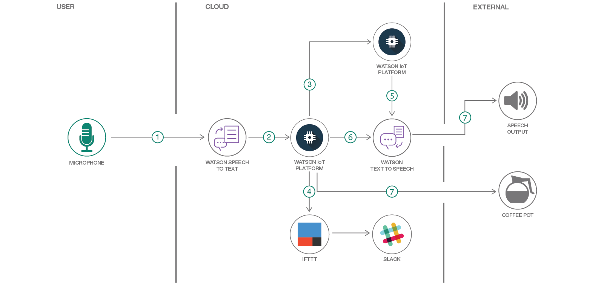

# スマート・コーヒー・メーカーを作成する

### Watson サービスを利用し、IFTTT と Slack を使って IoT アプリのカスタム音声エクスペリエンスを開発する

English version: https://developer.ibm.com/patterns/./create-a-custom-voice-experience
  ソースコード: 'https://github.com/IBM/iot-mic-sts-ifttt-slack'

###### 最新の英語版コンテンツは上記URLを参照してください。
last_updated: '2018-09-21'

 ## 概要

複数のサービスで構成された IoT アプリケーションの一例として、Watson サービス、IFTTT、Slack を利用した会話を通してコマンドを送信し、レスポンスを受信するスマート・コーヒー・メーカーを作成します。 

## 説明

このコード・パターンでは、Watson Speech to Text サービス、Watson Text to Speech サービス、そして Watson IoT Platform サービスを利用して、音声を受け取り、それをテキスト形式のコマンドに変換して登録済みデバイスに送信します。登録済みデバイスは IoT Platform に接続されていて、トピックを送信し、コマンドを受信することができます。ここで使用しているのは、MQTT を使用して通信する NodeMCU v2 デバイス (ESP8266 Wi-Fi ベースのマイクロコンピューター) です。さらに、このコード・パターンでは Slack メッセージングに対応するために IFTTT を実装し、デバイスに送信されたコマンドを Slack チャネルに渡せるようにします。

## フロー

1. Node-RED アプリがマイクロフォンからの音声リクエストを記録します。
1. Watson Speech to Text サービスが音声をテキストに変換します。
1. Watson IoT Platform がテキストを受信してデバイスに割り当てます。
1. Watson IoT Platform がリクエストを IFTTT に渡します。これによりイベントがトリガーされ、Slack 上にタスク完了メッセージが表示されます。
1. Watson IoT Platform サービス・ノードが Text to Speech サービスにレスポンスを送信します。
1. Watson IoT Platform が Text to Speech サービスにコールバック・レスポンスを送信します。
1. Watson Text to Speech サービスがテキストを音声に変換してオーディオ・プレイヤーに送信します。オーディオ・プレイヤーによって、音声によるレスポンスが読み上げられます。Watson IoT Platform は MQTT 対応の NodeMCU デバイスを使用してコーヒー・ポットにもコマンドを送信します。

## 手順

このコード・パターンに取り組む準備はできましたか？アプリケーションを起動して使用する方法について詳しくは、[README](https://github.com/IBM/iot-mic-sts-ifttt-slack/blob/master/README.md) を参照してください。
