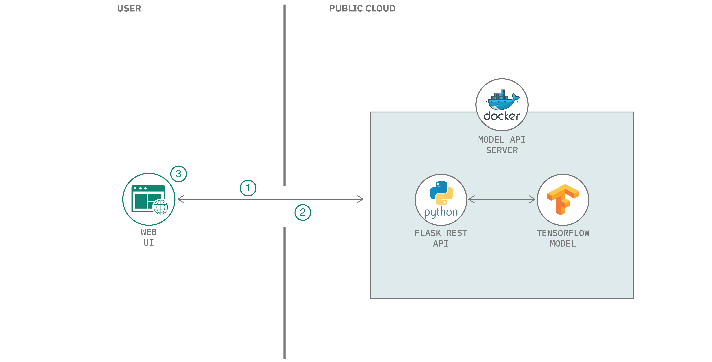

# 機械学習を使用して質問に回答する Web アプリを作成する

### Model Asset eXchange の Question Answering モデルを使用して、入力された質問に回答する

English version: https://developer.ibm.com/patterns/create-a-machine-learning-powered-web-app-to-answer-questions-from-a-book
  ソースコード: https://github.com/IBM/MAX-Question-Answering-Web-App

###### 最新の英語版コンテンツは上記URLを参照してください。
last_updated: 2019-11-05

 ## 概要

このコード・パターンで作成するチャットボットは、ユーザーから質問を受けて、その質問に答えるために大学の生物学の教科書で回答を見つけます。このチャットボットを作成する方法を学んでください。

## 説明

ミトコンドリアとは何なのか疑問に思ったことはありませんか？ニューロンが互いに情報を伝達する仕組みについて好奇心を持ったことは？質問の答えを見つけるには Google 検索が大いに役立ちますが、わかりやすいながらも、より正確な解答を得るにはどうすればよいでしょう？このコード・パターンでは、ユーザーから質問を受けて、その質問に答えるために大学の生物学の教科書で回答を見つけるチャットボットの作成方法を紹介します。このパターンで使用する教科書は、『[Biology 2e](https://opentextbc.ca/biology2eopenstax/)』(Mary Ann Clark、Matthew Douglas、Jung Choi 共著) です。

この Web アプリでは [Model Asset eXchange](https://developer.ibm.com/jp/exchanges/models/) (MAX) の [Question Answering モデル](https://developer.ibm.com/jp/exchanges/models/all/max-question-answering/)を使用して、ユーザーが入力した質問に対する回答を返します。ユーザーがこの Web アプリケーションに備わっているチャット感覚のインターフェースを使用して質問を入力すると、その質問が Flask Python サーバーに送信されます。バックエンドは受け取った質問と、その質問に対して教科書から検出されたテキスト本文を、MAX モデルが公開する REST エンドポイントに送信します。REST エンドポイントは質問に対する回答を Web アプリケーションに返し、その回答がチャットボットからの応答として表示されます。モデルの REST エンドポイントは、MAX 上に用意されている Docker イメージを使用してセットアップされたものです。

このコード・パターンを完了すると、以下の方法がわかるようになります。

* Model Asset eXchange (MAX) の Question Answering モデルの Docker イメージをビルドする
* REST エンドポイントが設定された深層学習モデルをデプロイする
* MAX Model の REST API を使用して、質問に対する回答を生成する
* モデルの REST API を使用する Web アプリケーションを実行する

## フロー

## 手順

このパターンの詳細な手順については、[README](https://github.com/IBM/MAX-Question-Answering-Web-App/blob/master/README.md) ファイルを参照してください。手順の概要は以下のとおりです。

1. モデルをデプロイします。
1. Web アプリを作成します。
1. リポジトリーのクローンを作成します。
1. 依存関係をインストールします。
1. サーバーを起動します。
