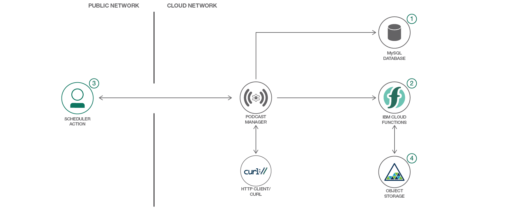

# サーバーレス・テクノロジーを使用してポッドキャスト・ダウンローダーを作る

### Apache OpenWhisk を使用して、ポッドキャストをダウンロードするためのマイクロサービスを構築する

English version: https://developer.ibm.com/patterns/create-a-podcast-downloader-using-serverless-technology
 
ソースコード: https://github.com/IBM/PodcastDownloader

###### 最新の英語版コンテンツは上記URLを参照してください。
last_updated: 2018-02-21

 
## 概要

Apache OpenWhisk は、どんな規模でもイベントに応答して関数を実行できる、サーバーレスのオープンソース・クラウド・プラットフォームです。この開発者向けコード・パターンでは、サーバーレス・テクノロジーを使用してポッドキャスト・ダウンローダーを作成する方法を説明し、サーバーレスのプロセスとプログラミングの概要を紹介します。

## 説明

開発者として、最新のプログラミング手法とツールに常に通じていることは必須です。モバイル・アプリが急増し、接続されるデバイスの数に事実上制限がなくなっているなか、開発者は効率的に機能する頼れるソフトウェアの作成方法を理解していなければなりません。

サーバーレス・プログラミングは、マイクロサービス、モバイル、IoT をはじめ、あらゆるタイプのアプリに最適なテクノロジーです。オンデマンドで実行される軽量のコードを開発できるからです。

このコード・パターンでは、皆さんがサーバーレス・プログラミングの世界に飛び込めるよう、ポッドキャストをダウンロードするアプリを構築する手順を案内します。IBM Cloud Functions という Apache OpenWhisk の IBM フレーバーと、IBM Cloud Object Storage、そしていくつかのよく知られている Web フレームワークを使用して、分散型マイクロサービス・アプリを組み立てる方法を学んでください。

このコード・パターンをひととおり完了すると、以下の方法がわかるようになります。

* サーバーレス・プログラミングの基礎を実装する 
* 分散型マイクロサービス・アプリを構築する 
* IBM Cloud Object Storage サービスを利用する 

## フロー

1. ローカル Python アプリに MySQL バックエンドをセットアップします。
1. Python アクションと仮想環境を ZIP ファイルにパッケージ化して、IBM Cloud Functions にアップロードします。
1. ユーザーがローカル・アプリを操作してアクションを呼び出します。
1. データが Object Storage サービス内の OpenStack Swift に保管されます。

## 手順

Ready to put this code pattern to use? Complete details on how to get started running and using this application are in the [README](https://github.com/IBM/PodcastDownloader/blob/master/README.md).
