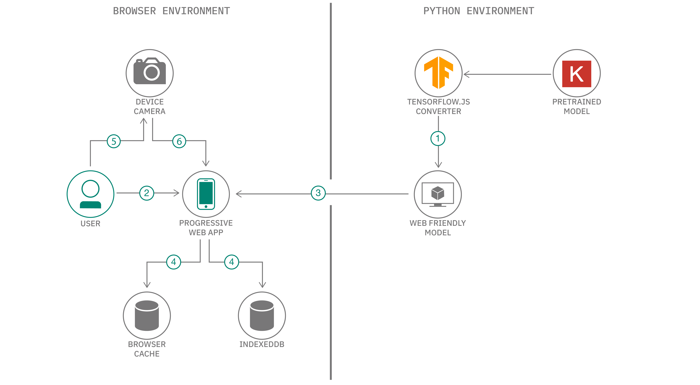

# オフラインでも画像を分類できるプログレッシブ Web アプリを作成する

### ローカルで選択した画像、または携帯端末のカメラで撮った画像を分類できる、クロスプラットフォームのアプリケーションを作成する

English Version: https://developer.ibm.com/patterns/create-a-progressive-web-application-for-offline-image-classification/

ソースコード: https://github.com/IBM/tfjs-web-app

###### 最新の英語版コンテンツは上記URLを参照してください。
last_updated: "2019-10-08"

## 概要

このコード・パターンでは、モバイル・プラットフォーム対応のプログレッシブ Web アプリを作成する 1 つの方法を説明します。サンプル・アプリケーションとして、ユーザーがローカルで選択した画像、または携帯端末のカメラで撮った画像を分類するアプリを作成します。このアプリでは、インターネット接続が断続的であったり存在しなかったりする地域でも、ユーザーがオフラインでモデルを実行できます。

## 説明

深層学習モデルを作成した後は、トレーニング済みのモデルを独自のアプリケーションにデプロイできるようにする必要があります。それにはいくつかの方法があり、どの方法を選ぶかは、主に使用ケースと要件に依存します。このコード・パターンで作成するアプリの要件の 1 つは、インターネット接続が断続的であったり存在しなかったりする地域でも、オフラインでモデルを実行できることです。この要件を満たすためのソリューションとしては、モデルをパッケージ化して圧縮したバージョンのモデルをロードする、モバイル・プラットフォーム固有のアプリを作成するという方法があります。ただし、この方法にはオーバーヘッドが伴います。それは、開発者に Android および iOS 開発の専門知識が必要になることです。

このコード・パターンでは、それよりも簡単にこのオフラインのモバイル要件を満たせる方法に目を向けます。この方法では、React を使用してプログレッシブ Web アプリを作成し、そのアプリに TensorFlow.js を使用したモデルをデプロイします。プログレッシブ Web アプリはネイティブ・アプリのように操作できて、最近のほとんどの Web ブラウザー上で実行できます。プログレッシブ Web アプリなら、HTML/JavaScript で一度開発するだけでよいので、クロスプラットフォーム開発が大幅に容易になります。しかも、サービス・ワーカーを使用すれば、プログレッシブ Web アプリはオフラインでも完全に機能します。

TensorFlow.js を使用して、事前トレーニング済みの TensorFlow モデルまたは Keras モデルを JavaScript に変換して、アプリでブラウザーを介してモデルを実行できるようにします。こうすれば、クロスプラットフォーム・アプリになって、ユーザーがローカルで選択した画像、または携帯端末のカメラで撮った画像を分類するために使用できます。アプリは推論機能を提供するために、TensorFlow.js と、TensorFlow.js 形式に変換された事前トレーニング済みモデルを使用します。このモデルは IndexedDB を使用してブラウザー内でローカルに保存されます。ローカルに保存されたモデルをオフラインでも実行できるよう、サービス・ワーカーを使用します。

このソリューションの仕組みは以下のとおりです。

* データを端末上に保持し、ローカルで分類を行います。
* アセットをブラウザーのキャッシュとストレージに保管します。
* アプリはデスクトップ上で実行することも、携帯端末上に「インストール」することもできます。
* ユーザーに更新するよう求めることで、ローカルで保管されているコンテンツでも更新できます。

## フロー

1. 事前トレーニング済みの Keras/TensorFlow モデルを Web で処理しやすい TensorFlow.js 形式に変換し、アプリに統合します。
1. ユーザーがプログレッシブ Web アプリを起動します。
1. アプリのアセットと TensorFlow.js モデルのファイルを Web からダウンロードします。
1. アセットとモデルは、ブラウザーのキャッシュと IndexedDB ストレージを使用してローカルで保管されます。
1. ユーザーが端末のカメラで写真を撮るか、ローカルに保存されている画像を選択します。
1. 画像が送信されてモデルによって推論が行われ、最上位の予測が提示されます。

## 手順

このパターンの詳細な手順については、[README](https://github.com/IBM/tfjs-web-app/blob/master/README.md) を参照してください。手順の概要は以下のとおりです。

1. リポジトリーのクローンを作成します。
1. アプリの依存関係をインストールします。
1. 事前トレーニング済みのモデルをダウンロードして変換します。
1. 構成ファイルをセットアップします。
1. アプリをデプロイして画像を分類します。
