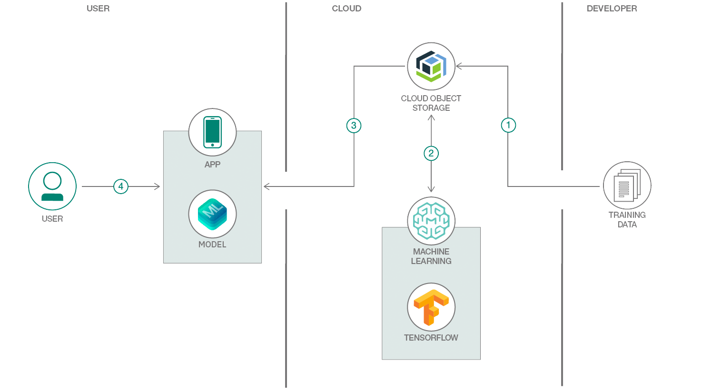

# Watson Machine Learning を利用してリアルタイムのオブジェクト検出アプリを作成する

### 多大な計算能力と時間を費やさずに独自のカスタム・モデルをトレーニングする

English version: https://developer.ibm.com/patterns/create-a-real-time-object-detection-app-using-watson-machine-learning
  
ソースコード: 'https://github.com/cloud-annotations/object-detection-ios'

###### 最新の英語版コンテンツは上記URLを参照してください。
last_updated: '2019-04-09'

 
## 概要

路上を走る自動車の数を数えるのでも、自然災害時に屋根の上に取り残された被災者の数を数えるのでも、オブジェクト検出の使用ケースは山ほどあります。多くの場合、事前にトレーニングされたオブジェクト検出モデルでは特定のニーズを満たさないため、独自のカスタム・モデルを作成することになります。けれども多大な計算能力と時間を費やさずに、機械学習を使用して独自のカスタム・モデルをトレーニングするにはどうすればよいでしょうか？その答えは、Watson Machine Learning にあります。では、カスタマイズしてトレーニングしたモデルを使用してリアルタイムでオブジェクトを検出し、しかもそのプロセスをユーザーのプライバシーを侵害せずに、一貫してモバイル・デバイス上で行うことはできるのでしょうか？それには、Apple の Core ML という手段があります。

## 説明

このコード・パターンでは、独自にカスタマイズしてトレーニングしたモデルを使用できる、オブジェクト検出用の iOS アプリを作成します。そのために、まず IBM Cloud Object Storage インスタンスを作成してラベル付きデータを保管します。データの準備が整ったら Watson Machine Learning インスタンスを起動して、最先端の GPU 上で独自のカスタム・モデルをトレーニングする方法を学びます。モデルのトレーニングが完了した後は、それを Core ML モデルとして iOS アプリケーションに接続すればよいだけです。

このコード・パターンをひと通り完了すると、以下の方法がわかるようになります。

* オブジェクト検出に使用できるデータにラベルを付ける
* Watson Machine Learning でカスタム・データを使用してモデルをトレーニングする
* Core ML を使用してオブジェクトを検出する

## サンプル・アプリの図

1. トレーニング・データを IBM Cloud Object Storage にアップロードします。
1. Watson Machine Learning が IBM Cloud Object Storage からトレーニング・データをプルし、TensorFlow を使用してモデルをトレーニングします。トレーニング後のモデルが再び IBM Cloud Object Storage に保管されます。
1. トレーニング済みのモデルが Core ML モデルとして iOS アプリに追加されます。
1. ユーザーがアプリを操作し、アプリによってリアルタイムでオブジェクトが検出されます。

## 手順

このアプリを作成するには、以下のワークショップで説明している手順に従います。

* [オブジェクト検出モデルのトレーニング](https://cloud-annotations.github.io/training/object-detection/cli/)
