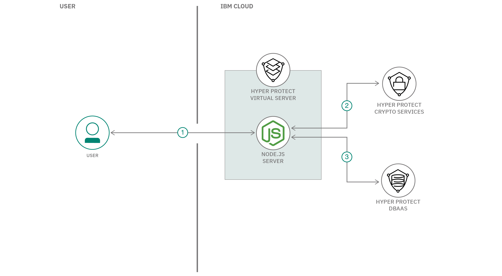

# 統合データベースにデータを書き込む、セキュアなマイクロサービスを作成する

### 鍵管理ソリューションをデータベース・バックエンドにリンクする

English version: https://developer.ibm.com/patterns/create-a-secured-microservices-and-deploy-it-to-a-consolidated-database
  
ソースコード: https://github.com/IBM/secured-microservices-writing-to-a-consolidated-database

###### 最新の英語版コンテンツは上記URLを参照してください。
last_updated: 2020-02-10

 ## 概要

この開発者コード・パターンでは、IBM Cloud&trade; Hyper Protect Crypto Services のような鍵管理ソリューションを IBM Cloud Hyper Protect DBaaS for MongoDB のようなデータベース・バックエンドと連動させる方法を明らかにするアプリケーションを作成してデプロイします。このパターンに従ってアプリケーションを作成してデプロイすることで、IBM Cloud Identity and Access Management (IAM) API 鍵を使用して認証を行う方法、データベース内に保管する前に情報を暗号化するための鍵を Key Protect REST API を使用して生成する方法を学ぶことができます。

## 説明

多くの企業が目標としているのは、コストの削減です。組織が複数のチームから編成されていて、それぞれの組織が専用のデータベースを所有しているとしたら、コストを削減するには、これらのデータベースを統合して 1 つのデータ層にするのが当然でしょう。

マイクロサービス・アーキテクチャーの一般的なパターンでは、1 つのデータ層に統合する場合、複数のチームがその同じデータ層からデータを読み取り、そこにデータを書き込めるようにする必要があります。また、単一のデータベースでビジネスをサポートするには、チーム単位でアクセスを制限するために、データベース内のフィールドごとに暗号化を行う必要も出てくるでしょう。こうすれば、それぞれのフィールドのデータを読み取れるのは、対応する暗号鍵を持つチームだけに制限できるからです。

このコード・パターンで作成するのは、チームごとの暗号鍵を作成できる Node.js アプリケーションです。その目的は、生成した暗号鍵を使用して顧客データを暗号化し、暗号化された状態で顧客データをデータベース内に保管するためです。このアプリケーションでは IBM Cloud Hyper Protect Crypto Services インスタンスが提供する Key Protect RESTful API を使用します。データベースとしては、IBM Cloud Hyper Protect DBaaS for MongoDB を使用します。このアプリケーションは、Docker コンテナー内に収容して Mac または Linux ラップトップ上で実行することも、パブリック・クラウド内でランタイム保護機能を備えた IBM Cloud Hyper Protect Virtual Servers 上で実行することもできます。

このコード・パターンを完了すると、以下の方法がわかるようになります。

* Docker コンテナーをビルドして実行する
* Node.js アプリ内で Docker から環境変数を取得する
* IBM Cloud IAM API 鍵を作成する
* IBM Cloud Hyper Protect Crypto Services が提供する IBM Cloud Key Protect REST API を駆動する

## フロー

1. ユーザーが Web アプリを表示して顧客情報を入力します。
1. アプリが Key Protect REST API を使用して鍵を生成します。
1. アプリが生成された鍵を使用して顧客情報を暗号化し、データベース内に保管します。

## 手順

このコード・パターンに取り組む準備はできましたか？詳しい手順については、[README](https://github.com/IBM/secured-microservices-writing-to-a-consolidated-database/blob/master/README.md) を参照してください。
