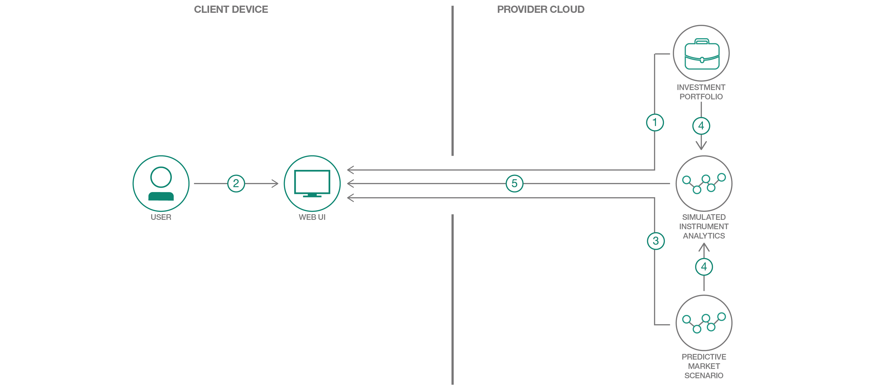

# 投資ポートフォリオ向けストレス・テスト・アプリを作成する

### 複数の金融サービスを利用して、投資ポートフォリオのストレス・テストを実行する Web アプリを作成する

English version: https://developer.ibm.com/patterns/create-a-stress-test-app-for-investment-portfolios
  ソースコード: https://github.com/IBM/Predictive-Market-Stress-Testing

###### 最新の英語版コンテンツは上記URLを参照してください。
last_updated: 2018-05-22

 ## 概要

金融市場は予測不可能だといっても、投資家たちは自分のポートフォリオのパフォーマンスがさまざまな条件下でどのように変わるのかを把握したいと思うものです。このコード・パターンで、一連の金融関連の Web サービスを利用して、ポートフォリオ向けストレス・テスト・アプリを作成する方法を学んでください。

## 説明

金融市場は、予測不可能なことで悪名高い市場です。金利、政治情勢、大衆の心情をはじめ、ほぼあらゆる要因が、投資ポートフォリオに良くも悪くも影響を与えます。投資家は当然のことながら、自分のポートフォリオがさまざまな状況によってどのように影響されるかを把握したいと思うものですが、通常はその手段が提供されないため、推測に任せざるを得ません。

顧客が一連の異なる条件下でのポートフォリオ・パフォーマンスを評価できるようにすれば、投資アドバイスや投資サービスを提供する会社または組織は、そこに大きなビジネス価値を認めるはずです。市況によって各人のポートフォリオ・パフォーマンスがどのように変わるかを投資家に見せることができ、投資家は有益な結果のあらましを描いたり、不況時に備えたりできるようになるためです。投資に関しては、情報が大きな力を持ちます。

私たちのチームは、市況の変化がポートフォリオに与える影響を投資家や金融会社が確認するためのアプリを考案したらどうかと考えました。IBM Cloud にはそのようなアプリに役立つ新しいサービスがあることがわかっていました。投資ポートフォリオのストレス・テストを実現するには、それらのサービスを組み合わせればよいだけです。

その取り組みの成果が、このコード・パターンです。このコード・パターンでは、投資ポートフォリオを対象に予測的市場ストレス・テストを実行するために、IBM Cloud の一連の金融サービスを利用する方法を説明します。これらのサービスは 1 つの Web インターフェースに統合されていて、そのインターフェースが IBM Cloud Investment Portfolio サービスを利用してユーザーのポートフォリオをロードします。ストレス・テストのシナリオは、いくつかの基本的な情報を入力するだけで作成できます。例えば、S&P 500 インデックス全体の価値が 5% 上昇したとしたら、特定のポートフォリオにどのような影響があるかを調べるといったシナリオを作成できます。

このコード・パターンで作成する Predictive Market Stress Testing アプリでは、いくつかの異なるシナリオを作成してから、IBM Cloud Simulated Instrument Analytics サービスを利用して、ポートフォリオ内の各債券にそれらのシナリオを適用することができます。このコード・パターンで説明する方法に従えば、金融学や経済学の博士号がなくても、IBM Cloud Finance サービスを利用して堅牢なエンタープライズ・レベルのストレス・テストを作成できます。ストレス・テスト、予測アナリティクス、あるいはマルチサービス・アプリの開発について理解する必要がある開発者にとって、最適なコード・パターンとなるはずです。

## フロー

1. アプリケーションを実行する前に、ユーザーが Investment Portfolio サービスにポートフォリオ固有の情報をシードします。
1. ユーザーが Web インターフェースを使用して、ポートフォリオの内容、リスク要因、市場下落幅などの情報を入力します。
1. IBM Cloud Predictive Market Scenario サービスが、リスク要因と市場下落幅の入力からシナリオを生成します。
1. IBM Cloud Simulated Instrument Analytics サービスが前のステップで生成されたシナリオを使用して、ポートフォリオに含まれる債権ごとにストレス値を計算します。
1. 出力が表形式で Web インターフェースに表示されます。

## 手順

Ready to put this code pattern to use? Complete details on how to get started running and using this application are in the [README](https://github.com/IBM/Predictive-Market-Stress-Testing/blob/master/README.md).
