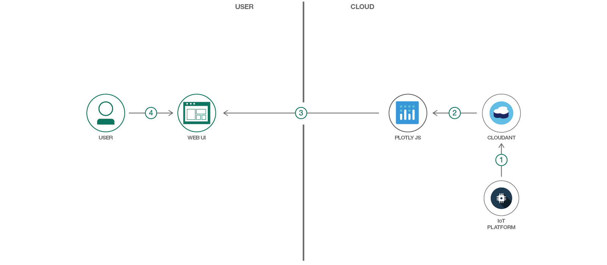

#  IoT デバイス・データを分析して視覚化する Web アプリを作成する

### Watson IoT Platform、Cloudant、plotly.js を使用して、数日間にわたる IoT デバイス・データやその他の統計グラフを表示して分析するための Web アプリを構築する

English version: https://developer.ibm.com/patterns/./create-a-web-app-to-analyze-and-visualize-iot-device-data
  ソースコード: https://github.com/IBM/iot-device-trend-analysis

###### 最新の英語版コンテンツは上記URLを参照してください。
last_updated: 2018-05-17

 
## 概要

IoT デバイスは短期間で大量のデータを生成することがよくあります。IBM Watson IoT Platform に用意されている優れた拡張機能を使用すれば、このような大量のデータを直接 IBM Cloud 上のデータベース内に保管できます。IoT データがデータベース内に保管されるようになれば、アプリケーションを作成して、保管されたデータを分析したり各種のプロットやグラフで表示したりすることができます。

このコード・パターンでは、IoT データを受信する Cloudant データベースをセットアップした後、そのデータを表示して分析するためのアプリケーションを作成します。作成するアプリケーションは、Python バックエンドを使用してデータを読み取って分析し、分析データを JavaScript フロントエンドに送信して plotly.js を使ってデータのインタラクティブなグラフを作成します。数日間にわたるロー・データを表示するグラフ、一時間ごとの統計と傾向を表示するグラフ、デバイス間でデータを比較するグラフ、あらゆる相関関係を示すグラフを描画できます。

## 説明

企業は常に、IoT デバイスによって生成される膨大な量のデータを分析する方法を探し求めています。IoT デバイスを使用する場合、利害関係者は IoT デバイス・データの傾向を表示して経時的な値の増加 (または減少) を確認したいと望むでしょう。さらに、特定の期間における値の上昇といったパターンや、データに含まれる異常値を、利害関係者が確認できるようにする必要もあります。

このコード・パターンでは、IoT デバイス・データのグラフと傾向を表示するアプリケーションを作成します。IoT デバイス・データをグラフにすれば、データ・サイエンティストはそこからデータの意味を解釈し、一定の期間にわたる IoT デバイスの動作について洞察を発見することができます。この目的に役立つグラフには、特定の 1 日および数日間のデバイス・データを表示するグラフ、1 時間ごとの統計と傾向を表示するグラフ、数日間にわたるデバイス統計を比較するグラフ、デバイスのフィールド間の相関関係を示すグラフなどが挙げられます。このアプリケーションでは、ユーザーが拡張、保存、更新できるインタラクティブなグラフを作成するために、[plotly.js](https://plot.ly/javascript/) を使用します。

このコード・パターンをひと通り完了すると、以下の方法がわかるようになります。

* Watson IoT Platform を使用して、IoT データを直接 Cloudant データベース内に保管する 
* Cloudant データベースからデータを読み取って分析するアプリケーションを作成する 
* plotly.js を使用してデータの視覚化を作成する 
 
## フロー

1. IoT データは日次バケットとして Cloudant データベース内に保管されます。
1. Cloudant データベース内に保管されたデータと plotly.js を使用して視覚化を作成します。
1. ユーザーのリクエストに応じたグラフが、Web UI に表示されます。
1. ユーザーは Web UI を使用してグラフを表示し、各グラフの分析を行うことができます。

## 手順

このパターンの詳細な手順については、[README](https://github.com/IBM/iot-device-trend-analysis/blob/master/README.md) を参照してください。手順の概要は以下のとおりです。

1. IBM Cloud 上で IoT アプリを作成します。
1. IoT Platform 上でデバイスを登録してシミュレーションします。
1. IBM Cloud 上で Cloudant データベースを作成します。
1. Cloudant DB を IoT デバイス・データのデータ・ストアとして構成します。
1. Web アプリを実行します。
1. アプリを IBM Cloud にデプロイします。
