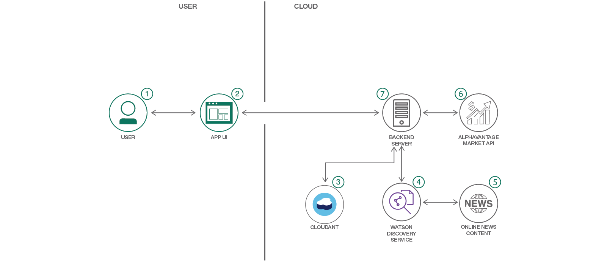

# 株式情報、株価、センチメントを取得するアプリを作成する

### Watson Discovery、Cloudant NoSQL DB、Node.js を利用して、個々の上場株に関するセンチメント、株価、ニュースをモニターする Web アプリを作成する

English version: https://developer.ibm.com/patterns/create-a-web-app-to-get-stock-information-prices-and-sentiment
  
ソースコード: https://github.com/IBM/watson-stock-advisor

###### 最新の英語版コンテンツは上記URLを参照してください。
last_updated: 2018-07-01

 
## 概要

投資の世界には、考慮しなければならない要素が多数あります。株価や収益といった通常のメトリックだけでなく、十分な情報に基づいた意思決定を行うためには、企業に関するセンチメントといった要素も考慮しなければなりません。このコード・パターンでは、Watson Discovery、Node.js、Cloudant NoSQL DB を利用して、投資の意思決定を行う際に役立つアプリを作成する方法を説明します。このアプリを参考に、自身のコーディング・プロジェクトを活性化させてください。

## 説明

株式市場への投資は、考慮しなければならない多数のメトリックがあることから難しい判断になりがちです。株価、株価収益率、アルファ、株価純資産率、純現金収支などは、考慮しなければならない要素のほんの一部です。さらに、ニュース・ソースから得られる定性データもあります。つまり、肯定的ニュースか否定的ニュースかを基に企業の将来価値を見据えて、投資の意思決定を行うためのデータです。このような意思決定をサポートするには、Watson Discovery によって事前にエンリッチされたニュース・コレクションを使用して、さまざまな企業の状況を追跡するという方法があります。このコード・パターンに従えば、投資の候補として考えている企業を対象に、センチメント情報をモニターして表示したり、ニュース記事へのリンクを取得したり、株価の推移を追跡したりできる Web アプリを作成できます。

このコード・パターンでは、Blackrock Digital が提供しているオープンソースのブートストラップ・テンプレートを使用した Node.js Web アプリの作成方法を説明します。このアプリは Watson Discovery を利用して企業に関する情報を収集し、肯定的または否定的センチメントの分析結果を表示します。Alpha Vantage から収集する株価情報を含め、すべての情報は Cloudant NoSQL データベース内に保管されます。

このコード・パターンをひと通り完了すると、以下の方法がわかるようになります。

* Watson Discovery News を利用する
* 株式情報への Web インターフェースとなる Node.js アプリを作成する
* Alpha Vantage が無料で提供している API を使用して株式情報にアクセスする
* Cloudant NoSQL データベース内に情報を保管し、そこから情報を取得する

## フロー

1. Web UI を使用して株式を追加および削除します。
1. アプリが入力を処理してバックエンド・サーバーにルーティングします。
1. バックエンド・サーバーが株式情報を Cloudant NoSQL データベース内に保管します。
1. バックエンド・サーバーは Watson Discovery を利用して、特定の企業に関する情報を見つけます。
1. Watson Discovery は Watson News Collection に対してクエリーを実行し、企業に関連するニュース記事を検出します。
1. 特定の企業の市場価格を調べるために、Alpha Vantage API に対するクエリーが実行されます。
1. Web アプリにニュース、センチメント、株価が返されて、そのすべてがレンダリングされます。

## 手順

このパターンの詳細な手順については、[README](https://github.com/IBM/watson-stock-advisor/blob/master/README.md) を参照してください。手順の概要は以下のとおりです。

1. watson-stock-advisor リポジトリーを複製します。
1. IBM Cloud サービスを作成します。
1. Watson Discovery を構成して資格情報を取得します。
1. Cloudant NoSQL データベースをプロビジョニングして資格情報を取得します。
1. IBM Cloud 資格情報を .env ファイルに追加します。
1. アプリケーションを実行します。
