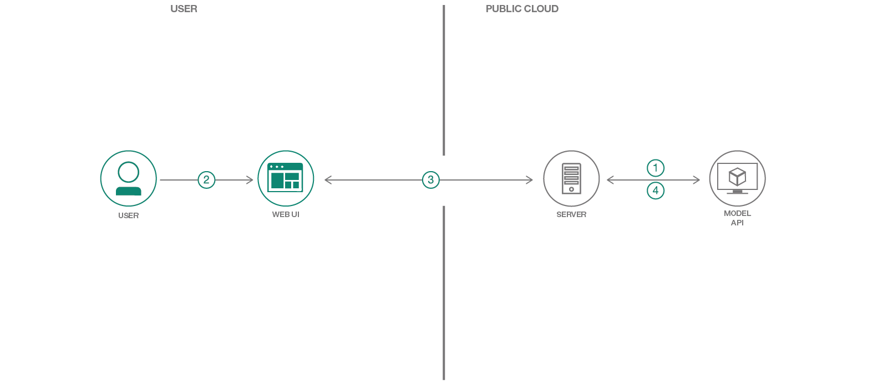

# 機械学習で生成された画像キャプションとやり取りする Web アプリを作成する

### オープンソースの画像キャプション・ジェネレーター深層学習モデルを使用して、Web アプリケーション内でコンテンツに応じて画像をフィルタリングする

English version: https://developer.ibm.com/patterns/create-a-web-app-to-interact-with-machine-learning-generated-image-captions
  ソースコード: https://github.com/IBM/MAX-Image-Caption-Generator-Web-App/

###### 最新の英語版コンテンツは上記URLを参照してください。
last_updated: 2019-03-28

 ## 概要

IBM Model Asset eXchange (MAX) の導入によって、データ・サイエンスの経験を持たないアプリケーション開発者が、あらかじめ作成された機械学習モデルに容易にアクセスできるようになっています。このコード・パターンでは、いかに簡単に MAX モデルを使用した Web アプリを作成できるかを明らかにします。ここで作成する Web アプリでは、MAX から入手できる画像キャプション・ジェネレーターを使用します。また、単純な Web UI を作成し、ユーザーがその UI を使用して、機械学習モデルが付けた説明に基づいて画像をフィルタリングできるようにします。

## 説明

IBM の調査 によると、1 日あたり 250 京バイトのデータが毎日生成されています。その多くは、テキスト、音声録音、画像などの非構造化データです。こうした非構造化データを利用するためには、まず、非構造化データを構造化データに変換する必要があります。

このコード・パターンでは、[Model Asset Exchange](https://developer.ibm.com/exchanges/models/) (MAX) から入手できるモデルのうちの 1 つを使用します。MAX は、オープンソースの深層学習モデルを開発者が見つけて実験できるように、モデルを公開しているプロジェクトです。具体的には、[画像キャプション・ジェネレーター](https://developer.ibm.com/exchanges/models/all/max-image-caption-generator/)を使用して画像にそのコンテンツを説明するキャプションを付け、キャプションに応じて画像をフィルタリングできる Web アプリケーションを作成します。この Web アプリケーションの提供するインタラクティブなユーザー・インターフェースは、Tornado を使った軽量の Python サーバーによってサポートされています。この Python サーバーが、UI を介して画像を取得してモデルの REST エンドポイントに送信し、生成されたキャプションを UI 上に表示します。モデルの REST エンドポイントは、MAX 上に用意されている Docker イメージを使用してセットアップします。Web UI は画像ごとに生成されたキャプションだけでなく、キャプションに基づいて画像をフィルタリングするためのインタラクティブなワード・クラウドも表示します。

このコード・パターンを完了すると、以下の方法がわかるようになります。

* REST エンドポイントを使用して深層学習モデルをデプロイする
* MAX Model の REST API を使用して、画像のキャプションを生成する
* MAX Model の REST API を使用する Web アプリケーションを実行する

## フロー

1. サーバーがデフォルトの画像を Model API に送信します。これにより、API から画像のキャプション・データが返されます。
1. ユーザーがデフォルトのコンテンツを含む Web UI を操作して画像をアップロードします。
1. Web UI がアップロードされた画像のキャプション・データをサーバーにリクエストし、サーバーからデータが返されたときにコンテンツを更新します。
1. サーバーがアップロードされた画像を Model API に送信し、API から受信したキャプション・データを Web UI に返します。

## 手順

このコード・パターンに取り組む準備はできましたか？アプリケーションを起動して使用する方法について詳しくは、[README](https://github.com/IBM/MAX-Image-Caption-Generator-Web-App/blob/master/README.md) を参照してください。
